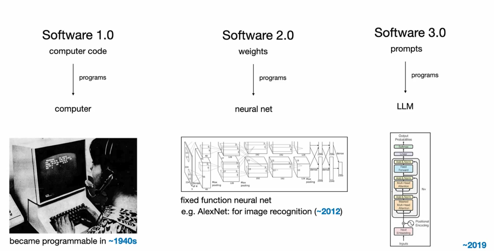

## 概述

Andrej Karpathy 提出软件发展的三阶段理论，揭示了从传统编程到AI时代的演进路径。软件的本质始终是：**寻找让机器解决问题的最优表达方式**。

## 软件发展三阶段

### Software 1.0: 传统编程时代

- **核心特征**: 通过编写计算机代码解决问题
- **标志性产物**: Github - 汇聚无数实际问题解决方案的程序仓库
- **编程范式**: 确定性编程(`if A then B else C`)
- **适用场景**: 明确的、逻辑清晰的问题

### Software 2.0: 神经网络时代  
- **核心特征**: 神经网络作为决策分类器，取代手写逻辑
- **编程方式**: 训练和调参，通过数据集修改网络权重
- **标志性产物**: Hugging Face - 全球最大的AI模型分享平台，沉淀海量可直接使用的预训练模型
  - 2016年由法国企业家在纽约创立，最初是青少年聊天机器人应用
  - 后转型为AI模型平台，成为Software 2.0时代的重要基础设施
  - 正是在2016年前后，深度学习和神经网络开始大规模应用，为AI的发展奠定了基础。
- **技术转变**: 从写代码转向训模型

### Software 3.0: 大语言模型时代
- **核心特征**: 神经网络变得"可编程"
- **编程语言**: 提示词(Prompt)替代传统代码
- **交互方式**: 通过自然语言与大模型交互
- **标志性产物**: Prompt IDE

## 编程范式的根本转变

### 确定性编程 → 概率性编程

| 维度 | 确定性编程 | 概率性编程 |
|------|------------|------------|
| **逻辑特点** | 规规矩矩的if-else逻辑 | 权重叠加的概率输出 |
| **问题范围** | 明确的具体问题 | 更大集合的复杂问题 |
| **应用前景** | 标准化场景 | 长尾需求的广泛满足 |

> **长尾需求**: 指占比较小但种类繁多的个性化、定制化需求。传统编程因开发成本高，往往只关注头部的标准化需求；而AI的概率性编程范式能够以较低成本满足大量分散的小众需求。

## 人机交互的核心挑战

### 表达精度问题
- **代码**: 过于精确，缺乏灵活性
- **自然语言**: 过于模糊，存在歧义
- **解决方案**: 规约(Specification)作为中间层

### 规约(Specification)的价值
- **本质作用**: 帮助人类和机器对齐意图
- **实际应用**: 需求拆解、需求澄清就是在"写spec"
- **价值重点**: 不在文档本身，而在意图对齐过程
- **工具演进**: 
  - **Kiro**: AWS推出的规约驱动AI IDE (kiro.dev)
    - 基于EARS语法生成requirements.md、design.md、tasks.md三文件规约
    - 从概念到生产的完整开发流程支持
  - **Trae Solo**: ByteDance的AI驱动开发环境 (trae.ai/solo)
    - "AI上下文工程师"，统一编辑器、终端、文档、浏览器
    - 支持语音输入、多模态交互
  - 这些工具都在探索从"写代码"到"写规约"的转变

## 未来发展趋势

### 协同模式演进
1. **人机协同** → **机机协同** → **人-机-机三方协同**
2. 机器"自主意识"增强，解决更复杂问题
3. 协同频次和复杂度持续提升

### Agentic编程的演进趋势

随着模型能力提升，Agentic coding的形态正在发生根本变化：

#### 开发体验转变
- **关注点转移**: 开发者越来越不关心coding过程，而专注于chatting和orchestration体验
- **Agent核心能力**: 需要具备维持多轮对话 + 准确的工具调用 + 能自愈的任务闭环
- **抽象化程度**: Claude Code等工具已将coding过程本身完全抽象化

#### 产品护城河构建
未来AI编程工具的竞争优势将体现在两个关键能力：

**1. 需求澄清能力**
- 帮助用户把好的问题定义清楚
- 具备深度业务理解和需求挖掘能力
- 保证"事情被做对"

**2. 验证闭环能力** 
- 提供完善的自动化测试机制
- 集成安全扫描和回滚机制
- 保证"交付结果稳定且可靠"

### 软件工程核心转向
- **从**: 编写具体实现代码
- **到**: 定义规则、目标与价值观

### 对工程师的新要求

#### 价值重构与角色变化
- **"编程"手艺**: 价值持续贬值，编程门槛降低
- **"程序员"群体**: 不会减少，反而会激增
- **变化重点**: 编程语言和编程界面的根本转变

#### 核心竞争力转移
从单纯的**Coding能力**转向：
- **懂业务**: 深度理解业务逻辑和用户需求
- **懂架构**: 掌握系统设计和技术架构能力  
- **懂技术品味**: 具备技术选型和质量判断力

#### 未来程序员画像

**从Coder走向Problem Solver**，成为「设计师 + 工程师 + 产品经理」的混合体：
- **设计师思维**: 用户体验和界面设计能力
- **工程师素养**: 技术实现和系统优化能力
- **产品经理视角**: 需求分析和项目管理能力

#### 编程体验的根本改变

很多程序员会享受指尖敲击键盘产出代码的过程，在coding&debugging中快速进入心流状态。LLM出现后，这种快乐正在逐渐消失：

- **交互方式变化**: 指尖敲击的内容从代码变成了与大模型的对话
- **生产过程变化**: 看着屏幕上"突突突"自动产出代码，还没看完程序就已经运行
- **技能价值重构**: 写出复杂代码和学习语法的爽感与获得感将不复存在
- **时代称谓**: 或许，未来基础的编程工作应该换个名字叫"古法制码"

#### 具体转型要求
- **技能转型**: 从编码能力转向规则定义能力
- **思维转变**: 适应人机交互的新模式  
- **核心能力**: 写规则而非写代码
- **适应性**: 需要提早适应这种转变趋势

## 总结

软件发展的三阶段反映了人类与机器交互方式的根本性变化。在AI时代，工程师的价值将更多体现在规则设计和意图表达上，这需要我们重新思考软件工程的本质和工程师的核心技能。