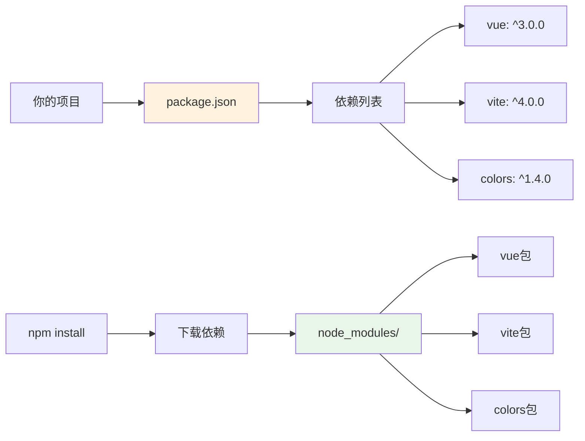
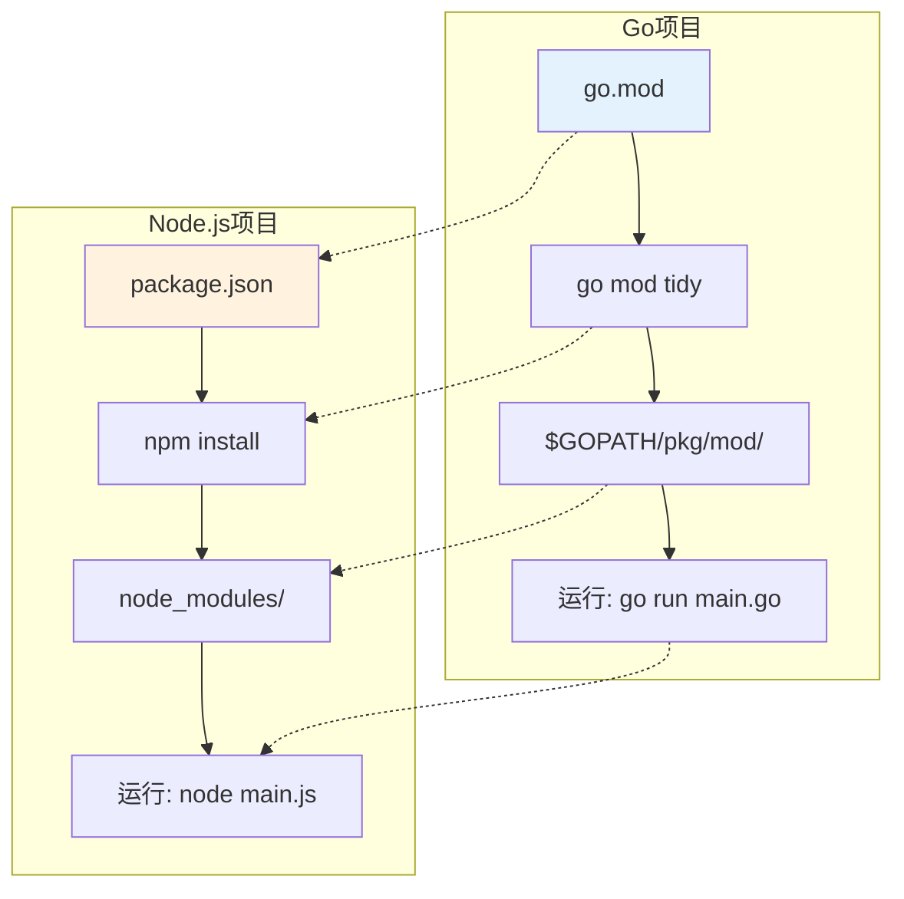
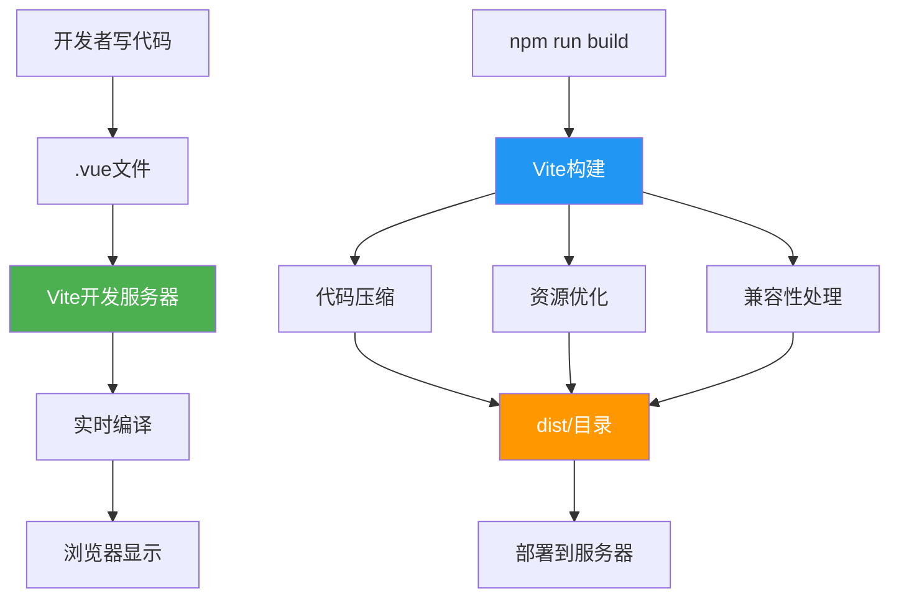
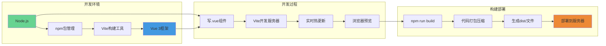

# Node.js 基础教程

### 浏览器中的JavaScript
```javascript
// 浏览器环境
window.alert('Hello');        // 有window对象
document.getElementById();    // 可以操作DOM
localStorage.setItem();       // 浏览器API
```

### Node.js中的JavaScript
```javascript
// Node.js环境
console.log('Hello');         // 没有window对象
process.version;              // 有process全局对象
require('fs');                // 可以读写文件
```

## 4. Node.js核心概念

### 4.1 全局对象
```javascript
console.log('当前Node版本:', process.version);
console.log('当前系统:', process.platform);
console.log('当前目录:', __dirname);
console.log('当前文件:', __filename);
```

### 4.2 模块系统（类比Go的import）
```javascript
// Go语言
import "fmt"
import "os"

// Node.js
const fs = require('fs');      // 文件系统
const path = require('path');  // 路径处理
const os = require('os');      // 操作系统信息
```

### 4.3 异步编程
```javascript
// 读取文件（异步）
const fs = require('fs');
fs.readFile('README.md', 'utf8', (err, data) => {
  if (err) {
    console.error('出错了:', err);
  } else {
    console.log('文件内容:', data);
  }
});
```

## 5. npm包管理系统

### 5.1 什么是包(Package)？
- 包就是别人写好的JavaScript代码库
- 类似Go的第三方模块，可以直接使用
- 避免重复造轮子



### 5.2 类比Go语言
| Go | Node.js | 说明 |
|---|---|---|
| `go.mod` | `package.json` | 项目配置文件 |
| `go.sum` | `package-lock.json` | 依赖版本锁定 |
| `go mod tidy` | `npm install` | 下载依赖 |
| `$GOPATH/pkg/mod` | `node_modules/` | 依赖存储目录 |



### 5.3 package.json 文件解释
```json
{
  "name": "learnvue",           // 项目名称
  "version": "1.0.0",           // 版本号
  "description": "学习vue3",     // 项目描述
  "main": "index.js",           // 入口文件
  "scripts": {                  // 脚本命令
    "start": "node index.js",
    "dev": "vite",
    "build": "vite build"
  },
  "dependencies": {             // 运行时依赖
    "vue": "^3.0.0"
  },
  "devDependencies": {          // 开发时依赖
    "vite": "^4.0.0"
  }
}
```

## 6. 常用npm命令

### 6.1 项目初始化
```bash
npm init                 # 交互式创建package.json
npm init -y             # 使用默认设置创建package.json
```

### 6.2 安装包
```bash
npm install vue         # 安装vue包（添加到dependencies）
npm install vite -D     # 安装为开发依赖（devDependencies）
npm install            # 根据package.json安装所有依赖
```

### 6.3 运行脚本
```bash
npm run dev            # 运行package.json中scripts.dev定义的命令
npm start              # 运行package.json中scripts.start定义的命令
npm run build          # 运行构建命令
```

## 7. 重要文件和目录

### 7.1 不要提交到Git的文件
```gitignore
node_modules/          # 依赖包目录，文件很多很大
package-lock.json      # 有争议，一般建议提交
```

### 7.2 为什么node_modules不提交Git？
- **文件数量巨大**: 一个简单项目可能有几千个文件
- **可重新生成**: 通过`npm install`可以重新下载
- **平台差异**: 不同操作系统可能需要不同的编译版本

## 8. Node.js在Vue开发中的作用



### 8.1 开发阶段
- **Vite开发服务器**: 提供热更新、实时编译
- **代码转换**: 将.vue文件转换为浏览器可识别的JavaScript
- **模块打包**: 将多个文件打包成少数几个文件

### 8.2 构建阶段  
- **代码压缩**: 减小文件体积
- **资源优化**: 图片压缩、CSS提取
- **兼容性处理**: 转换新语法为老浏览器支持的语法

## 9. 实践练习

### 练习1: 创建第一个Node.js程序
```bash
# 创建文件
echo 'console.log("Hello Node.js!");' > hello.js
# 运行程序
node hello.js
```

### 练习2: 使用第三方包
```bash
# 安装colors包（用于彩色输出）
npm install colors
```

```javascript
// 创建demo.js文件
const colors = require('colors');
console.log('这是红色文字'.red);
console.log('这是绿色文字'.green);
console.log('这是彩虹文字'.rainbow);
```

```bash
# 运行
node demo.js
```

## 10. 现代前端开发完整流程

