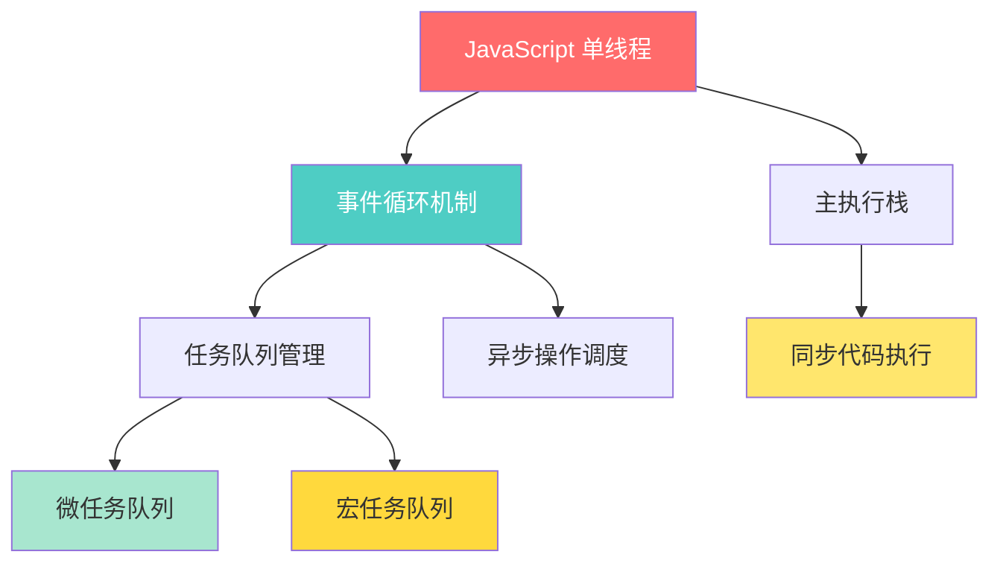
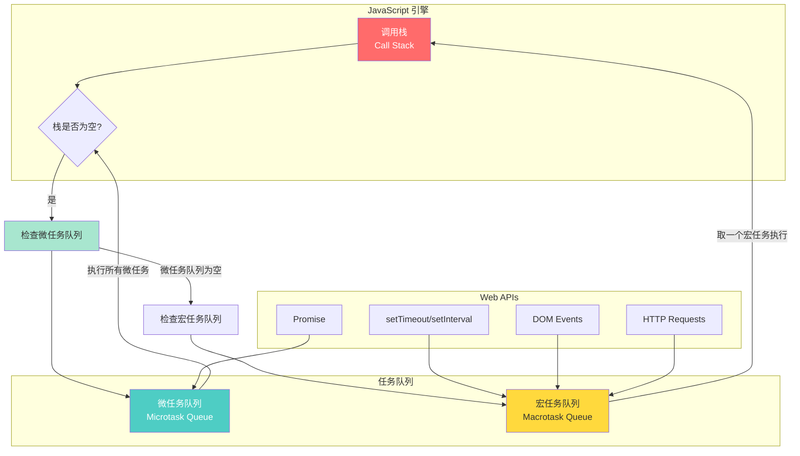
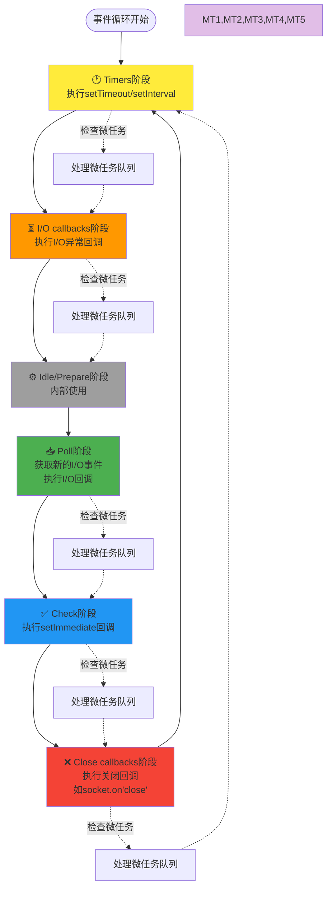

# JavaScript 事件循环与异步执行机制完整分析

本文深度分析JavaScript的单线程执行机制、事件循环原理，以及浏览器和Node.js环境下的异步执行模型差异。

## 核心概念速览

### JavaScript的单线程本质

JavaScript 是**单线程语言**，但通过**事件循环（Event Loop）**机制实现了非阻塞的异步执行。



## 浏览器环境的事件循环

### 执行栈与任务队列



### 微任务 vs 宏任务

#### 微任务（Microtasks）
- **Promise.then/catch/finally**
- **queueMicrotask()**
- **MutationObserver**
- **process.nextTick**（Node.js）

#### 宏任务（Macrotasks）
- **setTimeout/setInterval**
- **setImmediate**（Node.js）
- **I/O操作**
- **UI渲染**
- **用户交互事件**

### 执行优先级规则

```javascript
'use strict';

console.log('=== 执行顺序测试 ===');

// 1. 同步代码
console.log('1. 同步代码');

// 2. 宏任务
setTimeout(() => {
    console.log('4. setTimeout(宏任务)');
}, 0);

// 3. 微任务
Promise.resolve().then(() => {
    console.log('3. Promise.then(微任务)');
});

// 4. 同步代码
console.log('2. 同步代码结束');

// 输出顺序：
// 1. 同步代码
// 2. 同步代码结束  
// 3. Promise.then(微任务)
// 4. setTimeout(宏任务)
```

### 复杂执行顺序示例

```javascript
'use strict';

async function complexExample() {
    console.log('1. 函数开始');
    
    // 宏任务1
    setTimeout(() => {
        console.log('7. setTimeout 1');
        
        // 嵌套微任务
        Promise.resolve().then(() => {
            console.log('8. 嵌套Promise');
        });
    }, 0);
    
    // 微任务1
    Promise.resolve().then(() => {
        console.log('4. Promise 1');
        
        // 微任务中的微任务
        return Promise.resolve();
    }).then(() => {
        console.log('5. Promise 2');
    });
    
    // 宏任务2
    setTimeout(() => {
        console.log('9. setTimeout 2');
    }, 0);
    
    // 微任务2
    queueMicrotask(() => {
        console.log('6. queueMicrotask');
    });
    
    console.log('2. 函数中间');
    
    // await 创建微任务
    await Promise.resolve();
    console.log('3. await 后');
}

complexExample();

// 执行顺序：
// 1. 函数开始
// 2. 函数中间
// 3. await 后
// 4. Promise 1
// 5. Promise 2
// 6. queueMicrotask
// 7. setTimeout 1
// 8. 嵌套Promise
// 9. setTimeout 2
```

## Node.js 环境的事件循环

### Node.js 事件循环的6个阶段



### Node.js 异步操作分类

```javascript
'use strict';

// 1. Timer 类：setTimeout/setInterval
setTimeout(() => {
    console.log('setTimeout - Timers阶段');
}, 0);

// 2. I/O 类：文件操作、网络请求
const fs = require('fs');
fs.readFile('package.json', (err, data) => {
    console.log('fs.readFile - Poll阶段');
});

// 3. setImmediate：Check阶段
setImmediate(() => {
    console.log('setImmediate - Check阶段');
});

// 4. process.nextTick：优先级最高的微任务
process.nextTick(() => {
    console.log('process.nextTick - 微任务');
});

// 5. Promise：普通微任务
Promise.resolve().then(() => {
    console.log('Promise.then - 微任务');
});

console.log('同步代码');

// Node.js 执行顺序：
// 同步代码
// process.nextTick - 微任务 （最高优先级）
// Promise.then - 微任务
// setTimeout - Timers阶段
// setImmediate - Check阶段
// fs.readFile - Poll阶段
```

### Node.js 微任务优先级

```javascript
'use strict';

// Node.js 中的微任务优先级：
// 1. process.nextTick (最高)
// 2. Promise.then/catch/finally
// 3. queueMicrotask

console.log('开始');

Promise.resolve().then(() => {
    console.log('Promise 1');
    
    process.nextTick(() => {
        console.log('嵌套 nextTick');
    });
    
    return Promise.resolve();
}).then(() => {
    console.log('Promise 2');
});

process.nextTick(() => {
    console.log('nextTick 1');
    
    Promise.resolve().then(() => {
        console.log('nextTick中的Promise');
    });
});

queueMicrotask(() => {
    console.log('queueMicrotask');
});

process.nextTick(() => {
    console.log('nextTick 2');
});

console.log('结束');

// 输出顺序：
// 开始
// 结束
// nextTick 1
// nextTick 2
// Promise 1
// queueMicrotask
// nextTick中的Promise
// 嵌套 nextTick
// Promise 2
```

## 浏览器 vs Node.js 差异对比

### 关键差异总结

| 特性 | 浏览器 | Node.js |
|------|--------|---------|
| **事件循环结构** | 简单的宏任务+微任务循环 | 6阶段循环 + 微任务检查 |
| **微任务优先级** | 统一优先级 | process.nextTick > Promise |
| **定时器精度** | 4ms最小间隔 | 1ms最小间隔 |
| **setImmediate** | 不支持 | Check阶段执行 |
| **UI渲染** | 在事件循环中 | 无UI渲染 |

### 相同代码不同结果示例

```javascript
'use strict';

// 这段代码在浏览器和Node.js中可能有不同结果

setTimeout(() => console.log('setTimeout1'), 0);
setImmediate(() => console.log('setImmediate1')); // Node.js only

Promise.resolve().then(() => {
    console.log('Promise1');
    setTimeout(() => console.log('setTimeout2'), 0);
});

process.nextTick(() => console.log('nextTick1')); // Node.js only

console.log('sync');

// 浏览器结果（忽略不支持的API）：
// sync → Promise1 → setTimeout1 → setTimeout2

// Node.js结果：
// sync → nextTick1 → Promise1 → setImmediate1 → setTimeout1 → setTimeout2
```

## 实际应用场景

### 1. 避免阻塞UI的大计算

```javascript
'use strict';

// ❌ 错误：阻塞UI
function heavyComputation(n) {
    let result = 0;
    // 大量计算，会阻塞UI
    for (let i = 0; i < n; i++) {
        result += Math.sqrt(i);
    }
    return result;
}

// ✅ 正确：分片执行
async function heavyComputationAsync(n, chunkSize = 100000) {
    let result = 0;
    
    for (let i = 0; i < n; i += chunkSize) {
        const end = Math.min(i + chunkSize, n);
        
        // 处理一小块数据
        for (let j = i; j < end; j++) {
            result += Math.sqrt(j);
        }
        
        // 让出控制权，允许UI更新
        await new Promise(resolve => setTimeout(resolve, 0));
        
        // 更新进度
        console.log(`进度: ${((end / n) * 100).toFixed(1)}%`);
    }
    
    return result;
}

// 使用示例
heavyComputationAsync(10000000).then(result => {
    console.log('计算完成:', result);
});
```

### 2. 控制异步操作执行顺序

```javascript
'use strict';

// 需求：确保某些操作在下一个事件循环执行
class DataProcessor {
    constructor() {
        this.data = [];
        this.listeners = [];
    }
    
    addData(item) {
        this.data.push(item);
        
        // 使用微任务确保所有同步操作完成后再通知
        Promise.resolve().then(() => {
            this.notifyListeners(item);
        });
    }
    
    // 或使用宏任务延迟到下一轮事件循环
    addDataDelayed(item) {
        this.data.push(item);
        
        setTimeout(() => {
            this.notifyListeners(item);
        }, 0);
    }
    
    notifyListeners(item) {
        this.listeners.forEach(listener => listener(item));
    }
    
    onDataAdded(callback) {
        this.listeners.push(callback);
    }
}

const processor = new DataProcessor();

processor.onDataAdded(item => {
    console.log('收到数据:', item);
});

// 批量添加数据
processor.addData('item1');
processor.addData('item2');
processor.addData('item3');

console.log('批量添加完成');
// 输出顺序：
// 批量添加完成
// 收到数据: item1
// 收到数据: item2  
// 收到数据: item3
```

### 3. Promise与setTimeout的配合

```javascript
'use strict';

// 实现一个带超时的Promise
function withTimeout(promise, timeoutMs) {
    return Promise.race([
        promise,
        new Promise((_, reject) => {
            setTimeout(() => {
                reject(new Error(`操作超时: ${timeoutMs}ms`));
            }, timeoutMs);
        })
    ]);
}

// 使用示例
async function fetchWithTimeout() {
    try {
        const data = await withTimeout(
            fetch('/api/data').then(res => res.json()),
            5000 // 5秒超时
        );
        console.log('获取数据成功:', data);
    } catch (error) {
        console.error('获取数据失败:', error.message);
    }
}
```

### 4. 实现防抖和节流

```javascript
'use strict';

// 防抖：延迟执行，重复调用会重置计时器
function debounce(func, delay) {
    let timeoutId;
    return function(...args) {
        clearTimeout(timeoutId);
        timeoutId = setTimeout(() => func.apply(this, args), delay);
    };
}

// 节流：限制执行频率
function throttle(func, interval) {
    let lastTime = 0;
    return function(...args) {
        const now = Date.now();
        if (now - lastTime >= interval) {
            lastTime = now;
            func.apply(this, args);
        }
    };
}

// 使用示例
const expensiveOperation = () => {
    console.log('执行昂贵操作:', Date.now());
};

const debouncedOp = debounce(expensiveOperation, 1000);
const throttledOp = throttle(expensiveOperation, 1000);

// 测试防抖
debouncedOp(); // 不会立即执行
debouncedOp(); // 重置计时器
debouncedOp(); // 1秒后执行

// 测试节流
for (let i = 0; i < 10; i++) {
    setTimeout(() => throttledOp(), i * 100); // 每100ms调用一次，但最多1秒执行一次
}
```

## 调试技巧与最佳实践

### 1. 可视化事件循环

```javascript
'use strict';

// 用于调试的事件循环可视化工具
class EventLoopDebugger {
    static log(type, message) {
        const timestamp = Date.now();
        console.log(`[${timestamp}] ${type}: ${message}`);
    }
    
    static sync(message) {
        this.log('SYNC', message);
    }
    
    static micro(message) {
        Promise.resolve().then(() => {
            this.log('MICRO', message);
        });
    }
    
    static macro(message, delay = 0) {
        setTimeout(() => {
            this.log('MACRO', message);
        }, delay);
    }
}

// 使用示例
EventLoopDebugger.sync('开始');
EventLoopDebugger.micro('微任务1');
EventLoopDebugger.macro('宏任务1');
EventLoopDebugger.sync('结束');
EventLoopDebugger.micro('微任务2');
```

### 2. 性能监控

```javascript
'use strict';

// 监控事件循环阻塞
class EventLoopMonitor {
    constructor(threshold = 100) { // 100ms阈值
        this.threshold = threshold;
        this.monitoring = false;
    }
    
    start() {
        if (this.monitoring) return;
        
        this.monitoring = true;
        this.check();
    }
    
    stop() {
        this.monitoring = false;
    }
    
    check() {
        if (!this.monitoring) return;
        
        const start = Date.now();
        
        setTimeout(() => {
            const delay = Date.now() - start;
            
            if (delay > this.threshold) {
                console.warn(`事件循环阻塞 ${delay}ms (阈值: ${this.threshold}ms)`);
            }
            
            this.check(); // 继续监控
        }, 0);
    }
}

// 使用示例
const monitor = new EventLoopMonitor(50);
monitor.start();

// 模拟阻塞操作
setTimeout(() => {
    const start = Date.now();
    while (Date.now() - start < 200) {
        // 阻塞200ms
    }
}, 1000);
```

## 深度理解：与其他语言对比

### 与 Go 语言协程对比

```javascript
// JavaScript 异步模型
'use strict';

async function jsAsyncModel() {
    console.log('JS: 开始异步操作');
    
    // 单线程，通过事件循环调度
    const result1 = await fetch('/api/data1');
    const result2 = await fetch('/api/data2');
    
    console.log('JS: 异步操作完成');
}
```

```go
// Go 协程模型（对比参考）
func goCoroutineModel() {
    fmt.Println("Go: 开始协程操作")
    
    // 多线程，通过调度器管理协程
    var wg sync.WaitGroup
    wg.Add(2)
    
    go func() {
        defer wg.Done()
        // 并发执行
        fetchData("/api/data1")
    }()
    
    go func() {
        defer wg.Done()
        // 并发执行
        fetchData("/api/data2")
    }()
    
    wg.Wait()
    fmt.Println("Go: 协程操作完成")
}
```

**核心差异**：
- **JavaScript**: 单线程 + 事件循环，异步非阻塞
- **Go**: 多线程 + 协程调度，并发执行
- **PHP**: 传统同步阻塞模型（除非使用Swoole等扩展）
- **C**: 手动线程管理或回调机制

### 与 PHP 的对比

```javascript
// JavaScript 异步处理
'use strict';

async function processMultipleRequests() {
    console.log('开始处理多个请求');
    
    // 并发执行，不阻塞
    const promises = [
        fetch('/api/user/1'),
        fetch('/api/user/2'), 
        fetch('/api/user/3')
    ];
    
    const results = await Promise.all(promises);
    console.log('所有请求完成');
    
    return results;
}
```

```php
<?php
// PHP 传统同步处理（对比参考）
function processMultipleRequests() {
    echo "开始处理多个请求\n";
    
    // 串行执行，每个都会阻塞
    $result1 = file_get_contents('/api/user/1');
    $result2 = file_get_contents('/api/user/2');
    $result3 = file_get_contents('/api/user/3');
    
    echo "所有请求完成\n";
    
    return [$result1, $result2, $result3];
}
?>
```

## 常见误区与陷阱

### 1. 误解setTimeout(0)

```javascript
'use strict';

console.log('开始');

setTimeout(() => {
    console.log('setTimeout 0');
}, 0);

Promise.resolve().then(() => {
    console.log('Promise');
});

console.log('结束');

// 很多人以为setTimeout(0)会立即执行
// 实际输出：开始 → 结束 → Promise → setTimeout 0
// 原因：微任务优先级高于宏任务
```

### 2. async/await 的执行时机

```javascript
'use strict';

async function test() {
    console.log('async 函数开始');
    
    await Promise.resolve();
    
    console.log('await 后面的代码');
}

console.log('同步代码1');
test();
console.log('同步代码2');

// 输出：
// 同步代码1
// async 函数开始  
// 同步代码2
// await 后面的代码

// 解释：await会让函数暂停，await后面的代码会作为微任务执行
```

### 3. 事件循环阻塞

```javascript
'use strict';

// ❌ 错误：这会阻塞事件循环
function blockingOperation() {
    const start = Date.now();
    while (Date.now() - start < 5000) {
        // 阻塞5秒
    }
    console.log('阻塞操作完成');
}

// ✅ 正确：分解为非阻塞操作
async function nonBlockingOperation() {
    const total = 5000;
    const chunkSize = 100;
    
    for (let i = 0; i < total; i += chunkSize) {
        // 处理一小块
        const start = Date.now();
        while (Date.now() - start < chunkSize) {
            // 工作100ms
        }
        
        // 让出控制权
        await new Promise(resolve => setTimeout(resolve, 0));
        
        console.log(`进度: ${((i + chunkSize) / total * 100).toFixed(1)}%`);
    }
    
    console.log('非阻塞操作完成');
}
```

## 总结

### 核心要点

1. **JavaScript 是单线程的**，但通过事件循环实现异步非阻塞
2. **微任务优先级高于宏任务**，理解执行顺序很重要
3. **浏览器和Node.js的事件循环有差异**，需要分别理解
4. **合理使用异步机制**，避免阻塞事件循环
5. **掌握调试技巧**，能够分析复杂的异步执行流程

### 实践建议

- **使用严格模式**：`'use strict'` 避免潜在问题
- **优先使用Promise/async-await**：比回调更清晰
- **注意执行顺序**：微任务 → 宏任务 → UI渲染
- **避免长时间阻塞**：大计算分片执行
- **善用调试工具**：Chrome DevTools的Performance面板

### 与其他语言的优势

相比Go的协程、PHP的同步模型、C的手动线程管理：

- **学习成本低**：单线程模型相对简单
- **内存效率高**：无需为每个连接创建线程
- **适合I/O密集型**：网络请求、文件操作等
- **生态丰富**：Promise、async/await等现代语法

JavaScript的事件循环机制是其异步编程的核心，深入理解这个机制对于写出高性能的JavaScript代码至关重要，特别是在Vue、React等现代前端框架的开发中。