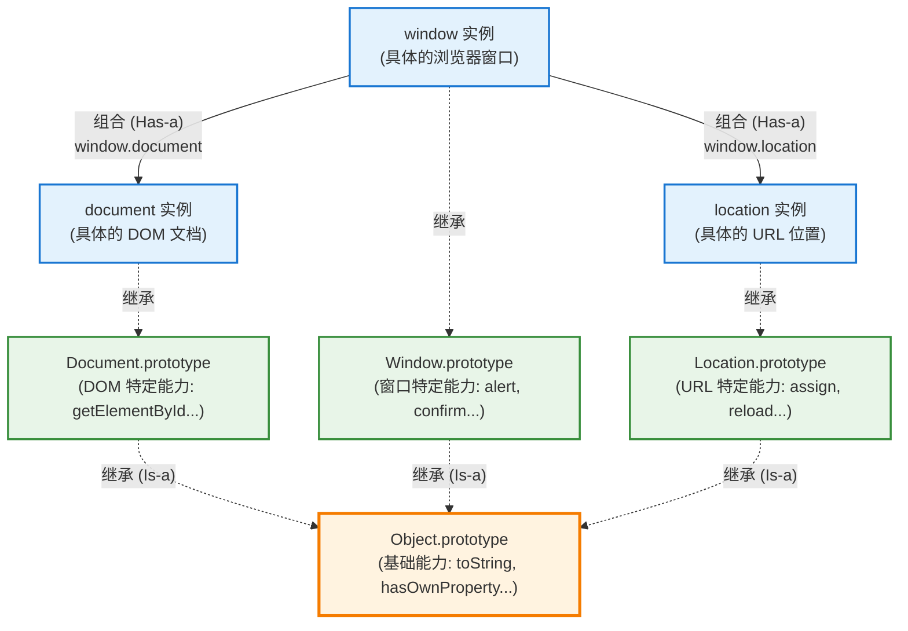

# JavaScript 宿主环境对象与继承关系深度分析

宿主环境提供的顶级对象（如 `window`、`global`、`process`）与标准 JavaScript 对象的继承关系分析。

## 核心发现：宿主环境对象都继承了 Object！

**简短答案**：
- `window` (浏览器) ✅ 继承 Object.prototype
- `global` (Node.js) ✅ 继承 Object.prototype  
- `process` (Node.js) ✅ 继承 Object.prototype

但它们的原型链比普通对象更复杂，提供了环境特定的功能。

## 浏览器环境：window 对象

### window 对象及其常用子对象

```mermaid
graph TD
    %% window 主对象
    WindowInstance["window 对象<br/>(浏览器全局对象)"]
    
    %% window 的直接子对象
    Document["document<br/>(DOM 文档对象)"]
    Location["location<br/>(URL 位置对象)"]
    Navigator["navigator<br/>(浏览器信息)"]
    History["history<br/>(浏览历史)"]
    Screen["screen<br/>(屏幕信息)"]
    LocalStorage["localStorage<br/>(本地存储)"]
    SessionStorage["sessionStorage<br/>(会话存储)"]
    Console["console<br/>(控制台)"]
    
    %% document 的子对象
    DocumentElement["document.documentElement<br/>(html 元素)"]
    DocumentBody["document.body<br/>(body 元素)"]
    DocumentHead["document.head<br/>(head 元素)"]
    
    %% location 的重要属性
    LocationHref["location.href<br/>(完整 URL)"]
    LocationOrigin["location.origin<br/>(源)"]
    LocationSearch["location.search<br/>(查询参数)"]
    
    %% 属性包含关系 (实线箭头表示"拥有"关系)
    WindowInstance -->|"window.document"| Document
    WindowInstance -->|"window.location"| Location
    WindowInstance -->|"window.navigator"| Navigator
    WindowInstance -->|"window.history"| History
    WindowInstance -->|"window.screen"| Screen
    WindowInstance -->|"window.localStorage"| LocalStorage
    WindowInstance -->|"window.sessionStorage"| SessionStorage
    WindowInstance -->|"window.console"| Console
    
    Document -->|"document.documentElement"| DocumentElement
    Document -->|"document.body"| DocumentBody
    Document -->|"document.head"| DocumentHead
    
    Location -->|"location.href"| LocationHref
    Location -->|"location.origin"| LocationOrigin
    Location -->|"location.search"| LocationSearch
    
    %% 原型链结构
    WindowPrototype["Window.prototype<br/>{alert, confirm, ...}"]
    WindowProperties["WindowProperties.prototype"]
    EventTarget["EventTarget.prototype<br/>{addEventListener, ...}"]
    ObjectPrototype["Object.prototype<br/>{toString, hasOwnProperty, ...}"]
    Null["null"]
    
    %% 原型链连接
    WindowInstance -.->|"__proto__"| WindowPrototype
    WindowPrototype -.->|"__proto__"| WindowProperties
    WindowProperties -.->|"__proto__"| EventTarget
    EventTarget -.->|"__proto__"| ObjectPrototype
    ObjectPrototype -.->|"__proto__"| Null
    
    %% 子对象也都继承 Object
    Document -.->|"原型链最终到达"| ObjectPrototype
    Location -.->|"原型链最终到达"| ObjectPrototype
    Navigator -.->|"原型链最终到达"| ObjectPrototype
    Console -.->|"原型链最终到达"| ObjectPrototype
    
    %% 样式
    classDef hostObject fill:#fff3e0,stroke:#f57c00,stroke-width:3px
    classDef subObject fill:#e8eaf6,stroke:#3f51b5,stroke-width:2px
    classDef property fill:#f3e5f5,stroke:#9c27b0,stroke-width:1px
    classDef browserPrototype fill:#e8f5e8,stroke:#388e3c,stroke-width:2px
    classDef standardPrototype fill:#e3f2fd,stroke:#1976d2,stroke-width:2px
    classDef terminal fill:#ffebee,stroke:#d32f2f,stroke-width:2px
    
    class WindowInstance hostObject
    class Document,Location,Navigator,History,Screen,LocalStorage,SessionStorage,Console subObject
    class DocumentElement,DocumentBody,DocumentHead,LocationHref,LocationOrigin,LocationSearch property
    class WindowPrototype,WindowProperties,EventTarget browserPrototype
    class ObjectPrototype standardPrototype
    class Null terminal
```



**图例说明**：
- `-->` **实线箭头**：表示属性包含关系 (如 `window.document`)
- `-.->` **虚线箭头**：表示原型链继承关系 (如 `window.__proto__`)

### window 对象的常用子对象列表

| 子对象 | 类型 | 主要用途 | 继承 Object |
|--------|------|----------|------------|
| **document** | Document | DOM 操作、元素查找 | ✅ |
| **location** | Location | URL 操作、页面跳转 | ✅ |
| **navigator** | Navigator | 浏览器信息、用户代理 | ✅ |
| **history** | History | 浏览历史操作 | ✅ |
| **screen** | Screen | 屏幕尺寸信息 | ✅ |
| **localStorage** | Storage | 持久化本地存储 | ✅ |
| **sessionStorage** | Storage | 会话级存储 | ✅ |
| **console** | Console | 调试输出 | ✅ |
| **XMLHttpRequest** | Constructor | HTTP 请求构造函数 | ✅ |
| **fetch** | Function | 现代 HTTP 请求 | ✅ |

### 验证 window 继承 Object

```javascript
// 在浏览器控制台中测试
console.log('=== window 对象继承验证 ===');

// 1. 类型检测
console.log(typeof window);                              // "object"

// 2. 原型链检测  
console.log(Object.prototype.isPrototypeOf(window));     // true ✅

// 3. 继承的 Object 方法可用
console.log(window.hasOwnProperty('document'));          // true
console.log(window.toString());                          // "[object Window]"

// 4. 完整类型检测
console.log(Object.prototype.toString.call(window));     // "[object Window]"
```

## Node.js 环境：global 和 process

### process 对象及其常用子对象

```mermaid
graph TD
    %% process 主对象
    ProcessInstance["process 对象<br/>(Node.js 进程实例)"]
    
    %% process 的直接子对象/属性
    ProcessEnv["process.env<br/>(环境变量)"]
    ProcessArgv["process.argv<br/>(命令行参数)"]
    ProcessStdout["process.stdout<br/>(标准输出流)"]
    ProcessStderr["process.stderr<br/>(错误输出流)"]
    ProcessStdin["process.stdin<br/>(标准输入流)"]
    ProcessVersions["process.versions<br/>(版本信息)"]
    ProcessMemoryUsage["process.memoryUsage<br/>(内存使用情况)"]
    
    %% global 对象及其子对象
    GlobalInstance["global 对象<br/>(Node.js 全局对象)"]
    GlobalProcess["global.process<br/>(进程对象引用)"]
    GlobalBuffer["global.Buffer<br/>(缓冲区构造函数)"]
    GlobalConsole["global.console<br/>(控制台)"]
    GlobalSetTimeout["global.setTimeout<br/>(定时器)"]
    GlobalRequire["global.require<br/>(模块加载)"]
    
    %% 内置模块相关 (通过 require 获取)
    FS["fs 模块<br/>(文件系统)"]
    Path["path 模块<br/>(路径操作)"]
    HTTP["http 模块<br/>(HTTP 服务)"]
    OS["os 模块<br/>(操作系统)"]
    
    %% 属性包含关系 (实线箭头表示"拥有"关系)
    ProcessInstance -->|"process.env"| ProcessEnv
    ProcessInstance -->|"process.argv"| ProcessArgv
    ProcessInstance -->|"process.stdout"| ProcessStdout
    ProcessInstance -->|"process.stderr"| ProcessStderr
    ProcessInstance -->|"process.stdin"| ProcessStdin
    ProcessInstance -->|"process.versions"| ProcessVersions
    ProcessInstance -->|"process.memoryUsage"| ProcessMemoryUsage
    
    GlobalInstance -->|"global.process"| GlobalProcess
    GlobalInstance -->|"global.Buffer"| GlobalBuffer
    GlobalInstance -->|"global.console"| GlobalConsole
    GlobalInstance -->|"global.setTimeout"| GlobalSetTimeout
    GlobalInstance -->|"global.require"| GlobalRequire
    
    GlobalRequire -->|"require('fs')"| FS
    GlobalRequire -->|"require('path')"| Path
    GlobalRequire -->|"require('http')"| HTTP
    GlobalRequire -->|"require('os')"| OS
    
    %% 原型链结构
    ProcessPrototype["Process.prototype<br/>{exit, cwd, kill, ...}"]
    EventEmitter["EventEmitter.prototype<br/>{on, emit, removeListener, ...}"]
    ObjectPrototype["Object.prototype<br/>{toString, hasOwnProperty, ...}"]
    Null["null"]
    
    %% 原型链连接
    ProcessInstance -.->|"__proto__"| ProcessPrototype
    ProcessPrototype -.->|"__proto__"| EventEmitter
    EventEmitter -.->|"__proto__"| ObjectPrototype
    ObjectPrototype -.->|"__proto__"| Null
    
    %% global 的原型链 (更简单)
    GlobalInstance -.->|"__proto__"| ObjectPrototype
    
    %% 子对象也都继承 Object
    ProcessEnv -.->|"原型链最终到达"| ObjectPrototype
    ProcessStdout -.->|"原型链最终到达"| ObjectPrototype
    GlobalBuffer -.->|"原型链最终到达"| ObjectPrototype
    GlobalConsole -.->|"原型链最终到达"| ObjectPrototype
    
    %% 样式
    classDef hostObject fill:#fff3e0,stroke:#f57c00,stroke-width:3px
    classDef subObject fill:#e8eaf6,stroke:#3f51b5,stroke-width:2px
    classDef module fill:#e0f2f1,stroke:#00695c,stroke-width:2px
    classDef nodePrototype fill:#e8f5e8,stroke:#388e3c,stroke-width:2px
    classDef standardPrototype fill:#e3f2fd,stroke:#1976d2,stroke-width:2px
    classDef terminal fill:#ffebee,stroke:#d32f2f,stroke-width:2px
    
    class ProcessInstance,GlobalInstance hostObject
    class ProcessEnv,ProcessArgv,ProcessStdout,ProcessStderr,ProcessStdin,ProcessVersions,ProcessMemoryUsage,GlobalProcess,GlobalBuffer,GlobalConsole,GlobalSetTimeout,GlobalRequire subObject
    class FS,Path,HTTP,OS module
    class ProcessPrototype,EventEmitter nodePrototype
    class ObjectPrototype standardPrototype
    class Null terminal
```



**图例说明**：
- `-->` **实线箭头**：表示属性包含关系 (如 `process.env`)
- `-.->` **虚线箭头**：表示原型链继承关系 (如 `process.__proto__`)

### Node.js 对象的常用子对象列表

#### process 对象的重要属性/方法

| 子对象/属性 | 类型 | 主要用途 | 继承 Object |
|-------------|------|----------|------------|
| **process.env** | Object | 环境变量访问 | ✅ |
| **process.argv** | Array | 命令行参数 | ✅ (Array → Object) |
| **process.stdout** | WriteStream | 标准输出流 | ✅ |
| **process.stderr** | WriteStream | 错误输出流 | ✅ |
| **process.stdin** | ReadStream | 标准输入流 | ✅ |
| **process.versions** | Object | Node.js/V8 版本信息 | ✅ |
| **process.cwd()** | Function | 获取当前工作目录 | ✅ |
| **process.exit()** | Function | 退出进程 | ✅ |

#### global 对象的重要属性

| 子对象/属性 | 类型 | 主要用途 | 继承 Object |
|-------------|------|----------|------------|
| **global.process** | Process | 进程对象引用 | ✅ |
| **global.Buffer** | Constructor | 二进制数据处理 | ✅ |
| **global.console** | Console | 控制台输出 | ✅ |
| **global.setTimeout** | Function | 定时器 | ✅ |
| **global.require** | Function | 模块加载器 | ✅ |
| **global.__dirname** | String | 当前目录路径 | ❌ (原始字符串) |
| **global.__filename** | String | 当前文件路径 | ❌ (原始字符串) |

#### 常用内置模块 (通过 require 获取)

| 模块 | 主要对象 | 用途 | 继承 Object |
|------|----------|------|------------|
| **fs** | FileSystem | 文件系统操作 | ✅ |
| **path** | Path | 路径字符串处理 | ✅ |
| **http** | HTTP | HTTP 服务器/客户端 | ✅ |
| **os** | OS | 操作系统信息 | ✅ |
| **util** | Util | 实用工具函数 | ✅ |
| **crypto** | Crypto | 加密功能 | ✅ |

### 验证子对象继承关系

```javascript
// 验证浏览器环境的子对象继承 (在浏览器控制台运行)
function testBrowserSubObjects() {
    console.log('=== 浏览器子对象继承验证 ===');
    
    // document 对象
    console.log('document 继承 Object:', Object.prototype.isPrototypeOf(document));
    console.log('document.toString():', document.toString());
    console.log('document.hasOwnProperty("body"):', document.hasOwnProperty('body'));
    
    // location 对象
    console.log('\nlocation 继承 Object:', Object.prototype.isPrototypeOf(location));
    console.log('location.toString():', location.toString());
    console.log('location.hasOwnProperty("href"):', location.hasOwnProperty('href'));
    
    // localStorage 对象
    console.log('\nlocalStorage 继承 Object:', Object.prototype.isPrototypeOf(localStorage));
    console.log('localStorage.toString():', localStorage.toString());
    
    // console 对象
    console.log('\nconsole 继承 Object:', Object.prototype.isPrototypeOf(console));
    console.log('console.toString():', console.toString());
}

// 验证 Node.js 环境的子对象继承 (在 Node.js 中运行)
function testNodeSubObjects() {
    console.log('=== Node.js 子对象继承验证 ===');
    
    // process.env 对象
    console.log('process.env 继承 Object:', Object.prototype.isPrototypeOf(process.env));
    console.log('process.env.toString():', process.env.toString());
    console.log('process.env.hasOwnProperty("NODE_ENV"):', process.env.hasOwnProperty('NODE_ENV'));
    
    // process.argv 数组
    console.log('\nprocess.argv 继承 Object:', Object.prototype.isPrototypeOf(process.argv));
    console.log('process.argv.toString():', process.argv.toString());
    console.log('process.argv 是数组:', Array.isArray(process.argv));
    
    // process.stdout 流对象
    console.log('\nprocess.stdout 继承 Object:', Object.prototype.isPrototypeOf(process.stdout));
    console.log('process.stdout 构造函数:', process.stdout.constructor.name);
    
    // Buffer 构造函数
    console.log('\nBuffer 继承 Object:', Object.prototype.isPrototypeOf(Buffer));
    console.log('Buffer.toString():', Buffer.toString());
    
    // Buffer 实例
    const buf = Buffer.from('hello');
    console.log('Buffer 实例继承 Object:', Object.prototype.isPrototypeOf(buf));
    console.log('Buffer 实例.toString():', buf.toString());
    
    // 内置模块对象
    const fs = require('fs');
    const path = require('path');
    
    console.log('\n=== 内置模块继承验证 ===');
    console.log('fs 模块继承 Object:', Object.prototype.isPrototypeOf(fs));
    console.log('path 模块继承 Object:', Object.prototype.isPrototypeOf(path));
    console.log('fs.toString():', fs.toString());
    console.log('path.toString():', path.toString());
}
```

## 关键发现

### 1. 都继承自 Object.prototype ✅
```javascript
// 所有宿主对象最终都继承 Object
Object.prototype.isPrototypeOf(window);   // true (浏览器)
Object.prototype.isPrototypeOf(global);   // true (Node.js) 
Object.prototype.isPrototypeOf(process);  // true (Node.js)
```

### 2. 拥有 Object 的基础能力 ✅
```javascript
// 可以使用 Object.prototype 上的方法
window.hasOwnProperty('document');     // 浏览器
global.hasOwnProperty('process');      // Node.js
process.hasOwnProperty('env');         // Node.js

// 都有 toString 方法
window.toString();    // "[object Window]"
process.toString();   // "[object process]"
```

### 3. 原型链层次对比

| 对象 | 原型链深度 | 路径 |
|------|------------|------|
| `{}` | 1层 | Object.prototype → null |
| `window` | 4-5层 | Window → WindowProperties → EventTarget → Object → null |
| `global` | 1层 | Object.prototype → null |
| `process` | 3层 | Process → EventEmitter → Object → null |

### 4. 环境特定功能

```javascript
// 浏览器特有
window.alert('Hello');           // 弹窗
window.location.href;            // URL操作
window.addEventListener();        // 事件监听

// Node.js 特有
process.exit(0);                 // 进程退出
process.env.NODE_ENV;            // 环境变量
process.on('exit', callback);    // 进程事件
```

## 总结

**答案：是的，所有宿主环境对象都继承了 Object！**

**继承关系**：
- ✅ 都最终继承自 `Object.prototype`
- ✅ 都拥有 `toString`、`hasOwnProperty` 等基础方法
- ✅ 都可以使用 `Object` 的静态方法进行操作

**特殊之处**：
- 🔗 原型链更复杂，中间有环境特定的原型层
- 🎯 提供宿主环境的专有功能和API
- 🏗️ 继承了事件系统（EventTarget/EventEmitter）

这种设计确保了：
1. **一致性** - 所有对象都有统一的基础行为
2. **扩展性** - 宿主环境可以添加特定功能  
3. **兼容性** - JavaScript 核心特性在任何环境都可用

这就是为什么你可以在任何环境中对任何对象调用 `.toString()` 或 `.hasOwnProperty()` 的原因！

## 设计模式深度分析：继承 + 组合的完美结合

宿主环境对象体现了面向对象设计中**继承 + 组合**的经典模式：

### 核心概念图解



### 两种关系的具体体现

#### 1. 继承关系 (Is-a) - 获得基础能力
```javascript
// document 是一个 Object - 拥有 Object 的所有基础能力
console.log(Object.prototype.isPrototypeOf(document));     // true
document.toString();                                        // "[object HTMLDocument]"
document.hasOwnProperty('body');                           // true

// location 是一个 Object - 拥有 Object 的所有基础能力  
console.log(Object.prototype.isPrototypeOf(location));     // true
location.toString();                                        // "https://example.com"
location.hasOwnProperty('href');                           // true

// 所有宿主对象都继承了统一的基础行为
[window, document, location, navigator].forEach(obj => {
    console.log(`${obj.constructor.name}.toString():`, obj.toString());
});
```

#### 2. 组合关系 (Has-a) - 模块化功能
```javascript
// window 拥有 document - 通过组合获得 DOM 操作能力
window.document.getElementById('myId');        // DOM 操作
window.document.createElement('div');          // 元素创建

// window 拥有 location - 通过组合获得 URL 操作能力
window.location.href = '/new-page';           // 页面跳转
window.location.reload();                     // 页面刷新

// window 拥有 navigator - 通过组合获得浏览器信息
window.navigator.userAgent;                  // 用户代理
window.navigator.language;                   // 语言信息
```

### 设计优势分析

#### 🎯 1. 模块化职责分离
```javascript
// 每个对象专注自己的核心职责
document.getElementById('myId');    // 专注 DOM 操作
location.href = '/page';           // 专注 URL 管理  
navigator.userAgent;               // 专注浏览器信息
history.pushState();               // 专注历史管理

// window 作为组合容器，统一提供访问入口
window.document.getElementById('myId');
window.location.href;
window.navigator.userAgent;
window.history.pushState();
```

#### 🔧 2. 统一的基础行为
```javascript
// 所有对象都有一致的 Object 基础能力
const hostObjects = [window, document, location, navigator, history];

hostObjects.forEach(obj => {
    // 统一的类型检测
    console.log(Object.prototype.toString.call(obj));
    
    // 统一的属性检测
    console.log(typeof obj.hasOwnProperty);    // "function"
    
    // 统一的原型链检测
    console.log(Object.prototype.isPrototypeOf(obj));  // true
});
```

#### ⚡ 3. 灵活的扩展性
```javascript
// 可以独立扩展特定对象的能力
Document.prototype.customDOMMethod = function() {
    return "Custom DOM functionality";
};

Location.prototype.customURLMethod = function() {
    return "Custom URL functionality";
};

// 扩展互不影响，保持模块独立性
console.log(document.customDOMMethod());       // 工作正常
console.log(location.customURLMethod());       // 工作正常
console.log(navigator.customDOMMethod);        // undefined (不受影响)
```

### Node.js 中的相同模式

Node.js 环境也采用了完全相同的设计模式：

```javascript
// 继承关系：所有对象都继承 Object
console.log(Object.prototype.isPrototypeOf(process));      // true
console.log(Object.prototype.isPrototypeOf(global));       // true

// 组合关系：global 组合了各种功能模块
global.process;         // 进程控制
global.Buffer;          // 二进制数据处理
global.console;         // 调试输出
global.setTimeout;      // 定时器

// 内置模块也遵循相同模式
const fs = require('fs');
const path = require('path');
console.log(Object.prototype.isPrototypeOf(fs));           // true (继承)
console.log(Object.prototype.isPrototypeOf(path));         // true (继承)
// 各模块可以被任意组合使用 (组合)
```

### 体现的设计原则

这种架构完美体现了面向对象设计的核心原则：

| 设计原则 | 在宿主环境中的体现 |
|----------|-------------------|
| **单一职责原则** | 每个对象专注单一功能：document(DOM)、location(URL)、navigator(浏览器信息) |
| **组合优于继承** | window 通过组合而非继承获得复杂功能 |
| **开放封闭原则** | 可扩展各对象能力，但不修改核心结构 |
| **里氏替换原则** | 所有对象都可以使用 Object 的方法，行为一致 |
| **依赖倒置原则** | 都依赖于 Object 抽象，而非具体实现 |

### 深度总结

**宿主环境对象 = 继承 + 组合的完美实践**

- **继承关系**: `document` 是一个 `Object` (Is-a关系) - 获得统一的基础能力
- **组合关系**: `window` 拥有一个 `document` (Has-a关系) - 获得模块化的专业功能

这种设计既保持了 JavaScript 对象模型的一致性（通过继承），又通过组合提供了丰富的功能模块，是面向对象架构设计的经典范例。这也完美解释了为什么在任何 JavaScript 环境中，你都可以放心地对任何对象调用基础方法的根本原因！