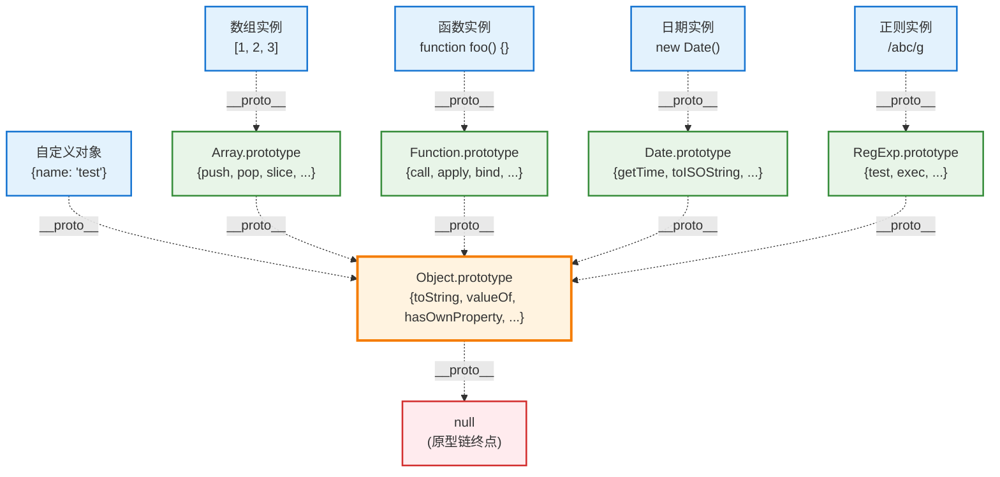

# JavaScript 原型链源头：Object 对象详解

Object 是 JavaScript 原型链的根源，几乎所有对象都直接或间接继承自 `Object.prototype`。

## Object 在原型链中的地位



## 继承了 Object 的内置对象

### 直接继承 Object.prototype 的对象
```javascript
// 1. 普通对象字面量
const obj = {};
console.log(obj.__proto__ === Object.prototype); // true

// 2. 使用 Object 构造函数
const obj2 = new Object();
console.log(obj2.__proto__ === Object.prototype); // true

// 3. 使用 Object.create()
const obj3 = Object.create(Object.prototype);
console.log(obj3.__proto__ === Object.prototype); // true
```

### 间接继承 Object.prototype 的内置对象

```javascript
// 数组
const arr = [];
console.log(arr.__proto__ === Array.prototype);              // true
console.log(Array.prototype.__proto__ === Object.prototype); // true

// 函数
function fn() {}
console.log(fn.__proto__ === Function.prototype);              // true
console.log(Function.prototype.__proto__ === Object.prototype); // true

// 日期
const date = new Date();
console.log(date.__proto__ === Date.prototype);              // true
console.log(Date.prototype.__proto__ === Object.prototype);  // true

// 正则表达式
const regex = /abc/;
console.log(regex.__proto__ === RegExp.prototype);              // true
console.log(RegExp.prototype.__proto__ === Object.prototype);  // true

// 错误对象
const error = new Error();
console.log(error.__proto__ === Error.prototype);              // true
console.log(Error.prototype.__proto__ === Object.prototype);  // true

// 字符串包装对象
const strObj = new String("hello");
console.log(strObj.__proto__ === String.prototype);              // true
console.log(String.prototype.__proto__ === Object.prototype);   // true

// 数字包装对象
const numObj = new Number(42);
console.log(numObj.__proto__ === Number.prototype);              // true
console.log(Number.prototype.__proto__ === Object.prototype);   // true

// 布尔包装对象
const boolObj = new Boolean(true);
console.log(boolObj.__proto__ === Boolean.prototype);              // true
console.log(Boolean.prototype.__proto__ === Object.prototype);    // true
```

## Object.prototype 提供的核心能力

### 1. 基础对象方法

```javascript
const obj = { name: "Alice", age: 25 };

// toString() - 对象的字符串表示
console.log(obj.toString()); // "[object Object]"

// valueOf() - 对象的原始值
console.log(obj.valueOf()); // { name: "Alice", age: 25 }

// hasOwnProperty() - 检查自有属性
console.log(obj.hasOwnProperty('name')); // true
console.log(obj.hasOwnProperty('toString')); // false (继承的)

// propertyIsEnumerable() - 检查属性是否可枚举
console.log(obj.propertyIsEnumerable('name')); // true

// isPrototypeOf() - 检查是否在原型链上
console.log(Object.prototype.isPrototypeOf(obj)); // true
```

### 2. Object 静态方法 (在构造函数上)

```javascript
const obj = { x: 1 };

// 属性描述符相关
console.log(Object.getOwnPropertyDescriptor(obj, 'x'));
// { value: 1, writable: true, enumerable: true, configurable: true }

// 定义属性
Object.defineProperty(obj, 'y', {
    value: 2,
    writable: false,
    enumerable: false,
    configurable: false
});

// 对象操作
console.log(Object.keys(obj));                    // ['x'] (可枚举属性)
console.log(Object.getOwnPropertyNames(obj));     // ['x', 'y'] (所有自有属性)
console.log(Object.values(obj));                  // [1] (可枚举属性值)
console.log(Object.entries(obj));                 // [['x', 1]] (可枚举键值对)

// 原型操作
console.log(Object.getPrototypeOf(obj) === Object.prototype); // true
```

### 3. 原型链操作

```javascript
const parent = { parentProp: "parent" };
const child = Object.create(parent);
child.childProp = "child";

// 检查原型关系
console.log(parent.isPrototypeOf(child)); // true
console.log(Object.prototype.isPrototypeOf(child)); // true
console.log(Object.prototype.isPrototypeOf(parent)); // true
```

## 实际应用示例

### 1. 重写 toString 方法
```javascript
function Person(name, age) {
    this.name = name;
    this.age = age;
}

// 重写继承自 Object.prototype 的 toString 方法
Person.prototype.toString = function() {
    return `Person(${this.name}, ${this.age})`;
};

const person = new Person("Alice", 25);
console.log(person.toString()); // "Person(Alice, 25)"
console.log(String(person));    // 自动调用 toString: "Person(Alice, 25)"
```

### 2. 利用 hasOwnProperty 进行安全遍历
```javascript
const obj = Object.create({ inheritedProp: "inherited" });
obj.ownProp1 = "own1";
obj.ownProp2 = "own2";

// 只遍历自有属性
for (let key in obj) {
    if (obj.hasOwnProperty(key)) {
        console.log(`${key}: ${obj[key]}`);
    }
}
// 输出:
// ownProp1: own1
// ownProp2: own2

// 现代替代方案
console.log(Object.keys(obj));           // ['ownProp1', 'ownProp2']
console.log(Object.entries(obj));        // [['ownProp1', 'own1'], ['ownProp2', 'own2']]
```

### 3. 类型检测的应用
```javascript
function getType(obj) {
    return Object.prototype.toString.call(obj);
}

console.log(getType([]));           // "[object Array]"
console.log(getType({}));           // "[object Object]"
console.log(getType(new Date()));   // "[object Date]"
console.log(getType(/abc/));        // "[object RegExp]"
console.log(getType(null));         // "[object Null]"
console.log(getType(undefined));    // "[object Undefined]"
console.log(getType(function(){})); // "[object Function]"

// 这是最准确的类型检测方法，比 typeof 更可靠
```

### 4. 对象合并和克隆
```javascript
// 浅拷贝
const original = { a: 1, b: { c: 2 } };
const copy1 = Object.assign({}, original);     // ES6
const copy2 = { ...original };                 // ES2018 扩展运算符

// 深拷贝 (简单对象)
const deepCopy = JSON.parse(JSON.stringify(original));

// 检查拷贝结果
console.log(copy1.hasOwnProperty('a'));        // true
console.log(Object.prototype.isPrototypeOf(copy1)); // true
```

## 特殊情况：不继承 Object 的对象

### 1. null 原型对象
```javascript
// 创建不继承 Object.prototype 的对象
const nullObj = Object.create(null);
console.log(nullObj.__proto__);         // undefined
console.log(nullObj.toString);          // undefined - 没有继承 Object 的方法
console.log(nullObj.hasOwnProperty);    // undefined

// 这种对象常用作纯净的字典/映射
const map = Object.create(null);
map['key'] = 'value';
// 没有原型污染的风险
```

### 2. 基本类型值 (原始值)
```javascript
// 原始值本身不是对象
console.log(typeof "hello");    // "string" - 原始值
console.log(typeof 42);         // "number" - 原始值
console.log(typeof true);       // "boolean" - 原始值

// 但通过自动装箱可以访问 Object 的方法
console.log("hello".toString()); // "hello" - 自动装箱调用
console.log("hello".hasOwnProperty); // function - 自动装箱获得

// 验证原始值不直接继承 Object
console.log(Object.prototype.isPrototypeOf("hello")); // false (原始值)
console.log(Object.prototype.isPrototypeOf(new String("hello"))); // true (包装对象)
```

## 原型链查找过程演示

```javascript
const arr = [1, 2, 3];

// 当调用 arr.hasOwnProperty('length') 时的查找过程:
console.log("=== 原型链查找演示 ===");

// 1. 在 arr 实例上查找 hasOwnProperty
console.log("1. arr 自身有 hasOwnProperty:", arr.hasOwnProperty('hasOwnProperty')); // false

// 2. 在 Array.prototype 上查找
console.log("2. Array.prototype 有 hasOwnProperty:", Array.prototype.hasOwnProperty('hasOwnProperty')); // false

// 3. 在 Object.prototype 上查找
console.log("3. Object.prototype 有 hasOwnProperty:", Object.prototype.hasOwnProperty('hasOwnProperty')); // true

// 实际调用成功
console.log("arr.hasOwnProperty('length'):", arr.hasOwnProperty('length')); // true
```

## Object.prototype 方法详解

### 核心方法分类

| 方法 | 功能 | 使用场景 |
|------|------|----------|
| **toString()** | 返回对象的字符串表示 | 调试、日志、类型检测 |
| **valueOf()** | 返回对象的原始值 | 隐式类型转换 |
| **hasOwnProperty(prop)** | 检查是否为自有属性 | 安全的属性遍历 |
| **isPrototypeOf(obj)** | 检查是否在原型链上 | 继承关系验证 |
| **propertyIsEnumerable(prop)** | 检查属性是否可枚举 | 属性特性检查 |

### 方法使用示例

```javascript
const obj = { name: 'Alice', age: 25 };

// toString - 可以被重写以提供有意义的字符串表示
Object.prototype.toString.call(obj);    // "[object Object]"
obj.toString();                         // "[object Object]"

// valueOf - 在需要原始值时被调用
console.log(obj.valueOf() === obj);     // true (对象本身)

// hasOwnProperty - 安全检查自有属性
obj.hasOwnProperty('name');             // true
obj.hasOwnProperty('toString');         // false (继承的)

// isPrototypeOf - 检查原型关系
Object.prototype.isPrototypeOf(obj);    // true
Array.prototype.isPrototypeOf(obj);     // false

// propertyIsEnumerable - 检查属性是否可枚举
obj.propertyIsEnumerable('name');       // true
obj.propertyIsEnumerable('toString');   // false
```

## 现代 JavaScript 中的替代方案

随着 JavaScript 的发展，一些操作有了更现代的替代方案：

```javascript
const obj = { a: 1, b: 2, c: 3 };

// 传统方式 vs 现代方式
// 1. 属性遍历
// 传统：for...in + hasOwnProperty
for (let key in obj) {
    if (obj.hasOwnProperty(key)) {
        console.log(key, obj[key]);
    }
}

// 现代：Object.keys/values/entries
Object.keys(obj).forEach(key => console.log(key, obj[key]));
Object.entries(obj).forEach(([key, value]) => console.log(key, value));

// 2. 原型检查
// 传统：isPrototypeOf
console.log(Object.prototype.isPrototypeOf(obj));

// 现代：Object.getPrototypeOf
console.log(Object.getPrototypeOf(obj) === Object.prototype);

// 3. 类型检测
// 传统：Object.prototype.toString.call
console.log(Object.prototype.toString.call([]));

// 现代：Array.isArray (针对数组)
console.log(Array.isArray([]));
```

## 总结

### Object.prototype 的重要性
1. **原型链根源**: 几乎所有对象最终都继承自它
2. **基础能力提供者**: 提供了对象的基本方法和能力  
3. **统一接口**: 让所有对象都有一致的基础行为

### 继承 Object 获得的核心能力
- `toString()` - 字符串转换和类型检测
- `valueOf()` - 原始值转换  
- `hasOwnProperty()` - 安全的属性检测
- `isPrototypeOf()` - 原型关系检测
- `propertyIsEnumerable()` - 属性枚举检测

### 实际开发中的意义
这种设计让 JavaScript 的所有对象都有统一的基础行为，是面向对象编程的重要基础。理解这个继承体系对掌握 JavaScript 的对象系统、原型链机制，以及现代框架的设计原理都至关重要。

无论是原生 JavaScript 开发，还是使用 Vue、React 等现代框架，Object.prototype 提供的这些基础能力都在幕后默默工作，确保整个 JavaScript 生态系统的一致性和可靠性。