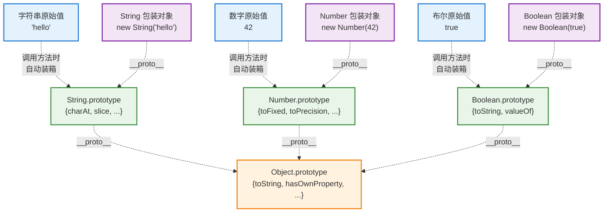

# JavaScript 原始类型装箱机制完整分析

JavaScript 中有三种原始类型具有装箱机制：**string**、**number** 和 **boolean**。它们都采用相同的设计模式。

## 装箱机制概览



## String 类型装箱机制 (回顾)

### 基本特征
```javascript
let str = "hello";
console.log(typeof str);                    // "string"
console.log(str.length);                    // 5 (自动装箱)
console.log(str.toUpperCase());             // "HELLO" (自动装箱)

// 包装对象
let strObj = new String("hello");
console.log(typeof strObj);                 // "object"
console.log(strObj.valueOf());              // "hello"
```

## Number 类型装箱机制

### 基本特征
```javascript
let num = 42;
console.log(typeof num);                    // "number"
console.log(num.toString());                // "42" (自动装箱)
console.log(num.toFixed(2));                // "42.00" (自动装箱)

// 包装对象
let numObj = new Number(42);
console.log(typeof numObj);                 // "object"
console.log(numObj.valueOf());              // 42
```

### Number.prototype 提供的方法

```javascript
let num = 123.456789;

// 数字格式化方法
console.log(num.toString());                // "123.456789"
console.log(num.toString(16));              // "7b" (十六进制)
console.log(num.toFixed(2));                // "123.46" (保留2位小数)
console.log(num.toPrecision(5));            // "123.46" (5位有效数字)
console.log(num.toExponential(2));          // "1.23e+2" (科学计数法)
console.log(num.toLocaleString());          // "123.457" (本地化格式)

// 类型检测和验证 (Number 静态方法)
console.log(Number.isInteger(123));         // true
console.log(Number.isNaN(NaN));             // true
console.log(Number.isFinite(123));          // true
console.log(Number.isSafeInteger(123));     // true

// 特殊值处理
let infinity = Infinity;
console.log(infinity.toString());           // "Infinity"
let nan = NaN;
console.log(nan.toString());                // "NaN"
```

### Number 装箱的特殊情况

```javascript
// 数字字面量的装箱需要注意语法
console.log(42.toString());                 // SyntaxError: Invalid or unexpected token
console.log((42).toString());               // "42" (正确)
console.log(42..toString());                // "42" (正确但不推荐)
console.log(42 .toString());                // "42" (正确但不推荐)

// 变量形式没问题
let num = 42;
console.log(num.toString());                // "42"

// 为什么会有语法错误？
// 因为 JavaScript 解析器会将 42. 理解为浮点数字面量，而不是 42 + .toString()
// 解决方案：
console.log(Number(42).toString());         // "42" (最清晰)
```

## Boolean 类型装箱机制

### 基本特征
```javascript
let bool = true;
console.log(typeof bool);                   // "boolean"
console.log(bool.toString());               // "true" (自动装箱)
console.log(bool.valueOf());                // true (自动装箱)

// 包装对象
let boolObj = new Boolean(true);
console.log(typeof boolObj);                // "object"
console.log(boolObj.valueOf());             // true
```

### Boolean 装箱的陷阱

Boolean 的装箱有一个重要陷阱：

```javascript
// 原始值的布尔转换
console.log(Boolean(false));                // false
console.log(Boolean(0));                    // false
console.log(Boolean(""));                   // false
console.log(Boolean(null));                 // false
console.log(Boolean(undefined));            // false

// 包装对象的布尔转换 - 陷阱！
console.log(Boolean(new Boolean(false)));   // true (!)
console.log(Boolean(new Boolean(0)));       // true (!)
console.log(Boolean(new Boolean("")));      // true (!)

// 在条件语句中的表现
if (false) {
    console.log("不会执行");
}

if (new Boolean(false)) {
    console.log("会执行！");                 // 这里会执行，因为对象总是 truthy
}

// 正确的判断方式
if (new Boolean(false).valueOf()) {
    console.log("不会执行");                 // 使用 valueOf() 获取原始值
}
```

### Boolean.prototype 的方法

Boolean 原型上的方法相对较少：

```javascript
let bool = true;

// 基础方法
console.log(bool.toString());               // "true"
console.log(bool.valueOf());                // true

// 继承自 Object 的方法
console.log(bool.hasOwnProperty('valueOf')); // false (来自原型)
console.log(Object.prototype.toString.call(bool)); // "[object Boolean]"
```

## 三种装箱机制的对比

### 功能对比表

| 特性 | String | Number | Boolean |
|------|--------|---------|---------|
| **原始值类型** | `"string"` | `"number"` | `"boolean"` |
| **包装对象类型** | `"object"` | `"object"` | `"object"` |
| **主要方法数量** | 丰富 (30+) | 中等 (10+) | 少 (2个) |
| **使用频率** | 很高 | 高 | 低 |
| **装箱陷阱** | 属性赋值失效 | 语法注意 | 布尔转换陷阱 |

### 方法分类对比

#### String 方法 (最丰富)
```javascript
let str = "Hello World";

// 访问和检索 (9个主要方法)
str.charAt(0), str.charCodeAt(0), str.indexOf('o'), str.lastIndexOf('o'),
str.search(/o/), str.includes('World'), str.startsWith('Hello'), str.endsWith('World');

// 提取和切片 (4个主要方法)
str.substring(0, 5), str.substr(6, 5), str.slice(0, 5), str.slice(-5);

// 转换和格式化 (8个主要方法)
str.toUpperCase(), str.toLowerCase(), str.trim(), str.trimStart(), str.trimEnd(),
str.padStart(15, '*'), str.padEnd(15, '*'), str.repeat(3);

// 分割和替换 (4个主要方法)
str.split(' '), str.replace('World', 'Universe'), str.replaceAll('l', 'L'), str.match(/\w+/g);
```

#### Number 方法 (专业化)
```javascript
let num = 123.456789;

// 格式化输出 (5个主要方法)
num.toString(), num.toString(16), num.toFixed(2), num.toPrecision(5), 
num.toExponential(2), num.toLocaleString();

// 静态检测方法 (6个主要方法)
Number.isInteger(num), Number.isNaN(num), Number.isFinite(num),
Number.isSafeInteger(num), Number.parseFloat(str), Number.parseInt(str);
```

#### Boolean 方法 (最简单)
```javascript
let bool = true;

// 只有基础方法 (2个)
bool.toString();    // "true"
bool.valueOf();     // true
```

### 自动装箱性能对比

```javascript
// 性能测试示例
function performanceTest() {
    const iterations = 1000000;
    
    // String 装箱测试
    console.time('String Boxing');
    for (let i = 0; i < iterations; i++) {
        "hello".toUpperCase();  // 每次都装箱
    }
    console.timeEnd('String Boxing');
    
    // Number 装箱测试
    console.time('Number Boxing');
    for (let i = 0; i < iterations; i++) {
        (42).toString();        // 每次都装箱
    }
    console.timeEnd('Number Boxing');
    
    // Boolean 装箱测试
    console.time('Boolean Boxing');
    for (let i = 0; i < iterations; i++) {
        true.toString();        // 每次都装箱
    }
    console.timeEnd('Boolean Boxing');
}

// 运行测试 (实际性能因环境而异)
// performanceTest();
```

## 不支持装箱的原始类型

### null 和 undefined

```javascript
// null 和 undefined 没有包装对象
console.log(typeof null);                   // "object" (历史bug)
console.log(typeof undefined);              // "undefined"

// 尝试调用方法会报错
try {
    null.toString();                        // TypeError: Cannot read property 'toString' of null
} catch (e) {
    console.log("null 没有装箱机制");
}

try {
    undefined.toString();                   // TypeError: Cannot read property 'toString' of undefined
} catch (e) {
    console.log("undefined 没有装箱机制");
}
```

### symbol 和 bigint (ES6+)

```javascript
// symbol 有方法但不是装箱机制（ES6）
let sym = Symbol('test');
console.log(typeof sym);                    // "symbol"
console.log(sym.toString());                // "Symbol(test)" (直接调用，不是装箱)
console.log(sym.description);               // "test" (属性访问)

// bigint 有方法但不是装箱机制（ES2020）
let big = 123n;
console.log(typeof big);                    // "bigint"
console.log(big.toString());                // "123" (直接调用，不是装箱)
console.log(big.toString(16));              // "7b" (支持进制转换)

// 验证没有对应的包装构造函数用于 new
try {
    new Symbol('test');                     // TypeError: Symbol is not a constructor
} catch (e) {
    console.log("Symbol 不能用 new 调用");
}

try {
    new BigInt(123);                        // TypeError: BigInt is not a constructor
} catch (e) {
    console.log("BigInt 不能用 new 调用");
}

// 它们的方法是直接定义在原型上的，不是通过装箱
console.log(Symbol.prototype.toString);     // function toString() { [native code] }
console.log(BigInt.prototype.toString);     // function toString() { [native code] }
```

## 实际应用建议

### ✅ 推荐做法

```javascript
// 使用原始值，让自动装箱处理方法调用
let str = "hello world";
let num = 42.567;
let bool = true;

// 直接调用方法
console.log(str.toUpperCase());             // "HELLO WORLD"
console.log(num.toFixed(2));                // "42.57"
console.log(bool.toString());               // "true"

// 类型转换使用函数形式
console.log(String(123));                   // "123"
console.log(Number("123"));                 // 123
console.log(Boolean(""));                   // false

// 数字方法调用的最佳实践
let number = 42;
console.log(number.toString(16));           // "2a" (推荐)
console.log(Number(42).toString(16));       // "2a" (也可以)
```

### ❌ 避免的做法

```javascript
// 避免显式创建包装对象
let str = new String("hello");              // 不推荐
let num = new Number(42);                   // 不推荐
let bool = new Boolean(true);               // 不推荐

// 避免依赖装箱后的属性
let primitive = "hello";
primitive.prop = "test";
console.log(primitive.prop);                // undefined (属性丢失)

// 避免 Boolean 包装对象在条件判断中的使用
if (new Boolean(false)) {                   // 错误：总是执行
    console.log("这会执行！");
}

// 正确的方式
if (Boolean(false)) {                       // 正确：不会执行
    console.log("这不会执行");
}
```

### 🔍 调试和检测

```javascript
// 检测是否为原始值
function isPrimitive(value) {
    return value !== Object(value);
}

// 检测是否为包装对象
function isWrapper(value) {
    return value instanceof String || 
           value instanceof Number || 
           value instanceof Boolean;
}

// 获取原始值
function getPrimitiveValue(value) {
    if (isWrapper(value)) {
        return value.valueOf();
    }
    return value;
}

// 测试
console.log(isPrimitive("hello"));          // true
console.log(isPrimitive(new String("hello"))); // false
console.log(isWrapper(new String("hello"))); // true
console.log(isWrapper("hello"));            // false

console.log(getPrimitiveValue(new Number(42))); // 42
console.log(getPrimitiveValue(42));          // 42
```

## 装箱机制的深层原理

### 引擎优化

```javascript
// JavaScript 引擎的优化策略
// 1. 缓存常用包装对象
// 2. 内联方法调用
// 3. 延迟创建临时对象

// 这解释了为什么装箱性能通常不是问题
function optimizationDemo() {
    let str = "hello";
    
    // 引擎优化：多次调用相同方法可能会被缓存
    for (let i = 0; i < 1000000; i++) {
        str.charAt(0);  // 引擎优化，不会每次都创建新对象
    }
    
    // 但不同的字符串调用会创建不同的临时对象
    for (let i = 0; i < 1000; i++) {
        let dynamicStr = "str" + i;
        dynamicStr.toUpperCase(); // 每次都需要装箱
    }
}
```

### 内存管理

```javascript
// 装箱对象的生命周期
function demonstrateBoxingLifecycle() {
    let str = "hello";
    
    // 1. 调用方法时创建临时包装对象
    let result = str.toUpperCase();
    // 2. 方法执行完毕，临时对象被标记为可回收
    // 3. 垃圾回收器回收临时对象
    // 4. 返回结果（原始值）
    
    return result; // "HELLO"
}

// 与持久包装对象的对比
function persistentWrapperComparison() {
    // 临时装箱 - 内存友好
    let result1 = "hello".toUpperCase();
    
    // 持久包装对象 - 内存占用大
    let wrapper = new String("hello");
    let result2 = wrapper.toUpperCase();
    
    // wrapper 对象会持续占用内存直到超出作用域
    return { result1, result2 };
}
```

## 装箱机制在实际开发中的应用

### 字符串处理管道
```javascript
// 利用方法链进行字符串处理
function processUserInput(input) {
    return input
        .trim()                    // 自动装箱：去除首尾空白
        .toLowerCase()             // 自动装箱：转换为小写
        .replace(/\s+/g, '-')      // 自动装箱：替换空白为连字符
        .slice(0, 50);             // 自动装箱：截取前50个字符
}

console.log(processUserInput("  Hello World Example  "));
// 输出: "hello-world-example"
```

### 数字格式化工具
```javascript
// 数字格式化函数
function formatNumber(num, options = {}) {
    const {
        decimals = 2,
        currency = false,
        percentage = false,
        locale = 'en-US'
    } = options;
    
    if (percentage) {
        return (num * 100).toFixed(decimals) + '%';
    }
    
    if (currency) {
        return num.toLocaleString(locale, {
            style: 'currency',
            currency: 'USD'
        });
    }
    
    return num.toFixed(decimals);
}

console.log(formatNumber(1234.5678));                    // "1234.57"
console.log(formatNumber(1234.5678, { currency: true })); // "$1,234.57"
console.log(formatNumber(0.1234, { percentage: true }));  // "12.34%"
```

### 类型安全的布尔检查
```javascript
// 安全的布尔值处理
function toBooleanSafely(value) {
    // 处理包装对象的特殊情况
    if (value instanceof Boolean) {
        return value.valueOf();
    }
    
    // 标准布尔转换
    return Boolean(value);
}

// 测试
console.log(toBooleanSafely(true));              // true
console.log(toBooleanSafely(false));             // false
console.log(toBooleanSafely(new Boolean(false))); // false (正确处理包装对象)
console.log(toBooleanSafely(""));                // false
console.log(toBooleanSafely("hello"));           // true
```

## 总结

### 装箱机制的统一设计

JavaScript 的 **string**、**number**、**boolean** 三种原始类型都采用了相同的装箱设计：

1. **原始值存储** - 高性能、轻量级
2. **自动装箱** - 无缝的方法调用体验  
3. **临时对象** - 用完即销毁，内存友好
4. **原型链继承** - 最终都继承自 Object.prototype

### 设计优势

- **性能与功能并存** - 既有原始值的高性能，又有对象的丰富方法
- **开发体验一致** - 统一的调用方式，降低学习成本  
- **内存效率** - 临时装箱避免了持久对象的内存开销
- **扩展性** - 可以通过原型扩展功能

### 各类型特点总结

| 类型 | 方法丰富程度 | 主要用途 | 特别注意 |
|------|-------------|----------|----------|
| **String** | 极丰富 (30+) | 文本处理、格式化 | 属性赋值失效 |
| **Number** | 中等 (10+) | 数值计算、格式化 | 字面量语法限制 |
| **Boolean** | 简单 (2个) | 逻辑判断 | 包装对象陷阱 |

这种装箱机制是 JavaScript 类型系统设计的精妙体现，平衡了性能、功能和易用性，为现代 JavaScript 开发提供了坚实的基础。理解这个机制不仅有助于写出更高效的代码，也为深入学习 JavaScript 和现代框架打下了重要基础。