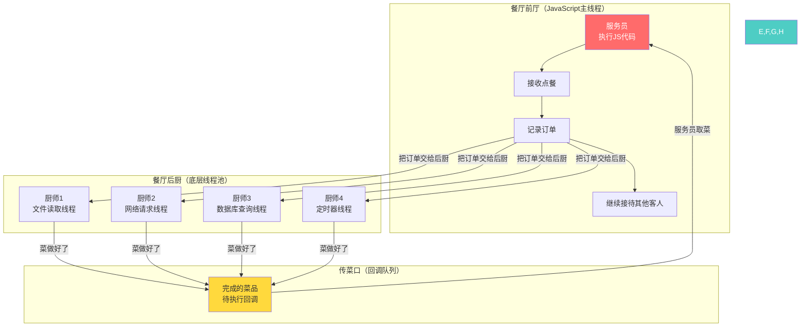
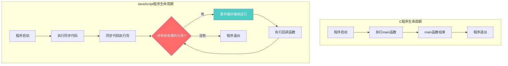
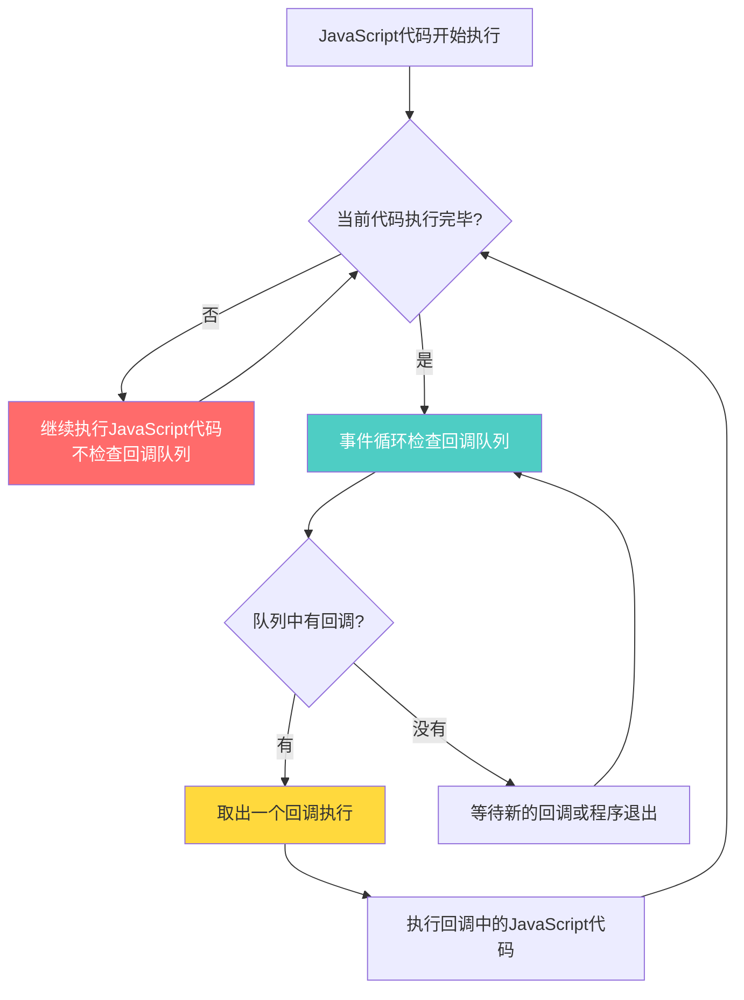
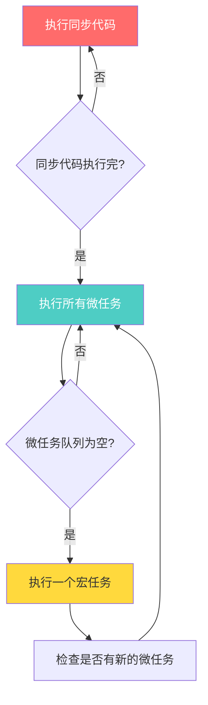
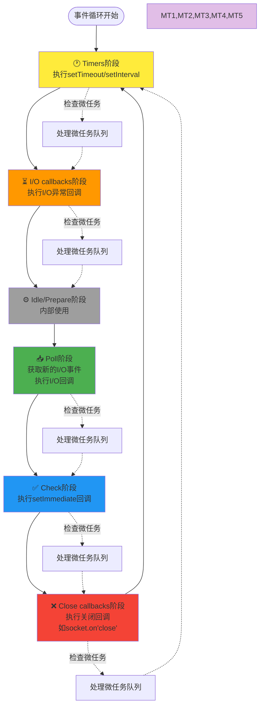

# JavaScript 单线程与事件循环深度解析：从困惑到精通

## 引言

作为一个熟悉Go、PHP、C语言的开发者，初次接触JavaScript的"单线程异步"概念时，很容易产生困惑：

- 如果是单线程，为什么可以同时处理多个异步操作？
- 主线程跑完代码后为什么不退出？
- 回调函数什么时候执行？能中断正在运行的代码吗？

本文将通过与熟悉语言的对比，彻底理解JavaScript的执行机制。

## 核心概念：什么是"单线程"？

### JavaScript的"单线程"真相

```javascript
'use strict';

console.log("JavaScript的单线程含义：");
console.log("1. 执行JavaScript代码：单线程（主线程）");
console.log("2. 处理I/O操作：多线程（底层线程池）");
console.log("3. 线程间通信：通过事件循环和回调队列");
```

**关键理解**：JavaScript说的"单线程"是指**执行JavaScript代码的线程只有一个**，但底层确实有其他线程在处理各种任务。

### 与其他语言的对比

#### C语言：手动管理所有线程
```c
#include <pthread.h>
#include <stdio.h>

void* worker_thread(void* arg) {
    printf("工作线程：处理I/O操作\n");
    sleep(2);  // 模拟I/O
    printf("工作线程：I/O完成\n");
    return NULL;
}

int main() {
    printf("主线程：程序开始\n");
    
    pthread_t thread;
    pthread_create(&thread, NULL, worker_thread, NULL);
    
    printf("主线程：继续执行其他任务\n");
    pthread_join(thread, NULL);  // 必须手动等待子线程
    
    return 0;
}
```

#### Go语言：runtime自动管理
```go
package main

import (
    "fmt"
    "net/http"
    "time"
)

func main() {
    fmt.Println("主goroutine：程序开始")
    
    // Go runtime会自动在多个OS线程上调度goroutine
    go func() {
        fmt.Println("工作goroutine：开始HTTP请求")
        resp, _ := http.Get("http://api.example.com")
        fmt.Println("工作goroutine：HTTP请求完成", resp.Status)
    }()
    
    fmt.Println("主goroutine：继续执行")
    time.Sleep(3 * time.Second)
}
```

#### JavaScript：单线程+底层线程池
```javascript
'use strict';

console.log("JavaScript主线程：程序开始");

// JavaScript引擎把这个任务交给底层线程处理
fetch('http://api.example.com').then(response => {
    console.log("JavaScript主线程：收到底层线程通知，执行回调");
    console.log("响应状态:", response.status);
});

console.log("JavaScript主线程：继续执行JavaScript代码");
// 主线程不阻塞，底层线程在后台工作
```

## 用餐厅比喻理解整体架构



**核心类比**：
- **服务员（主线程）**：只有一个，负责执行所有JavaScript代码
- **后厨（底层线程池）**：多个厨师并行工作，处理耗时的I/O操作
- **传菜口（回调队列）**：厨房完成的菜品在这里等待服务员来取

## 事件循环的持续运行机制

### 为什么主线程不退出？

```javascript
'use strict';

console.log("JavaScript程序开始");

setTimeout(() => {
    console.log("3秒后的回调");
}, 3000);

console.log("同步代码执行完毕");
// 注意：这里程序不会退出！
// 事件循环会一直运行，等待回调执行
```

### 程序生命周期对比



### 实际演示

```javascript
'use strict';

console.log("1. 程序开始");

// 设置一个3秒后的回调
setTimeout(() => {
    console.log("4. 3秒后执行的回调");
    
    // 在回调中又设置了一个新的回调
    setTimeout(() => {
        console.log("6. 又过了2秒");
    }, 2000);
    
}, 3000);

// 设置一个1秒后的回调
setTimeout(() => {
    console.log("3. 1秒后执行的回调");
}, 1000);

console.log("2. 同步代码执行完毕");
console.log("   但程序不会退出，等待回调...");

// 程序执行时间线：
// 0秒: 1. 程序开始
// 0秒: 2. 同步代码执行完毕，但程序不会退出，等待回调...
// 1秒: 3. 1秒后执行的回调
// 3秒: 4. 3秒后执行的回调  
// 5秒: 6. 又过了2秒
// 5秒后: 程序才真正退出（没有更多待处理任务）
```

## 关键问题：回调能中断正在运行的代码吗？

### 答案：绝对不能！

**JavaScript单线程的铁律**：主线程正在执行代码时，任何回调都不能中断。

```javascript
'use strict';

console.log("=== 单线程不可中断演示 ===");

// 注册一个1秒后的回调
setTimeout(() => {
    console.log("回调：我想执行，但要等主线程空闲");
}, 1000);

console.log("主线程：开始长时间运算");

// 模拟一个耗时5秒的同步操作
const start = Date.now();
while (Date.now() - start < 5000) {
    // 阻塞主线程5秒
    // 在这期间，即使定时器事件已经发生，回调也不能执行
}

console.log("主线程：长时间运算结束，现在空闲了");
console.log("事件循环：检查回调队列，发现有待执行的回调");

// 输出结果：
// === 单线程不可中断演示 ===
// 主线程：开始长时间运算
// (等待5秒...)
// 主线程：长时间运算结束，现在空闲了
// 事件循环：检查回调队列，发现有待执行的回调
// 回调：我想执行，但要等主线程空闲 (5秒后才执行，而不是1秒后)
```

### 与其他语言的中断机制对比

#### C语言的信号中断
```c
#include <signal.h>
#include <stdio.h>

void signal_handler(int sig) {
    printf("中断：收到信号，立即处理\n");
}

int main() {
    signal(SIGALRM, signal_handler);
    
    printf("主程序：开始长时间运算\n");
    alarm(1);  // 1秒后发送信号
    
    // 长时间运算
    for (int i = 0; i < 1000000000; i++) {
        // C语言中，信号可以中断这个循环
    }
    
    return 0;
}

// 输出可能是：
// 主程序：开始长时间运算
// 中断：收到信号，立即处理 (可能在运算中间被中断)
// 主程序：运算结束
```

#### Go语言的协程调度
```go
package main

import (
    "fmt"
    "runtime"
    "time"
)

func main() {
    fmt.Println("主goroutine：开始长时间运算")
    
    go func() {
        time.Sleep(1 * time.Second)
        fmt.Println("其他goroutine：我可以在主goroutine忙碌时运行")
    }()
    
    // 长时间运算，但Go调度器可能会切换goroutine
    for i := 0; i < 1000000000; i++ {
        if i%100000000 == 0 {
            runtime.Gosched() // 主动让出CPU
        }
    }
    
    fmt.Println("主goroutine：运算结束")
    time.Sleep(2 * time.Second)
}

// 输出可能是：
// 主goroutine：开始长时间运算  
// 其他goroutine：我可以在主goroutine忙碌时运行 (1秒后)
// 主goroutine：运算结束
```

#### JavaScript的严格单线程
```javascript
'use strict';

console.log("JavaScript主线程：开始长时间运算");

// 1秒后事件发生，但不能中断主线程
setTimeout(() => {
    console.log("回调：只能等主线程空闲后才能执行");
}, 1000);

// 这个循环不能被任何事件中断
for (let i = 0; i < 1000000000; i++) {
    // JavaScript主线程一旦开始执行，就不会被中断
    // 没有runtime.Gosched()，没有信号处理，没有抢占式调度
}

console.log("JavaScript主线程：运算结束");

// 输出一定是：
// JavaScript主线程：开始长时间运算
// JavaScript主线程：运算结束
// 回调：只能等主线程空闲后才能执行 (几秒后)
```

## 事件循环的详细机制

### 回调队列的工作原理



### 多个回调的排队机制

```javascript
'use strict';

console.log("=== 回调队列演示 ===");

// 多个事件几乎同时发生
setTimeout(() => console.log("回调1：1ms后"), 1);
setTimeout(() => console.log("回调2：2ms后"), 2);
setTimeout(() => console.log("回调3：3ms后"), 3);

console.log("主线程：开始2秒的阻塞操作");

// 阻塞主线程2秒
const blockStart = Date.now();
while (Date.now() - blockStart < 2000) {
    // 在这2秒内，所有回调都会在队列中等待
}

console.log("主线程：阻塞结束，检查回调队列");

// 输出：
// === 回调队列演示 ===
// 主线程：开始2秒的阻塞操作
// 主线程：阻塞结束，检查回调队列
// 回调1：1ms后 (实际2秒后执行)
// 回调2：2ms后 (实际2秒后执行)
// 回调3：3ms后 (实际2秒后执行)
```

## 微任务 vs 宏任务：更精细的执行顺序

### 基本概念

```javascript
'use strict';

console.log('1. 同步代码开始');

// 宏任务
setTimeout(() => console.log('4. setTimeout (宏任务)'), 0);

// 微任务
Promise.resolve().then(() => console.log('3. Promise (微任务)'));

console.log('2. 同步代码结束');

// 关键：微任务会在宏任务之前执行
// 输出：1 → 2 → 3 → 4
```

### 执行优先级规则



### 微任务和宏任务分类

#### 微任务（Microtasks）
- `Promise.then/catch/finally`
- `queueMicrotask()`
- `MutationObserver`
- `process.nextTick`（Node.js，优先级最高）

#### 宏任务（Macrotasks）
- `setTimeout/setInterval`
- `setImmediate`（Node.js）
- `I/O操作`
- `UI渲染`
- `用户交互事件`

### 复杂执行顺序示例

```javascript
'use strict';

async function complexExample() {
    console.log('1. 函数开始');
    
    // 宏任务1
    setTimeout(() => {
        console.log('7. setTimeout 1');
        
        // 嵌套微任务
        Promise.resolve().then(() => {
            console.log('8. 嵌套Promise');
        });
    }, 0);
    
    // 微任务1
    Promise.resolve().then(() => {
        console.log('4. Promise 1');
        
        // 微任务中的微任务
        return Promise.resolve();
    }).then(() => {
        console.log('5. Promise 2');
    });
    
    // 宏任务2
    setTimeout(() => {
        console.log('9. setTimeout 2');
    }, 0);
    
    // 微任务2
    queueMicrotask(() => {
        console.log('6. queueMicrotask');
    });
    
    console.log('2. 函数中间');
    
    // await 创建微任务
    await Promise.resolve();
    console.log('3. await 后');
}

complexExample();

// 执行顺序：
// 1. 函数开始
// 2. 函数中间
// 3. await 后
// 4. Promise 1
// 5. Promise 2
// 6. queueMicrotask
// 7. setTimeout 1
// 8. 嵌套Promise
// 9. setTimeout 2
```

## 浏览器 vs Node.js 的差异

### 关键差异总结

| 特性 | 浏览器 | Node.js |
|------|--------|---------|
| **事件循环结构** | 简单的宏任务+微任务循环 | 6阶段循环 + 微任务检查 |
| **微任务优先级** | 统一优先级 | process.nextTick > Promise |
| **定时器精度** | 4ms最小间隔 | 1ms最小间隔 |
| **setImmediate** | 不支持 | Check阶段执行 |
| **UI渲染** | 在事件循环中 | 无UI渲染 |

### Node.js 事件循环的6个阶段



### Node.js 微任务优先级

```javascript
'use strict';

// Node.js 中的微任务优先级：
// 1. process.nextTick (最高)
// 2. Promise.then/catch/finally
// 3. queueMicrotask

console.log('开始');

Promise.resolve().then(() => {
    console.log('Promise 1');
    
    process.nextTick(() => {
        console.log('嵌套 nextTick');
    });
    
    return Promise.resolve();
}).then(() => {
    console.log('Promise 2');
});

process.nextTick(() => {
    console.log('nextTick 1');
    
    Promise.resolve().then(() => {
        console.log('nextTick中的Promise');
    });
});

queueMicrotask(() => {
    console.log('queueMicrotask');
});

process.nextTick(() => {
    console.log('nextTick 2');
});

console.log('结束');

// 输出顺序：
// 开始
// 结束
// nextTick 1
// nextTick 2
// Promise 1
// queueMicrotask
// nextTick中的Promise
// 嵌套 nextTick
// Promise 2
```

## 实际应用中的问题和解决方案

### 问题1：长时间运算阻塞UI

```javascript
'use strict';

// ❌ 错误做法：阻塞主线程
function heavyCalculation() {
    console.log("开始大量计算");
    
    let result = 0;
    for (let i = 0; i < 10000000000; i++) {
        result += Math.sqrt(i);
        // 这期间用户点击、定时器等都无法响应
    }
    
    console.log("计算完成:", result);
}

// ✅ 正确做法：分片执行
async function heavyCalculationAsync() {
    console.log("开始分片计算");
    
    let result = 0;
    const chunkSize = 1000000;
    
    for (let i = 0; i < 10000000000; i += chunkSize) {
        // 计算一小块
        for (let j = i; j < i + chunkSize && j < 10000000000; j++) {
            result += Math.sqrt(j);
        }
        
        // 让出主线程，允许处理其他回调
        await new Promise(resolve => setTimeout(resolve, 0));
        
        console.log(`进度: ${(i / 10000000000 * 100).toFixed(1)}%`);
    }
    
    console.log("计算完成:", result);
}
```

### 问题2：事件循环"饥饿"

```javascript
'use strict';

// ⚠️ 危险：微任务可能导致宏任务"饥饿"
function createMicrotaskLoop() {
    Promise.resolve().then(() => {
        console.log('微任务执行');
        createMicrotaskLoop(); // 递归创建微任务
    });
}

setTimeout(() => {
    console.log('我可能永远不会执行！'); // 宏任务被饿死
}, 0);

// createMicrotaskLoop(); // 危险：不要运行这个

// ✅ 正确做法：适当使用宏任务
function createBalancedLoop(count = 0) {
    if (count < 1000) {
        console.log('处理任务:', count);
        
        // 使用setTimeout让出控制权
        setTimeout(() => createBalancedLoop(count + 1), 0);
    }
}
```

### 问题3：内存泄漏防范

```javascript
'use strict';

// ❌ 可能导致内存泄漏
function createTimer() {
    const data = new Array(1000000).fill('large data');
    
    setInterval(() => {
        console.log('Timer running');
        // data被闭包引用，无法回收
    }, 1000);
}

// ✅ 及时清理
function createTimerSafely() {
    const data = new Array(1000000).fill('large data');
    
    const timerId = setInterval(() => {
        console.log('Timer running');
    }, 1000);
    
    // 提供清理方法
    return () => {
        clearInterval(timerId);
        // data可以被回收
    };
}

// 使用示例
const cleanup = createTimerSafely();

// 在适当时机清理
setTimeout(() => {
    cleanup();
    console.log('定时器已清理');
}, 10000);
```

## 调试和性能监控

### 事件循环性能监控

```javascript
'use strict';

// 监控事件循环延迟
function monitorEventLoop() {
    let lastTime = Date.now();
    
    function check() {
        const now = Date.now();
        const delay = now - lastTime - 100; // 期望100ms间隔
        
        if (delay > 50) {
            console.warn(`事件循环延迟: ${delay}ms`);
        }
        
        lastTime = now;
        setTimeout(check, 100);
    }
    
    check();
}

// 在开发环境中监控
if (typeof process !== 'undefined' && process.env.NODE_ENV === 'development') {
    monitorEventLoop();
}
```

### 可视化事件循环调试工具

```javascript
'use strict';

// 用于调试的事件循环可视化工具
class EventLoopDebugger {
    static log(type, message) {
        const timestamp = Date.now();
        console.log(`[${timestamp}] ${type}: ${message}`);
    }
    
    static sync(message) {
        this.log('SYNC', message);
    }
    
    static micro(message) {
        Promise.resolve().then(() => {
            this.log('MICRO', message);
        });
    }
    
    static macro(message, delay = 0) {
        setTimeout(() => {
            this.log('MACRO', message);
        }, delay);
    }
}

// 使用示例
EventLoopDebugger.sync('开始');
EventLoopDebugger.micro('微任务1');
EventLoopDebugger.macro('宏任务1');
EventLoopDebugger.sync('结束');
EventLoopDebugger.micro('微任务2');

// 输出会清晰显示执行顺序和时间戳
```

## 并发模型总结对比

### JavaScript vs Go vs PHP vs C

| 特性 | JavaScript | Go | PHP | C |
|------|------------|----|----|---|
| **执行模型** | 单线程事件循环 | 多协程调度 | 同步阻塞 | 多线程抢占 |
| **并发方式** | 异步回调 | goroutine通信 | 进程/线程 | 线程同步 |
| **内存模型** | 单线程，无竞争 | CSP模型 | 共享状态 | 共享内存 |
| **学习难度** | 中等 | 中等 | 简单 | 高 |
| **性能特点** | I/O密集型优秀 | 通用性能好 | 单请求性能一般 | 系统级性能最优 |
| **适用场景** | Web前端/Node.js后端 | 微服务/云原生 | Web应用 | 系统编程 |

### 代码风格对比

```javascript
// JavaScript: 事件驱动异步
'use strict';
fetch('/api').then(handleResponse);
setTimeout(cleanup, 1000);
// 单线程，通过事件协调
```

```go
// Go: 协程通信
func main() {
    ch := make(chan string)
    go producer(ch)
    go consumer(ch)
    // 多协程，通过channel通信
}
```

```php
<?php
// PHP: 同步阻塞
$data = file_get_contents('/api');
handleResponse($data);
sleep(1);
cleanup();
// 串行执行，简单直接
?>
```

```c
// C: 线程同步
pthread_mutex_lock(&mutex);
shared_data++;
pthread_mutex_unlock(&mutex);
// 多线程，通过锁同步
```

## 核心理解和最佳实践

### 关键理解要点

1. **"单线程"的准确含义**：
   - JavaScript代码执行：单线程
   - I/O操作处理：多线程（底层）
   - 通信协调：事件循环

2. **事件循环的运行机制**：
   - 同步代码执行完不退出
   - 持续检查回调队列
   - 回调不能中断正在执行的代码

3. **微任务vs宏任务优先级**：
   - 微任务优先级高于宏任务
   - 每轮事件循环清空所有微任务
   - 防止微任务饿死宏任务

### 开发最佳实践

```javascript
'use strict';

// ✅ 推荐的异步编程模式
class AsyncBestPractices {
    // 1. 避免阻塞主线程
    static async processLargeData(data) {
        const results = [];
        const batchSize = 1000;
        
        for (let i = 0; i < data.length; i += batchSize) {
            const batch = data.slice(i, i + batchSize);
            const batchResults = batch.map(item => this.processItem(item));
            results.push(...batchResults);
            
            // 让出主线程
            if (i % 10000 === 0) {
                await new Promise(resolve => setTimeout(resolve, 0));
            }
        }
        
        return results;
    }
    
    // 2. 合理使用微任务和宏任务
    static scheduleWork(urgentTask, normalTask) {
        // 紧急任务用微任务
        Promise.resolve().then(urgentTask);
        
        // 普通任务用宏任务
        setTimeout(normalTask, 0);
    }
    
    // 3. 防止内存泄漏
    static createManagedTimer(callback, interval) {
        const timerId = setInterval(callback, interval);
        
        return {
            stop() {
                clearInterval(timerId);
            }
        };
    }
    
    // 4. 错误处理
    static async safeAsyncOperation() {
        try {
            const result = await this.riskyOperation();
            return result;
        } catch (error) {
            console.error('异步操作失败:', error);
            throw error;
        }
    }
    
    static processItem(item) {
        return item * 2;
    }
    
    static async riskyOperation() {
        // 模拟可能失败的异步操作
        return new Promise((resolve, reject) => {
            if (Math.random() > 0.5) {
                resolve('成功');
            } else {
                reject(new Error('操作失败'));
            }
        });
    }
}
```

## 总结

JavaScript的单线程事件循环机制是一个精巧的设计：

1. **执行JavaScript代码保持单线程**，避免了多线程编程的复杂性
2. **底层使用多线程处理I/O**，获得了并发处理的性能优势
3. **通过事件循环协调**，实现了异步非阻塞的编程体验

与传统的多线程模型相比，JavaScript的这种设计特别适合：
- **I/O密集型应用**：如Web服务器、API服务
- **用户界面应用**：如浏览器页面、桌面应用
- **实时通讯应用**：如聊天系统、在线游戏

理解这个机制对于编写高性能的JavaScript代码至关重要，也为学习现代前端框架（如Vue、React）打下了坚实的基础。

**记住核心原则**：
- JavaScript主线程不能被中断
- 回调函数必须等待主线程空闲
- 合理使用异步机制避免阻塞
- 微任务优先级高于宏任务

这就是JavaScript"单线程异步"的真正含义！