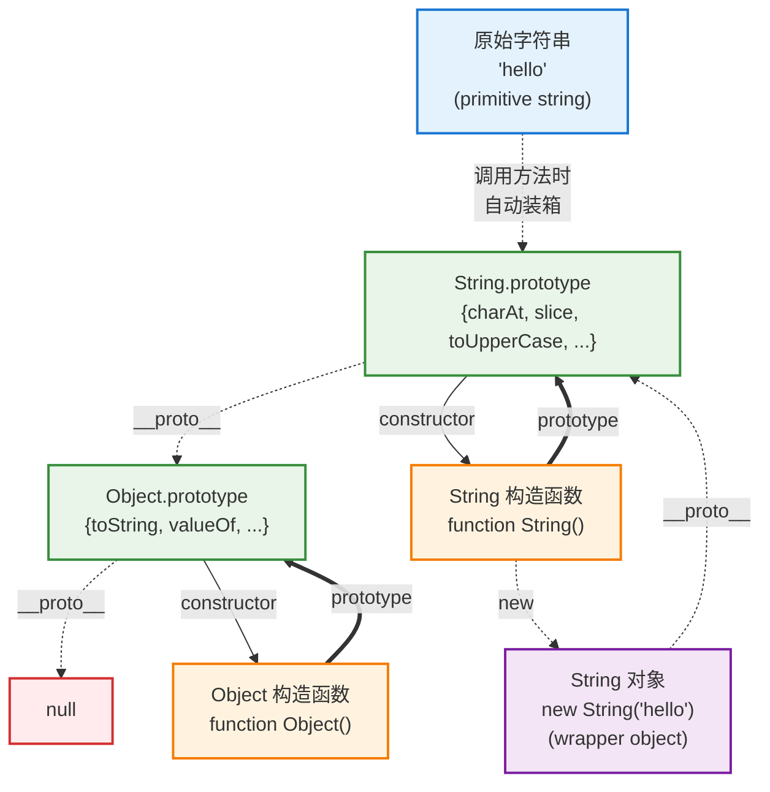
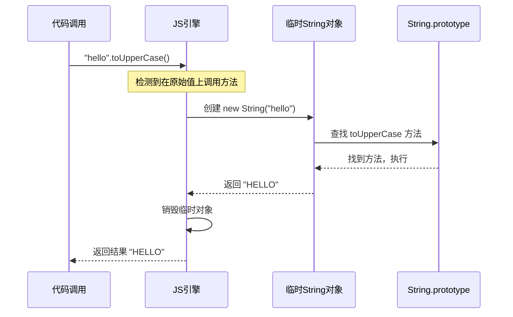

# JavaScript String 类型设计详解

JavaScript 的 string 类型设计是一个非常巧妙的**双重身份**系统，它既是原始类型又能像对象一样使用方法。

## 核心设计概念

### 1. 双重身份：原始值 + 包装对象

```javascript
// 原始字符串值
let str1 = "hello";
let str2 = 'world';
let str3 = `template`;

// String 包装对象
let strObj = new String("hello");

console.log(typeof str1);    // "string" (原始类型)
console.log(typeof strObj);  // "object" (对象类型)
```

### 2. 自动装箱机制 (Auto-boxing)

当你在原始字符串上调用方法时，JavaScript 会自动进行"装箱"操作：

```javascript
let str = "hello";
let result = str.toUpperCase(); // 自动装箱过程

// 等价于以下过程：
// 1. 创建临时 String 对象: new String("hello")
// 2. 调用方法: tempObj.toUpperCase()
// 3. 返回结果: "HELLO"
// 4. 销毁临时对象
```

## String 类型的原型链结构



## 自动装箱的详细过程

当在原始字符串上调用方法时的内部过程：



## 关键特性对比

| 特性 | 原始字符串 | String 包装对象 |
|------|------------|----------------|
| 类型检测 | `typeof "hello"` → `"string"` | `typeof new String("hello")` → `"object"` |
| 严格相等 | `"hello" === "hello"` → `true` | `new String("hello") === new String("hello")` → `false` |
| 可变性 | 不可变 (immutable) | 不可变 (但对象引用可变) |
| 内存占用 | 较小 | 较大 (对象开销) |
| 方法调用 | 自动装箱 | 直接调用 |

## 实际代码演示

```javascript
// 1. 类型检测差异
let primitive = "hello";
let object = new String("hello");

console.log(typeof primitive);  // "string"
console.log(typeof object);     // "object"

// 2. 值比较差异
console.log(primitive == object);   // true (类型转换)
console.log(primitive === object);  // false (类型不同)

// 3. 对象身份差异
let obj1 = new String("hello");
let obj2 = new String("hello");
console.log(obj1 === obj2);  // false (不同对象)

// 4. 自动装箱演示
let str = "hello";
console.log(str.length);        // 5 (自动装箱)
console.log(str.toUpperCase()); // "HELLO" (自动装箱)

// 5. 属性赋值差异
primitive.prop = "test";
object.prop = "test";
console.log(primitive.prop);  // undefined (临时对象已销毁)
console.log(object.prop);     // "test" (持久对象)
```

## 常用 String 方法分类

### 字符串检索和访问
```javascript
let str = "Hello World";

// 字符访问
console.log(str.charAt(0));          // "H"
console.log(str.charCodeAt(0));      // 72
console.log(str[0]);                 // "H" (ES5+)

// 位置查找
console.log(str.indexOf('o'));       // 4
console.log(str.lastIndexOf('o'));   // 7
console.log(str.search(/o/));        // 4

// 包含检测 (ES6+)
console.log(str.includes('World'));  // true
console.log(str.startsWith('Hello')); // true
console.log(str.endsWith('World'));  // true
```

### 字符串提取和切片
```javascript
let str = "Hello World";

// 提取子字符串
console.log(str.substring(0, 5));    // "Hello"
console.log(str.substr(6, 5));       // "World"
console.log(str.slice(0, 5));        // "Hello"
console.log(str.slice(-5));          // "World"
```

### 字符串转换和格式化
```javascript
let str = "  Hello World  ";

// 大小写转换
console.log(str.toUpperCase());      // "  HELLO WORLD  "
console.log(str.toLowerCase());      // "  hello world  "

// 空白处理
console.log(str.trim());             // "Hello World"
console.log(str.trimStart());        // "Hello World  "
console.log(str.trimEnd());          // "  Hello World"

// 填充 (ES2017+)
console.log("5".padStart(3, '0'));   // "005"
console.log("5".padEnd(3, '0'));     // "500"

// 重复 (ES6+)
console.log("Hi".repeat(3));         // "HiHiHi"
```

### 字符串分割和连接
```javascript
let str = "apple,banana,orange";

// 分割
console.log(str.split(','));         // ["apple", "banana", "orange"]
console.log(str.split('', 5));       // ["a", "p", "p", "l", "e"]

// 替换
console.log(str.replace('apple', 'grape'));     // "grape,banana,orange"
console.log(str.replaceAll(',', ' | '));        // "apple | banana | orange" (ES2021+)

// 匹配
console.log(str.match(/\w+/g));      // ["apple", "banana", "orange"]
```

## 设计优势

### 1. 性能优化
- **原始值轻量**: 避免了对象创建的开销
- **方法共享**: 所有字符串共享 `String.prototype` 上的方法
- **临时装箱**: 只在需要时创建临时对象

### 2. 易用性
- **统一接口**: 原始值和对象都能调用相同的方法
- **无缝体验**: 开发者无需关心装箱过程
- **丰富功能**: 提供大量字符串处理方法

### 3. 内存效率
```javascript
// 高效：原始值直接存储
let names = ["Alice", "Bob", "Charlie"];  // 占用内存小

// 低效：包装对象存储
let nameObjs = [new String("Alice"), new String("Bob"), new String("Charlie")];  // 占用内存大
```

## 最佳实践

### ✅ 推荐做法
```javascript
// 使用字面量创建字符串
let str = "hello world";

// 直接调用方法
let upper = str.toUpperCase();
let sub = str.substring(0, 5);

// 字符串拼接优先使用模板字符串
let name = "Alice";
let greeting = `Hello, ${name}!`;  // 而不是 "Hello, " + name + "!"
```

### ❌ 不推荐做法
```javascript
// 避免显式创建 String 对象
let str = new String("hello world");  // 不必要的对象开销

// 避免依赖装箱后的属性持久化
let primitive = "hello";
primitive.prop = "test";  // 属性会丢失

// 避免过度的字符串拼接
let result = "";
for (let i = 0; i < 1000; i++) {
    result += "text";  // 每次都创建新字符串，性能差
}
// 更好的做法：使用数组然后 join
let parts = [];
for (let i = 0; i < 1000; i++) {
    parts.push("text");
}
let result = parts.join("");
```

## 与其他语言的对比

| 语言 | 字符串设计 | 特点 |
|------|------------|------|
| **JavaScript** | 原始值 + 自动装箱 | 性能与易用性平衡 |
| **Java** | 对象类型 | 统一但有装箱/拆箱开销 |
| **C** | 字符数组 | 高性能但功能有限 |
| **Python** | 对象类型 | 统一设计，内建优化 |
| **Go** | 原始值类型 | 简单高效，方法通过函数 |

## 性能考虑

### 字符串不可变性
```javascript
// JavaScript 字符串是不可变的
let str = "hello";
str[0] = "H";  // 严格模式下报错，非严格模式下被忽略
console.log(str);  // 仍然是 "hello"

// 字符串操作总是返回新字符串
let original = "hello";
let modified = original.toUpperCase();
console.log(original);  // "hello" (原字符串未变)
console.log(modified);  // "HELLO" (新字符串)
```

### 引擎优化
```javascript
// 现代 JavaScript 引擎的优化：
// 1. 字符串池 - 相同字符串共享内存
let str1 = "hello";
let str2 = "hello";
console.log(str1 === str2);  // true (可能指向同一内存地址)

// 2. 延迟计算 - 某些操作延迟到真正需要时执行
// 3. 内联缓存 - 频繁调用的方法被优化
```

## 总结

JavaScript 的 string 类型设计巧妙地平衡了：
- **性能**: 原始值的轻量存储
- **功能**: 丰富的字符串处理方法
- **易用性**: 自动装箱的无缝体验

这种设计让开发者既能享受原始类型的高性能，又能使用面向对象的便利接口，是 JavaScript 类型系统设计的经典案例。

理解这个机制对掌握 JavaScript 的类型系统和性能优化都很重要，特别是在现代前端开发中，字符串操作无处不在，正确理解其工作原理能帮助写出更高效的代码。