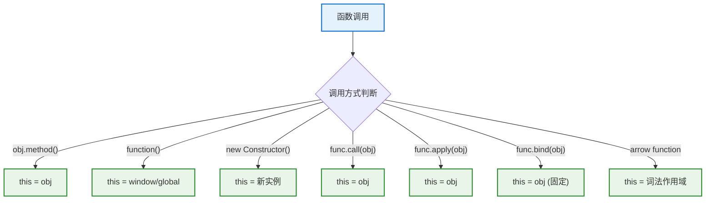
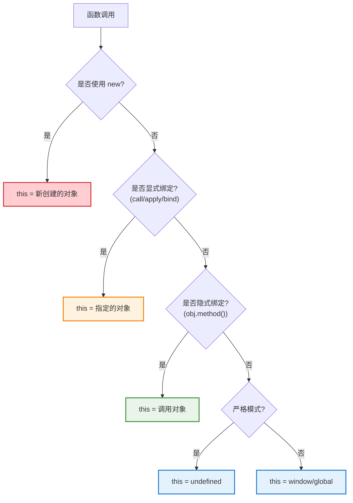

# JavaScript this 深度解析：从 ES5 到 ES6+ 的演进之路

JavaScript 中的 `this` 关键字经历了从 ES5 的复杂难懂到 ES6+ 的优雅实用的重大演进。本文将深入探讨 `this` 的设计哲学、ES6+ 的革命性改进和现代最佳实践。

## 历史背景：为什么需要 this？

### 面向对象编程的需求

JavaScript 诞生于 1995 年，当时面向对象编程正在兴起。设计者 Brendan Eich 需要在短时间内创造一门既能处理简单脚本，又能支持面向对象编程的语言。

```javascript
// 传统面向对象语言的期望行为
class Person {
    constructor(name) {
        this.name = name;  // this 指向当前实例
    }    
    sayHello() {
        return `Hello, I'm ${this.name}`;  // this 指向调用对象
    }
}
```

### JavaScript 的独特挑战

JavaScript 面临的挑战是：
1. **函数是一等公民** - 函数可以独立存在，不一定属于某个对象
2. **动态性** - 函数可以在运行时被任意对象调用
3. **简洁性** - 语法要足够简单，适合快速开发

```javascript
// JavaScript 的灵活性
function sayHello() {
    return `Hello, I'm ${this.name}`;
}

const person1 = { name: 'Alice', greet: sayHello };
const person2 = { name: 'Bob', greet: sayHello };

person1.greet();  // "Hello, I'm Alice"
person2.greet();  // "Hello, I'm Bob"
```

## 设计哲学：动态绑定 vs 静态绑定

### JavaScript 的动态绑定设计



### 与其他语言的对比

| 语言 | this 绑定方式 | 特点 |
|------|---------------|------|
| **Java/C#** | 静态绑定 | this 始终指向当前类实例 |
| **Python** | 显式传递 | self 作为第一个参数显式传递 |
| **JavaScript** | 动态绑定 | this 根据调用方式动态确定 |
| **Rust** | 无 this | 通过 &self 参数模拟 |

## 设计目标：灵活性与简洁性的平衡

### 目标1：支持多种编程范式

```javascript
// 1. 面向对象编程
const calculator = {
    value: 0,
    add(num) {
        this.value += num;  // this 指向 calculator
        return this;
    },
    multiply(num) {
        this.value *= num;  // 支持方法链
        return this;
    }
};

calculator.add(5).multiply(2);  // this 让方法链成为可能

// 2. 函数式编程
const numbers = [1, 2, 3, 4, 5];
const sum = numbers.reduce(function(acc, curr) {
    return acc + curr;  // this 在这里不重要
}, 0);

// 3. 事件驱动编程
button.addEventListener('click', function() {
    this.style.color = 'red';  // this 指向触发事件的元素
});
```

### 目标2：代码复用和动态性

```javascript
// 函数可以被多个对象复用
function introduce() {
    return `Hi, I'm ${this.name} and I'm ${this.age} years old`;
}

const person = { name: 'Alice', age: 25, speak: introduce };
const robot = { name: 'R2D2', age: 50, speak: introduce };

person.speak();  // "Hi, I'm Alice and I'm 25 years old"
robot.speak();   // "Hi, I'm R2D2 and I'm 50 years old"
```

## 底层实现原理

### 执行上下文与 this 绑定

JavaScript 引擎在执行函数时会创建执行上下文（Execution Context），其中包含 this 绑定：

```javascript
// 简化的执行上下文结构
ExecutionContext = {
    LexicalEnvironment: { /* 词法环境 */ },
    VariableEnvironment: { /* 变量环境 */ },
    ThisBinding: undefined  // this 的值在这里确定
}
```

### this 绑定的四种规则

#### 1. 默认绑定 (Default Binding)

```javascript
function foo() {
    console.log(this);  // 在非严格模式下指向 window/global
}

foo();  // 默认绑定

// 严格模式下
'use strict';
function bar() {
    console.log(this);  // undefined
}
bar();
```

#### 2. 隐式绑定 (Implicit Binding)

```javascript
const obj = {
    name: 'Alice',
    greet() {
        console.log(`Hello, ${this.name}`);  // this 隐式绑定到 obj
    }
};

obj.greet();  // this === obj

// 绑定丢失的情况
const fn = obj.greet;
fn();  // this 不再是 obj，而是默认绑定
```

#### 3. 显式绑定 (Explicit Binding)

```javascript
function introduce() {
    return `I'm ${this.name}`;
}

const person = { name: 'Bob' };

// call 和 apply
introduce.call(person);    // "I'm Bob"
introduce.apply(person);   // "I'm Bob"

// bind
const boundIntroduce = introduce.bind(person);
boundIntroduce();  // "I'm Bob"
```

#### 4. new 绑定 (new Binding)

```javascript
function Person(name) {
    this.name = name;  // this 指向新创建的实例
    // 隐式返回 this
}

const alice = new Person('Alice');
console.log(alice.name);  // "Alice"
```

### 内部实现机制

```javascript
// JavaScript 引擎内部的简化实现逻辑
function determineThis(func, callSite, args) {
    // 1. new 绑定优先级最高
    if (callSite.isNewCall) {
        const newInstance = Object.create(func.prototype);
        return newInstance;
    }
    
    // 2. 显式绑定 (call, apply, bind)
    if (callSite.hasExplicitBinding) {
        return callSite.explicitThis;
    }
    
    // 3. 隐式绑定 (obj.method())
    if (callSite.hasImplicitBinding) {
        return callSite.contextObject;
    }
    
    // 4. 默认绑定
    return strictMode ? undefined : window;
}
```

## this 绑定的优先级

### 优先级规则



### 优先级验证示例

```javascript
function test() {
    console.log(this.name);
}

const obj1 = { name: 'obj1', test };
const obj2 = { name: 'obj2' };

// 隐式绑定 vs 显式绑定
obj1.test.call(obj2);  // "obj2" - 显式绑定优先

// 显式绑定 vs new 绑定
function Constructor(name) {
    this.name = name;
}

const boundConstructor = Constructor.bind({ name: 'bound' });
const instance = new boundConstructor('new');
console.log(instance.name);  // "new" - new 绑定优先

// 隐式绑定丢失
const obj = {
    name: 'Alice',
    greet() { console.log(this.name); }
};

const greet = obj.greet;
greet();  // undefined (严格模式) 或 window.name (非严格模式)

// 回调函数中的 this 丢失
setTimeout(obj.greet, 1000);  // this 丢失
```

## ES5 时代的 this 痛点：为什么需要革命？

### 传统 JavaScript 中 this 的根本问题

在 ES6 之前，JavaScript 的 `this` 机制存在几个根本性问题，导致开发者必须使用各种 hack 来解决：

#### 问题1：回调函数中的 this 丢失

```javascript
// ES5 时代的经典问题
function Timer(name) {
    this.name = name;
    this.seconds = 0;
}

Timer.prototype.start = function() {
    // 问题：setTimeout 中的 this 不是 Timer 实例
    setTimeout(function() {
        this.seconds++;  // this 指向 window，而不是 Timer 实例
        console.log(this.name + ': ' + this.seconds);  // undefined: NaN
    }, 1000);
};

// ES5 解决方案1：保存 this 引用
Timer.prototype.start = function() {
    var self = this;  // 经典的 self/that 模式
    setTimeout(function() {
        self.seconds++;
        console.log(self.name + ': ' + self.seconds);
    }, 1000);
};

// ES5 解决方案2：使用 bind
Timer.prototype.start = function() {
    setTimeout(function() {
        this.seconds++;
        console.log(this.name + ': ' + this.seconds);
    }.bind(this), 1000);  // 手动绑定 this
};
```

#### 问题2：数组方法中的 this 混乱

```javascript
// ES5 时代数组遍历的 this 问题
function TodoList(name) {
    this.name = name;
    this.items = ['learn', 'code', 'debug'];
}

TodoList.prototype.printAll = function() {
    // 问题：forEach 回调中的 this 丢失
    this.items.forEach(function(item) {
        console.log(this.name + ': ' + item);  // undefined: learn
    });
    
    // ES5 解决方案1：thisArg 参数
    this.items.forEach(function(item) {
        console.log(this.name + ': ' + item);
    }, this);  // 传递 this 作为第二个参数
    
    // ES5 解决方案2：闭包
    var self = this;
    this.items.forEach(function(item) {
        console.log(self.name + ': ' + item);
    });
};
```

#### 问题3：事件处理中的 this 指向混淆

```javascript
// ES5 时代事件处理的困惑
function Button(element, label) {
    this.element = element;
    this.label = label;
    this.clickCount = 0;
    
    // 问题：事件处理器中 this 指向 DOM 元素
    this.element.addEventListener('click', this.handleClick);
}

Button.prototype.handleClick = function(event) {
    // this 指向 DOM 元素，而不是 Button 实例
    console.log(this);  // <button>...</button>
    this.clickCount++;  // TypeError: 不能设置 DOM 元素的 clickCount
};

// ES5 解决方案：必须手动绑定
function Button(element, label) {
    this.element = element;
    this.label = label;
    this.clickCount = 0;
    
    this.element.addEventListener('click', this.handleClick.bind(this));
}
```

### ES5 时代的常用 Hack 模式

```javascript
// 模式1：self/that 变量
var obj = {
    name: 'MyObject',
    method: function() {
        var self = this;  // 保存 this 引用
        setTimeout(function() {
            console.log(self.name);
        }, 1000);
    }
};

// 模式2：显式 bind
var obj = {
    name: 'MyObject',
    method: function() {
        setTimeout(function() {
            console.log(this.name);
        }.bind(this), 1000);  // 手动绑定
    }
};

// 模式3：call/apply 显式调用
function forEach(array, callback, thisArg) {
    for (var i = 0; i < array.length; i++) {
        callback.call(thisArg, array[i], i, array);  // 显式设置 this
    }
}
```

### 为什么这些问题需要解决？

1. **代码复杂性**：需要记住和使用各种 hack 模式
2. **性能开销**：bind 调用和闭包都有额外的性能成本
3. **可读性差**：`var self = this` 这样的代码污染了逻辑
4. **容易出错**：经常忘记绑定 this，导致运行时错误
5. **学习曲线陡峭**：新手难以理解 this 的各种绑定规则

## ES6 革命：箭头函数彻底改变了 this

### 箭头函数：JavaScript this 问题的终极解决方案

ES6 引入的箭头函数是 JavaScript 历史上最重要的 `this` 改进，它彻底解决了传统函数中 `this` 绑定复杂和容易出错的问题。

```javascript
// 传统函数 - 动态 this
const traditional = {
    name: 'Traditional',
    methods: ['forEach', 'map'],
    printMethods: function() {
        this.methods.forEach(function(method) {
            console.log(`${this.name} supports ${method}`);  // this 丢失
        });
    }
};

// 箭头函数 - 词法 this
const arrow = {
    name: 'Arrow',
    methods: ['forEach', 'map'],
    printMethods: function() {
        this.methods.forEach(method => {
            console.log(`${this.name} supports ${method}`);  // this 来自外层
        });
    }
};

traditional.printMethods();  // "undefined supports forEach"
arrow.printMethods();        // "Arrow supports forEach"
```

### 箭头函数的特殊性

```javascript
// 箭头函数不能被 call/apply/bind 改变 this
const arrowFunc = () => {
    console.log(this);
};

const obj = { name: 'test' };
arrowFunc.call(obj);    // this 仍然是词法作用域的 this
arrowFunc.apply(obj);   // 同上
arrowFunc.bind(obj)();  // 同上

// 箭头函数不能作为构造函数
const ArrowConstructor = () => {};
new ArrowConstructor();  // TypeError: ArrowConstructor is not a constructor
```

## 常见陷阱与解决方案

### 陷阱1：事件处理中的 this

```javascript
// 问题：this 指向 DOM 元素而不是对象
class Button {
    constructor(element) {
        this.element = element;
        this.clickCount = 0;
        
        // 错误的绑定方式
        this.element.addEventListener('click', this.handleClick);
    }
    
    handleClick() {
        this.clickCount++;  // this 指向 DOM 元素，没有 clickCount 属性
        console.log(`Clicked ${this.clickCount} times`);
    }
}

// 解决方案1：bind
class Button1 {
    constructor(element) {
        this.element = element;
        this.clickCount = 0;
        this.element.addEventListener('click', this.handleClick.bind(this));
    }
    
    handleClick() {
        this.clickCount++;
        console.log(`Clicked ${this.clickCount} times`);
    }
}

// 解决方案2：箭头函数
class Button2 {
    constructor(element) {
        this.element = element;
        this.clickCount = 0;
        this.element.addEventListener('click', this.handleClick);
    }
    
    handleClick = () => {
        this.clickCount++;
        console.log(`Clicked ${this.clickCount} times`);
    }
}
```

### 陷阱2：数组方法中的 this

```javascript
const obj = {
    name: 'MyObject',
    items: ['a', 'b', 'c'],
    
    // 问题版本
    printItems1() {
        this.items.forEach(function(item) {
            console.log(`${this.name}: ${item}`);  // this.name 是 undefined
        });
    },
    
    // 解决方案1：箭头函数
    printItems2() {
        this.items.forEach(item => {
            console.log(`${this.name}: ${item}`);  // 正确
        });
    },
    
    // 解决方案2：thisArg 参数
    printItems3() {
        this.items.forEach(function(item) {
            console.log(`${this.name}: ${item}`);
        }, this);  // 将 this 作为第二个参数传递
    },
    
    // 解决方案3：保存 this 引用
    printItems4() {
        const self = this;
        this.items.forEach(function(item) {
            console.log(`${self.name}: ${item}`);
        });
    }
};
```

### 陷阱3：嵌套函数中的 this

```javascript
const nested = {
    name: 'Nested',
    
    outerMethod() {
        console.log(this.name);  // "Nested"
        
        function innerFunction() {
            console.log(this.name);  // undefined (严格模式) 或 window.name
        }
        
        const innerArrow = () => {
            console.log(this.name);  // "Nested" - 继承外层的 this
        };
        
        innerFunction();
        innerArrow();
    }
};
```

## ES6+ 如何优雅解决 this 问题

### 对比：ES5 vs ES6+ 的 this 处理

让我们看看 ES6+ 如何优雅地解决前面提到的所有 ES5 痛点：

#### 回调函数问题的解决

```javascript
// ES5：复杂的 hack
function Timer(name) {
    this.name = name;
    this.seconds = 0;
}

Timer.prototype.start = function() {
    var self = this;  // 需要保存 this
    setTimeout(function() {
        self.seconds++;
        console.log(self.name + ': ' + self.seconds);
    }, 1000);
};

// ES6+：箭头函数直接解决
class Timer {
    constructor(name) {
        this.name = name;
        this.seconds = 0;
    }
    
    start() {
        setTimeout(() => {  // 箭头函数自动绑定 this
            this.seconds++;
            console.log(`${this.name}: ${this.seconds}`);
        }, 1000);
    }
}
```

#### 数组方法问题的解决

```javascript
// ES5：需要额外参数或闭包
TodoList.prototype.printAll = function() {
    var self = this;
    this.items.forEach(function(item) {
        console.log(self.name + ': ' + item);
    });
};

// ES6+：箭头函数天然解决
class TodoList {
    constructor(name) {
        this.name = name;
        this.items = ['learn', 'code', 'debug'];
    }
    
    printAll() {
        this.items.forEach(item => {  // 箭头函数继承外层 this
            console.log(`${this.name}: ${item}`);
        });
    }
}
```

#### 事件处理问题的解决

```javascript
// ES5：必须手动 bind
function Button(element, label) {
    this.element = element;
    this.label = label;
    this.clickCount = 0;
    this.element.addEventListener('click', this.handleClick.bind(this));
}

// ES6+：类字段箭头函数
class Button {
    constructor(element, label) {
        this.element = element;
        this.label = label;
        this.clickCount = 0;
        this.element.addEventListener('click', this.handleClick);  // 不需要 bind
    }
    
    handleClick = (event) => {  // 箭头函数自动绑定
        this.clickCount++;
        console.log(`${this.label} clicked ${this.clickCount} times`);
    }
}
```

### ES6+ 带来的核心改进

#### 1. 词法 this 绑定
```javascript
class Component {
    constructor() {
        this.name = 'MyComponent';
        this.handlers = [];
    }
    
    // 传统方法：需要运行时绑定
    traditionalMethod() {
        return this.name;
    }
    
    // 箭头函数：编译时绑定
    arrowMethod = () => {
        return this.name;  // this 在定义时就确定了
    }
    
    addHandler() {
        // 可以安全地传递箭头函数
        this.handlers.push(this.arrowMethod);  // 不会丢失 this
    }
}
```

#### 2. 类字段语法（ES2022 正式标准）
```javascript
class ModernComponent {
    // 公共字段
    name = 'ModernComponent';
    
    // 私有字段
    #privateData = 'secret';
    
    // 静态字段
    static version = '1.0.0';
    
    // 箭头函数方法（自动绑定）
    handleEvent = (event) => {
        console.log(`${this.name} handled:`, event.type);
        this.#processPrivateData();
    }
    
    // 私有方法
    #processPrivateData() {
        console.log('Processing:', this.#privateData);
    }
    
    // getter/setter
    get displayName() {
        return `Component: ${this.name}`;
    }
    
    set displayName(value) {
        this.name = value.replace('Component: ', '');
    }
}
```

## ES6+ 时代的现代 this 最佳实践

### 1. ES6 Class 的完整 this 模式

```javascript
class ModernClass {
    constructor(name) {
        this.name = name;
    }
    
    // 传统方法 - 需要手动绑定
    traditionalMethod() {
        return `Hello, ${this.name}`;
    }
    
    // 箭头函数方法 - 自动绑定
    arrowMethod = () => {
        return `Hello, ${this.name}`;
    }
    
    // 适合作为回调函数
    setupEventListener() {
        document.addEventListener('click', this.arrowMethod);  // 安全，不需要 bind
    }
}
```

### 2. React 组件中的最佳实践

```javascript
// React 类组件中的 this 处理
class ReactComponent extends React.Component {
    constructor(props) {
        super(props);
        this.state = { count: 0 };
        
        // 方法1：在构造函数中绑定
        this.handleClick1 = this.handleClick1.bind(this);
    }
    
    // 方法1：需要手动绑定的传统方法
    handleClick1() {
        this.setState({ count: this.state.count + 1 });
    }
    
    // 方法2：箭头函数方法（推荐）
    handleClick2 = () => {
        this.setState({ count: this.state.count + 1 });
    }
    
    render() {
        return (
            <div>
                <button onClick={this.handleClick1}>Click 1</button>
                <button onClick={this.handleClick2}>Click 2</button>
                {/* 方法3：内联箭头函数（不推荐，每次渲染都创建新函数） */}
                <button onClick={() => this.handleClick1()}>Click 3</button>
            </div>
        );
    }
}
```

### 3. 工具函数与 this

```javascript
// 创建绑定辅助函数
function bindMethods(obj, methods) {
    methods.forEach(method => {
        if (typeof obj[method] === 'function') {
            obj[method] = obj[method].bind(obj);
        }
    });
    return obj;
}

class APIClient {
    constructor() {
        this.baseURL = 'https://api.example.com';
        
        // 自动绑定所有方法
        bindMethods(this, ['get', 'post', 'put', 'delete']);
    }
    
    get(endpoint) {
        return fetch(`${this.baseURL}${endpoint}`);
    }
    
    post(endpoint, data) {
        return fetch(`${this.baseURL}${endpoint}`, {
            method: 'POST',
            body: JSON.stringify(data)
        });
    }
}

// 使用时不用担心 this 丢失
const api = new APIClient();
const { get, post } = api;  // 解构赋值后仍然可以正常使用
get('/users');  // this 正确指向 api 实例
```

### 4. TypeScript 中的 this 类型

```typescript
interface Calculator {
    value: number;
}

interface ChainableCalculator extends Calculator {
    add(n: number): this;
    multiply(n: number): this;
    getValue(): number;
}

class Calculator implements ChainableCalculator {
    value: number = 0;
    
    add(n: number): this {
        this.value += n;
        return this;  // 返回 this 类型，确保方法链的类型安全
    }
    
    multiply(n: number): this {
        this.value *= n;
        return this;
    }
    
    getValue(): number {
        return this.value;
    }
}

// 类型安全的方法链
const result = new Calculator()
    .add(5)
    .multiply(2)
    .add(3)
    .getValue();  // TypeScript 知道每一步的类型
```

## 调试 this 的技巧

### 1. 使用 console 调试

```javascript
function debugThis() {
    console.log('this:', this);
    console.log('this.constructor:', this.constructor);
    console.log('this === window:', this === window);
    console.trace('Call stack');  // 显示调用栈
}

// 在不同上下文中调用
debugThis();  // 默认绑定
({ method: debugThis }).method();  // 隐式绑定
debugThis.call({ name: 'test' });  // 显式绑定
```

### 2. 使用开发者工具

```javascript
class DebuggableClass {
    constructor(name) {
        this.name = name;
    }
    
    method() {
        debugger;  // 设置断点，在开发者工具中检查 this
        console.log(this);
    }
}
```

### 3. 创建 this 检查工具

```javascript
function thisChecker(func) {
    return function(...args) {
        console.group(`Calling ${func.name || 'anonymous'}`);
        console.log('this before call:', this);
        console.log('arguments:', args);
        
        const result = func.apply(this, args);
        
        console.log('this after call:', this);
        console.log('result:', result);
        console.groupEnd();
        
        return result;
    };
}

// 使用示例
const obj = {
    name: 'Test',
    method: thisChecker(function(x, y) {
        this.result = x + y;
        return this.result;
    })
};

obj.method(1, 2);  // 详细的 this 调试信息
```

## 性能考虑

### bind 与箭头函数的性能对比

```javascript
// 性能测试
class PerformanceTest {
    constructor() {
        this.count = 0;
        
        // bind 版本
        this.boundMethod = this.increment.bind(this);
    }
    
    increment() {
        this.count++;
    }
    
    // 箭头函数版本
    arrowIncrement = () => {
        this.count++;
    }
}

// 测试性能
function performanceTest() {
    const iterations = 1000000;
    const instance = new PerformanceTest();
    
    // 测试 bind 方法
    console.time('bind method');
    for (let i = 0; i < iterations; i++) {
        instance.boundMethod();
    }
    console.timeEnd('bind method');
    
    // 测试箭头函数方法
    console.time('arrow method');
    for (let i = 0; i < iterations; i++) {
        instance.arrowIncrement();
    }
    console.timeEnd('arrow method');
}
```

### 内存优化

```javascript
// 不好的做法：每个实例都有自己的箭头函数
class BadClass {
    constructor(name) {
        this.name = name;
    }
    
    method = () => {  // 每个实例都创建新函数
        return this.name;
    }
}

// 更好的做法：共享原型方法
class GoodClass {
    constructor(name) {
        this.name = name;
    }
    
    method() {  // 所有实例共享同一个函数
        return this.name;
    }
    
    // 需要绑定时再使用箭头函数
    getBoundMethod() {
        return () => this.name;  // 按需创建
    }
}
```

## 未来发展：提案和新特性

### 1. 类字段提案（已实现）

```javascript
class ModernClass {
    // 公共字段
    publicField = 'public';
    
    // 私有字段
    #privateField = 'private';
    
    // 静态字段
    static staticField = 'static';
    
    // 箭头函数方法（自动绑定）
    boundMethod = () => {
        return this.publicField;
    }
    
    // 私有方法
    #privateMethod() {
        return this.#privateField;
    }
}
```

### 2. this 类型推断改进

```typescript
// TypeScript 中的 this 类型推断越来越智能
class FluentAPI {
    private value: number = 0;
    
    add(n: number) {
        this.value += n;
        return this;
    }
    
    multiply(n: number) {
        this.value *= n;
        return this;
    }
    
    // 条件性返回类型
    finish(): number;
    finish<T>(transform: (value: number) => T): T;
    finish<T>(transform?: (value: number) => T): number | T {
        return transform ? transform(this.value) : this.value;
    }
}
```

## 总结：ES6+ 重新定义了 this

### ES5 vs ES6+：this 的演进历程

| 方面 | ES5 时代 | ES6+ 时代 |
|------|----------|-----------|
| **主要问题** | this 绑定复杂、容易丢失 | 箭头函数解决绑定问题 |
| **常用模式** | `var self = this`, `.bind(this)` | 箭头函数、类字段 |
| **学习难度** | 高（需要理解4种绑定规则） | 中等（重点掌握箭头函数） |
| **代码质量** | 充满 hack，可读性差 | 简洁优雅，意图明确 |
| **错误频率** | 高（经常忘记绑定） | 低（箭头函数自动处理） |
| **性能开销** | 高（bind 调用、闭包） | 低（编译时绑定） |

### ES6+ 的核心贡献

#### 1. 箭头函数：革命性的改进
```javascript
// 彻底解决了 this 绑定的复杂性
class AsyncComponent {
    constructor() {
        this.data = [];
    }
    
    async loadData() {
        const response = await fetch('/api/data');
        const json = await response.json();
        
        json.forEach(item => {
            this.data.push(item);  // 不需要任何 hack
        });
    }
}
```

#### 2. 类字段：现代化的语法
```javascript
class ModernButton {
    clicks = 0;  // 字段初始化
    
    handleClick = () => {  // 箭头函数方法
        this.clicks++;
        console.log(`Clicked ${this.clicks} times`);
    }
}
```

### 现代 JavaScript 的 this 最佳实践

#### ✅ 推荐做法（ES6+）

```javascript
// 1. 在类中优先使用箭头函数方法
class Component {
    handleEvent = (event) => {
        this.processEvent(event);  // 自动绑定，安全可靠
    }
}

// 2. 结合 async/await 和箭头函数
class DataManager {
    constructor() {
        this.cache = new Map();
    }
    
    fetchData = async (key) => {
        if (this.cache.has(key)) {
            return this.cache.get(key);
        }
        
        const data = await fetch(`/api/${key}`).then(r => r.json());
        this.cache.set(key, data);
        return data;
    }
}

// 3. TypeScript 中的 this 类型安全
class FluentAPI {
    private value = 0;
    
    add(n: number): this {
        this.value += n;
        return this;  // 类型安全的方法链
    }
}
```

#### ❌ 避免的做法（ES5 遗留）

```javascript
// 不要再使用这些 ES5 模式
var self = this;  // 箭头函数已解决
function() { }.bind(this);  // 类字段更优雅
thisArg 参数;  // 箭头函数自动处理
```

### 面向未来：this 的发展趋势

```javascript
// 装饰器与 this（提案中）
class Component {
    @autobind
    handleClick() {
        console.log(this);  // 装饰器自动绑定
    }
}

// 更智能的 TypeScript 推断
class SmartComponent {
    state = { count: 0 };
    
    handleIncrement = () => {
        this.state.count++;  // 完全类型安全
    }
}
```

### 最终总结

**ES6+ 彻底改变了 JavaScript 中 this 的使用方式：**

1. **从复杂到简单**：箭头函数让 this 绑定变得直观
2. **从 hack 到优雅**：类字段语法提供了现代化的解决方案
3. **从易错到安全**：词法绑定减少了运行时错误
4. **从学习障碍到开发利器**：this 不再是新手的噩梦

**现代 JavaScript 开发者应该：**
- **拥抱箭头函数**：作为解决 this 问题的首选方案
- **使用类字段**：享受现代语法带来的便利
- **理解历史包袱**：知道 ES5 的问题才能更好地利用 ES6+ 的优势
- **面向未来编程**：关注新特性，基于已标准化的功能构建应用

JavaScript 的 `this` 从语言的复杂特性转变为开发者的得力工具，这个演进过程完美体现了 JavaScript 生态系统的持续改进和现代化进程。在 ES6+ 时代，`this` 不再是需要回避的难题，而是可以优雅使用的强大特性。