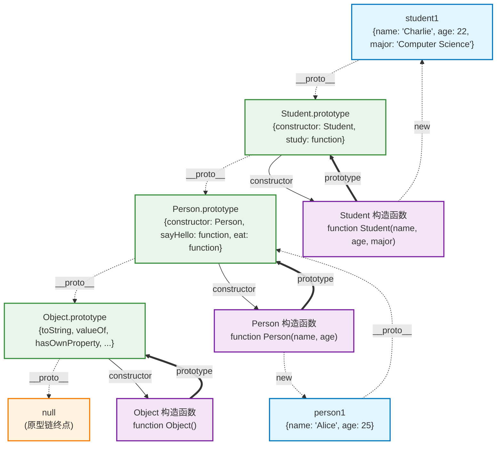
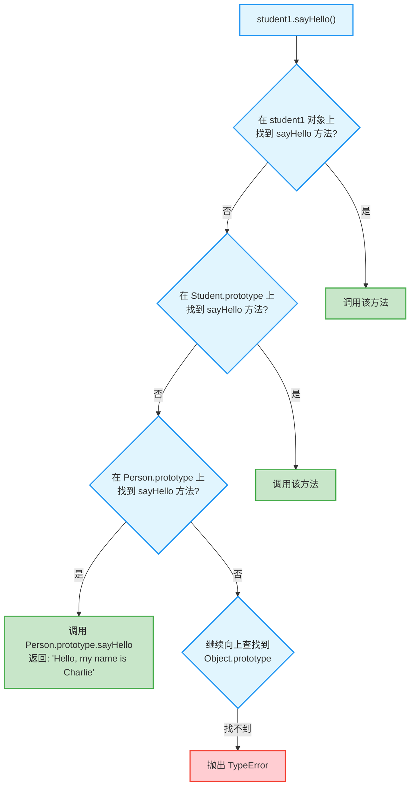

# JavaScript原型与继承

## 🔥 必须理解：原型链概念

### 什么是原型链

在JavaScript中，每个对象都有一个隐藏的`[[Prototype]]`属性，指向另一个对象。当访问对象的属性时，如果对象本身没有，就会沿着原型链向上查找。

```javascript
const person = {
    name: "张三",
    greet() {
        console.log(`你好，我是${this.name}`);
    }
};

// 创建另一个对象，以person为原型
const student = Object.create(person);

student.studentId = "001";
student.study = function() {
    console.log(`${this.name}正在学习`);
}
;
console.log(student.name);    // "张三" (从原型上继承)
student.greet();              // "你好，我是张三" (从原型上继承)
student.study();              // "张三正在学习" (自有方法)

// 查看原型链
console.log(student.__proto__ === person);           // true
console.log(person.__proto__ === Object.prototype);  // true
console.log(Object.prototype.__proto__);             // null (链的终点)
```

### 原型链查找机制

```javascript
const grandparent = {
    surname: "王",
    family: "王家"
};

const parent = Object.create(grandparent);
parent.job = "工程师";

const child = Object.create(parent);
child.name = "小明";
child.age = 10;

// 原型链: child -> parent -> grandparent -> Object.prototype -> null

console.log(child.name);    // "小明" (自有属性)
console.log(child.job);     // "工程师" (来自parent)
console.log(child.surname); // "王" (来自grandparent)
console.log(child.toString); // [Function: toString] (来自Object.prototype)

// 属性查找顺序
console.log(child.hasOwnProperty('name'));    // true (自有属性)
console.log(child.hasOwnProperty('job'));     // false (继承属性)
console.log('job' in child);                  // true (原型链中存在)
```

## 🔥 必须理解：构造函数和prototype

### 构造函数的原型机制

```javascript
// 构造函数
function Animal(name) {
    this.name = name;
}

// 在构造函数的prototype上添加方法
Animal.prototype.eat = function() {
    console.log(`${this.name}正在吃东西`);
};

Animal.prototype.sleep = function() {
    console.log(`${this.name}正在睡觉`);
};

// 创建实例
const dog = new Animal("小狗");
const cat = new Animal("小猫");

// 所有实例共享原型上的方法
dog.eat();   // "小狗正在吃东西"
cat.sleep(); // "小猫正在睡觉"

// 验证原型关系
console.log(dog.__proto__ === Animal.prototype);        // true
console.log(dog.constructor === Animal);                // true
console.log(dog instanceof Animal);                     // true

// 原型上的方法是共享的
console.log(dog.eat === cat.eat);                       // true (同一个函数)
```

### 原型继承实现

```javascript
// 父类构造函数
function Animal(name) {
    this.name = name;
}

Animal.prototype.eat = function() {
    console.log(`${this.name}在吃东西`);
};

// 子类构造函数
function Dog(name, breed) {
    Animal.call(this, name); // 调用父类构造函数
    this.breed = breed;
}

// 设置原型继承关系
Dog.prototype = Object.create(Animal.prototype);
Dog.prototype.constructor = Dog;

// 添加子类特有方法
Dog.prototype.bark = function() {
    console.log(`${this.name}在汪汪叫`);
};

// 使用
const myDog = new Dog("旺财", "金毛");
myDog.eat();  // "旺财在吃东西" (继承自Animal)
myDog.bark(); // "旺财在汪汪叫" (Dog特有)

console.log(myDog instanceof Dog);    // true
console.log(myDog instanceof Animal); // true
```

## 📚 现代替代：ES6 Class语法（推荐）

### Class基本语法

```javascript
// 使用Class语法重写上面的例子
class Animal {
    constructor(name) {
        this.name = name;
    }
    
    eat() {
        console.log(`${this.name}在吃东西`);
    }
    
    sleep() {
        console.log(`${this.name}在睡觉`);
    }
}

class Dog extends Animal {
    constructor(name, breed) {
        super(name); // 调用父类构造函数
        this.breed = breed;
    }
    
    bark() {
        console.log(`${this.name}在汪汪叫`);
    }
    
    // 方法重写
    eat() {
        console.log(`狗狗${this.name}在啃骨头`);
    }
}

// 使用方式完全相同
const myDog = new Dog("旺财", "金毛");
myDog.eat();  // "狗狗旺财在啃骨头"
myDog.bark(); // "旺财在汪汪叫"

console.log(myDog instanceof Dog);    // true
console.log(myDog instanceof Animal); // true
```

### 实际开发中的Class应用

```javascript
// 基础组件类
class Component {
    constructor(element) {
        this.element = element;
        this.initialize();
    }
    
    initialize() {
        // 子类可以重写
    }
    
    render() {
        throw new Error("子类必须实现render方法");
    }
    
    destroy() {
        if (this.element && this.element.parentNode) {
            this.element.parentNode.removeChild(this.element);
        }
    }
}

// 按钮组件
class Button extends Component {
    constructor(element, options = {}) {
        super(element);
        this.options = options;
        this.clickCount = 0;
    }
    
    initialize() {
        this.element.addEventListener('click', (e) => this.handleClick(e));
    }
    
    handleClick(event) {
        this.clickCount++;
        console.log(`按钮被点击了${this.clickCount}次`);
        
        if (this.options.onClick) {
            this.options.onClick(event, this.clickCount);
        }
    }
    
    render() {
        this.element.textContent = this.options.text || '点击我';
        return this.element;
    }
}

// 使用
const buttonElement = document.createElement('button');
const myButton = new Button(buttonElement, {
    text: '提交',
    onClick: (event, count) => {
        console.log(`提交按钮被点击了${count}次`);
    }
});
```

## ⚡ 了解应用：原型的实际应用

### 扩展内置对象原型（谨慎使用）

```javascript
// 给所有数组添加一个去重方法
Array.prototype.unique = function() {
    return [...new Set(this)];
};

const numbers = [1, 2, 2, 3, 3, 4];
console.log(numbers.unique()); // [1, 2, 3, 4]

// 给所有字符串添加首字母大写方法
String.prototype.capitalize = function() {
    return this.charAt(0).toUpperCase() + this.slice(1);
};

console.log("hello".capitalize()); // "Hello"

// ⚠️ 注意：扩展内置原型有风险，可能与其他库冲突
// 现代开发中更推荐使用工具函数
```

### 创建工具对象的原型

```javascript
// 工具函数的原型模式
const MathUtils = {
    PI: 3.14159,
    
    circleArea(radius) {
        return this.PI * radius * radius;
    },
    
    circlePerimeter(radius) {
        return 2 * this.PI * radius;
    }
};

// 创建具体的几何对象
const circle = Object.create(MathUtils);
circle.radius = 5;

console.log(circle.circleArea(circle.radius));      // 78.53975
console.log(circle.circlePerimeter(circle.radius)); // 31.4159
```

## 🔥 重要概念：原生原型

### 理解JavaScript内置对象的原型链

```javascript
// 数组的原型链
const arr = [1, 2, 3];
console.log(arr.__proto__ === Array.prototype);           // true
console.log(Array.prototype.__proto__ === Object.prototype); // true

// 函数的原型链
function myFunc() {}
console.log(myFunc.__proto__ === Function.prototype);     // true
console.log(Function.prototype.__proto__ === Object.prototype); // true

// 对象的原型链
const obj = {};
console.log(obj.__proto__ === Object.prototype);          // true
console.log(Object.prototype.__proto__);                  // null

// 这就是为什么所有对象都有toString、hasOwnProperty等方法
console.log(arr.toString());        // "1,2,3"
console.log(myFunc.toString());     // "function myFunc() {}"
console.log(obj.toString());        // "[object Object]"
```

### 原型污染防护

```javascript
// 创建无原型对象，避免原型污染
const safeObject = Object.create(null);
safeObject.name = "安全对象";

console.log(safeObject.toString);      // undefined (没有原型)
console.log(safeObject.hasOwnProperty); // undefined

// 安全的属性检查
function hasOwnProperty(obj, prop) {
    return Object.prototype.hasOwnProperty.call(obj, prop);
}

console.log(hasOwnProperty(safeObject, 'name')); // true
```

## 实际开发建议

### 现代开发中的最佳实践

```javascript
// ✅ 推荐：使用ES6 Class
class User {
    constructor(name, email) {
        this.name = name;
        this.email = email;
    }
    getProfile() {
        return {
            name: this.name,
            email: this.email
        };
    }
}
class AdminUser extends User {
    constructor(name, email, permissions) {
        super(name, email);
        this.permissions = permissions;
    }
    
    hasPermission(permission) {
        return this.permissions.includes(permission);
    }
}

// ✅ 推荐：工厂函数模式
function createUser(name, email) {
    return {
        name,
        email,
        getProfile() {
            return {
                name: this.name,
                email: this.email
            };
        }
    };
}

// ❌ 不推荐：复杂的原型操作
function User(name) {
    this.name = name;
}
User.prototype.getName = function() {
    return this.name;
};
```

### 什么时候需要了解原型

```javascript
// 1. 调试时理解继承关系
class Component extends React.Component {
    // 当你需要理解为什么可以调用this.setState时
    // 就需要知道它来自React.Component.prototype
}

// 2. 理解第三方库的工作原理
// jQuery、lodash等库大量使用原型

// 3. 性能优化：理解方法共享
class MyClass {
    constructor() {
        // ❌ 每个实例都会创建新函数
        this.method = function() {
            console.log('实例方法');
        };
    }
}

class MyClass {
    constructor() {
        // ✅ 所有实例共享原型上的方法
    }
    
    method() {
        console.log('原型方法');
    }
}
```

## 🔑 核心理解：原型链是JavaScript的本质

### Class只是语法糖的证明

```javascript
// ES6 Class语法
class Animal {
    constructor(name) {
        this.name = name;
    }
    
    speak() {
        console.log(`${this.name} makes a sound`);
    }
}

// 上面的Class实际上等价于：
function Animal(name) {
    this.name = name;
}

Animal.prototype.speak = function() {
    console.log(`${this.name} makes a sound`);
};

// 验证Class本质上还是原型
const obj = new Animal("test");
console.log(obj.__proto__ === Animal.prototype);         // true
console.log(typeof Animal);                              // "function" (不是特殊类型)
console.log(Animal.prototype.constructor === Animal);    // true
```

### 为什么JavaScript选择原型而不是类？

1. **历史设计**：1995年受Self语言影响，采用基于原型的继承
2. **动态灵活**：运行时可以修改原型链，对象可以直接继承对象
3. **"万物皆对象"**：统一的对象模型，所有值都通过原型链获得方法

```javascript
// 原型的动态特性：运行时修改
function Person(name) {
    this.name = name;
}

const person1 = new Person("张三");

// 运行时给所有Person实例添加方法
Person.prototype.greet = function() {
    console.log(`Hello, I'm ${this.name}`);
};

person1.greet(); // "Hello, I'm 张三" - 已有实例立即获得新方法！

// 这就解释了为什么所有对象都有toString、valueOf等方法
// 因为它们都在Object.prototype上
```

### 现代开发的平衡策略

```javascript
// ✅ 日常开发：使用Class语法（简洁、易读、不容易出错）
class UserService {
    constructor(apiUrl) {
        this.apiUrl = apiUrl;
    }
    
    async getUser(id) {
        const response = await fetch(`${this.apiUrl}/users/${id}`);
        return response.json();
    }
}

// ✅ 理解底层：知道Class实际上是原型操作的语法糖
// 这样遇到继承、this绑定等问题时能找到根本原因

// ✅ 特殊需求：直接操作原型（比如polyfill、库开发）
if (!Array.prototype.includes) {
    Array.prototype.includes = function(searchElement) {
        return this.indexOf(searchElement) !== -1;
    };
}
```

## 总结

### 🔥 核心认知
**原型链是JavaScript的DNA**：
- 所有对象的继承机制都基于原型链
- Class语法只是让原型操作更易写、易读的语法糖
- 理解原型链 = 理解JavaScript对象系统的本质

### 现在需要掌握的
1. **原型链是核心机制**：JavaScript继承的根本实现
2. **Class是语法糖**：底层还是原型操作，但代码更清晰
3. **动态特性**：理解为什么JavaScript如此灵活
4. **实际应用**：日常用Class，特殊情况直接操作原型

### 了解即可的
1. **复杂的原型操作**：Object.create、prototype链式操作
2. **原型污染**：安全相关的高级话题
3. **内置原型扩展**：有风险，谨慎使用

# JavaScript 原型链继承图解

基于 `practice.js` 中的原型链继承示例，展示 Person 和 Student 类的原型链结构。

## 代码结构概述
```js
function Person(name, age) {
    this.name = name;
    this.age = age;
}

// 在原型上添加方法
Person.prototype.sayHello = function() {
    return `Hello, my name is ${this.name}`;
};

Person.prototype.eat = function() {
    return `${this.name} is eating`;
};

// 创建实例
const person1 = new Person('Alice', 25);
const person2 = new Person('Bob', 30);

console.log('person1:', person1);
console.log('person1.sayHello():', person1.sayHello());
console.log('person2.eat():', person2.eat());

// 原型链继承示例
function Student(name, age, major) {
    // 继承属性
    Person.call(this, name, age);  // 调用父类构造函数，继承父类的属性
    this.major = major;  // 添加子类特有的属性
}

// 继承方法（设置原型链）
Student.prototype = Object.create(Person.prototype);  // 创建一个以Person.prototype为原型的对象，并将其设为Student的原型
// 修复构造函数指向
Student.prototype.constructor = Student;  // 重置constructor属性，使其指向Student本身

// 添加子类特有方法
Student.prototype.study = function() {
    return `${this.name} is studying ${this.major}`;
};

const student1 = new Student('Charlie', 22, 'Computer Science');
console.log('\nstudent1:', student1);
console.log('student1.sayHello():', student1.sayHello()); // 继承自Person
console.log('student1.study():', student1.study()); // Student特有方法

// 原型链查找演示
console.log('\n原型链查找演示:');
console.log('student1.__proto__ === Student.prototype:', student1.__proto__ === Student.prototype);
console.log('Student.prototype.__proto__ === Person.prototype:', Student.prototype.__proto__ === Person.prototype);
console.log('Person.prototype.__proto__ === Object.prototype:', Person.prototype.__proto__ === Object.prototype);
console.log('Object.prototype.__proto__:', Object.prototype.__proto__); // null，原型链的终点
```

- **Person**: 父类构造函数，包含 `name` 和 `age` 属性
- **Student**: 子类构造函数，继承 Person 并添加 `major` 属性
- **继承方式**: 使用 `Object.create()` 和 `call()` 实现原型链继承

## 原型链继承图

  1. 原型链继承结构图 - 展示了 Person 和 Student 类的完整原型链关系，包括实例、构造函数、原型对象之间的连接关系
  2. 方法查找流程图 - 演示了当调用 student1.sayHello() 时，JavaScript 引擎如何沿着原型链查找方法的过程

  图表清楚地展示了：
  - 实例对象通过 __proto__ 连接到原型对象
  - 构造函数通过 prototype 连接到原型对象
  - 原型链的层次结构：student1 → Student.prototype → Person.prototype → Object.prototype → null
  - 方法继承和查找的机制

  这个可视化图表能帮助你更好地理解 JavaScript 原型链继承的工作原理。



## 方法查找过程

当调用 `student1.sayHello()` 时的查找过程：



## 关键概念说明

### 1. 原型链查找规则
- 先在实例对象自身查找属性/方法
- 找不到则沿着 `__proto__` 链向上查找
- 直到 `Object.prototype.__proto__` (null) 为止

### 2. 继承实现关键步骤
```javascript
// 1. 继承属性: 在子类构造函数中调用父类构造函数
Person.call(this, name, age);

// 2. 继承方法: 设置原型链关系
Student.prototype = Object.create(Person.prototype);

// 3. 修复构造函数指向
Student.prototype.constructor = Student;
```

### 3. 原型链的优势
- **方法共享**: 所有实例共享原型上的方法，节省内存
- **动态扩展**: 可以动态给原型添加方法，所有实例立即可用
- **继承机制**: 通过原型链实现类之间的继承关系

这种原型链继承机制是 JavaScript 面向对象编程的核心，理解它对掌握 JavaScript 和后续学习 Vue 3 的响应式原理都很重要。