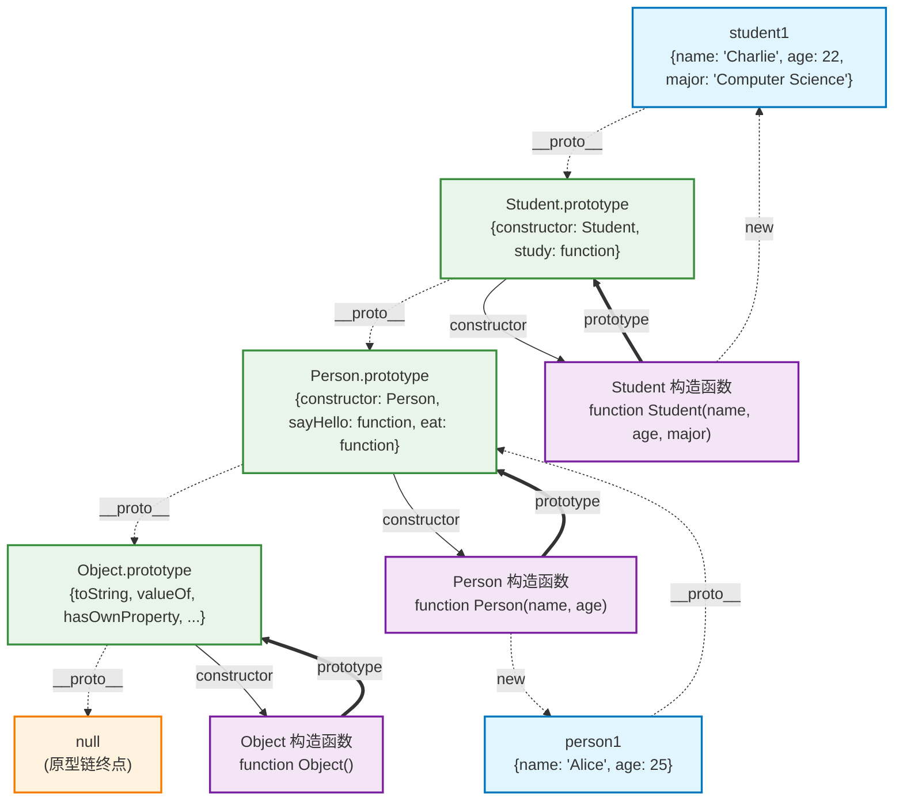
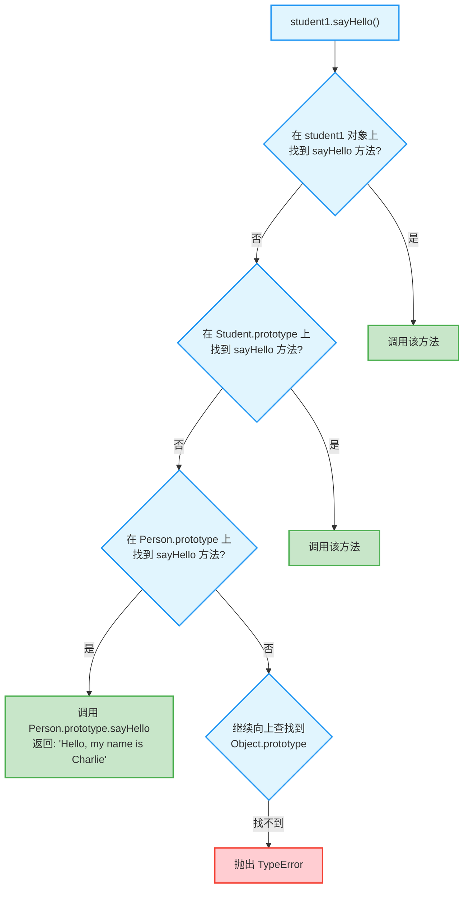

# JavaScript 原型链继承图解

基于经典的 Person 和 Student 类原型链继承示例，深度图解 JavaScript 原型链机制。

## 代码结构概述
- **Person**: 父类构造函数，包含 `name` 和 `age` 属性
- **Student**: 子类构造函数，继承 Person 并添加 `major` 属性
- **继承方式**: 使用 `Object.create()` 和 `call()` 实现原型链继承

## 原型链继承图



## 方法查找过程

当调用 `student1.sayHello()` 时的查找过程：



## 关键概念说明

### 1. 原型链查找规则
- 先在实例对象自身查找属性/方法
- 找不到则沿着 `__proto__` 链向上查找
- 直到 `Object.prototype.__proto__` (null) 为止

### 2. 继承实现关键步骤
```javascript
// 1. 继承属性: 在子类构造函数中调用父类构造函数
Person.call(this, name, age);

// 2. 继承方法: 设置原型链关系
Student.prototype = Object.create(Person.prototype);

// 3. 修复构造函数指向
Student.prototype.constructor = Student;
```

### 3. 原型链的优势
- **方法共享**: 所有实例共享原型上的方法，节省内存
- **动态扩展**: 可以动态给原型添加方法，所有实例立即可用
- **继承机制**: 通过原型链实现类之间的继承关系

### 4. 实际代码示例

```javascript
// 父类构造函数
function Person(name, age) {
    this.name = name;
    this.age = age;
}

// 在原型上添加方法
Person.prototype.sayHello = function() {
    return `Hello, my name is ${this.name}`;
};

Person.prototype.eat = function() {
    return `${this.name} is eating`;
};

// 子类构造函数
function Student(name, age, major) {
    // 继承属性
    Person.call(this, name, age);  
    this.major = major;  
}

// 继承方法（设置原型链）
Student.prototype = Object.create(Person.prototype);  
// 修复构造函数指向
Student.prototype.constructor = Student;  

// 添加子类特有方法
Student.prototype.study = function() {
    return `${this.name} is studying ${this.major}`;
};

// 使用示例
const student1 = new Student('Charlie', 22, 'Computer Science');
console.log(student1.sayHello()); // 继承自Person
console.log(student1.study());    // Student特有方法

// 原型链验证
console.log(student1.__proto__ === Student.prototype);                    // true
console.log(Student.prototype.__proto__ === Person.prototype);           // true
console.log(Person.prototype.__proto__ === Object.prototype);            // true
console.log(Object.prototype.__proto__ === null);                        // true
```

## 与现代 ES6 Class 的对比

ES6 的 class 语法本质上也是基于原型链的语法糖：

```javascript
// ES6 Class 写法
class Person {
    constructor(name, age) {
        this.name = name;
        this.age = age;
    }
    
    sayHello() {
        return `Hello, my name is ${this.name}`;
    }
}

class Student extends Person {
    constructor(name, age, major) {
        super(name, age);  // 等价于 Person.call(this, name, age)
        this.major = major;
    }
    
    study() {
        return `${this.name} is studying ${this.major}`;
    }
}

// 原型链结构完全相同
const student = new Student('Alice', 20, 'Math');
console.log(student.__proto__ === Student.prototype);              // true
console.log(Student.prototype.__proto__ === Person.prototype);     // true
```

这种原型链继承机制是 JavaScript 面向对象编程的核心，理解它对掌握 JavaScript 和现代框架（如 Vue 3）的响应式原理都很重要。