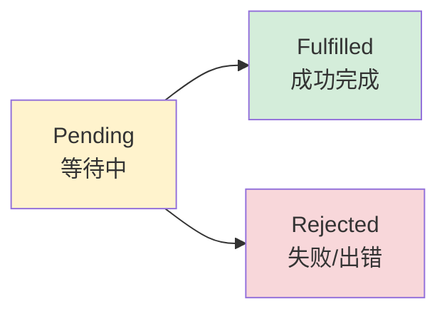

# JavaScript Promise 详解

## 什么是Promise？

Promise是JavaScript中处理异步操作的现代方式，它代表一个"将来会完成的操作"的结果。

### 生活中的类比
想象你在餐厅点餐：
1. **下单**：你点了一份菜（创建Promise）
2. **等待**：厨师在做菜，你不知道什么时候好（Pending状态）
3. **结果**：
   - 菜做好了，服务员送来（Fulfilled状态）
   - 厨师说没有这个菜了（Rejected状态）

## Promise的三种状态



```javascript
// Promise的生命周期
const promise = new Promise((resolve, reject) => {
    // 初始状态：Pending（等待中）
    
    setTimeout(() => {
        const success = Math.random() > 0.5
        
        if (success) {
            resolve("操作成功！")  // 变为 Fulfilled
        } else {
            reject("操作失败！")   // 变为 Rejected
        }
    }, 2000)
})
```

## 与Go语言的对比

### Go语言的异步处理
```go
package main

import (
    "fmt"
    "time"
)

// Go中使用goroutine + channel处理异步
func fetchDataGo() <-chan string {
    resultChan := make(chan string, 1)
    
    go func() {
        // 模拟耗时操作
        time.Sleep(2 * time.Second)
        
        // 随机成功或失败
        if time.Now().Unix()%2 == 0 {
            resultChan <- "数据获取成功"
        } else {
            resultChan <- "ERROR: 获取失败"
        }
        close(resultChan)
    }()
    
    return resultChan
}

func main() {
    fmt.Println("开始获取数据...")
    
    // 阻塞等待结果
    result := <-fetchDataGo()
    fmt.Println("结果:", result)
    
    fmt.Println("程序结束")
}
```

### JavaScript的Promise处理
```javascript
// JavaScript中使用Promise处理异步
function fetchDataJS() {
    return new Promise((resolve, reject) => {
        // 模拟耗时操作
        setTimeout(() => {
            // 随机成功或失败
            if (Math.random() > 0.5) {
                resolve("数据获取成功")
            } else {
                reject("ERROR: 获取失败")
            }
        }, 2000)
    })
}

console.log("开始获取数据...")

// 非阻塞处理结果
fetchDataJS()
    .then(result => console.log("结果:", result))
    .catch(error => console.log("错误:", error))

console.log("程序继续执行...")  // 立即执行，不等待
```

## Promise的基本语法

### 1. 创建Promise
```javascript
const myPromise = new Promise((resolve, reject) => {
    // executor函数：立即执行的代码
    
    // 异步操作成功时调用resolve
    // 异步操作失败时调用reject
})
```

### 2. 使用Promise
```javascript
myPromise
    .then(result => {
        // 处理成功结果
        console.log("成功:", result)
    })
    .catch(error => {
        // 处理错误
        console.log("失败:", error)
    })
    .finally(() => {
        // 无论成功失败都会执行
        console.log("操作完成")
    })
```

## 实际应用示例

### 1. 网络请求模拟
```javascript
// 模拟API调用
function fetchUserInfo(userId) {
    return new Promise((resolve, reject) => {
        console.log(`正在获取用户${userId}的信息...`)
        
        // 模拟网络延迟
        setTimeout(() => {
            if (userId <= 0) {
                reject(new Error("用户ID无效"))
                return
            }
            
            // 模拟网络失败
            if (Math.random() < 0.2) {
                reject(new Error("网络连接失败"))
                return
            }
            
            // 成功返回用户数据
            const userData = {
                id: userId,
                name: `用户${userId}`,
                email: `user${userId}@example.com`,
                skills: ['Go', 'PHP', 'JavaScript']
            }
            
            resolve(userData)
        }, 1500)
    })
}

// 使用示例
fetchUserInfo(123)
    .then(user => {
        console.log("获取到用户信息:", user)
        console.log(`欢迎 ${user.name}！`)
        return user.skills  // 可以返回值给下一个then
    })
    .then(skills => {
        console.log("用户技能:", skills.join(', '))
    })
    .catch(error => {
        console.error("获取用户信息失败:", error.message)
    })
    .finally(() => {
        console.log("用户信息请求处理完成")
    })
```

### 2. 文件操作模拟
```javascript
// 模拟文件读取
function readFile(filename) {
    return new Promise((resolve, reject) => {
        console.log(`正在读取文件: ${filename}`)
        
        setTimeout(() => {
            // 模拟文件不存在
            if (filename.includes('notfound')) {
                reject(new Error(`文件不存在: ${filename}`))
                return
            }
            
            // 模拟文件内容
            const content = `这是 ${filename} 的内容\n包含一些重要数据...`
            resolve(content)
        }, 1000)
    })
}

// 使用示例
readFile('config.json')
    .then(content => {
        console.log("文件内容:")
        console.log(content)
    })
    .catch(error => {
        console.error("读取文件失败:", error.message)
    })
```

## Promise链式调用

```javascript
// 多个异步操作按顺序执行
function step1() {
    return new Promise(resolve => {
        setTimeout(() => {
            console.log("步骤1完成")
            resolve("step1 result")
        }, 1000)
    })
}

function step2(data) {
    return new Promise(resolve => {
        setTimeout(() => {
            console.log("步骤2完成, 接收到:", data)
            resolve("step2 result")
        }, 1000)
    })
}

function step3(data) {
    return new Promise(resolve => {
        setTimeout(() => {
            console.log("步骤3完成, 接收到:", data)
            resolve("final result")
        }, 1000)
    })
}

// 链式调用
step1()
    .then(result1 => step2(result1))
    .then(result2 => step3(result2))
    .then(finalResult => {
        console.log("所有步骤完成:", finalResult)
    })
    .catch(error => {
        console.error("某个步骤失败:", error)
    })
```

## Promise的实用方法

### 1. Promise.all() - 并发执行
```javascript
// 同时执行多个Promise，全部成功才返回
const promise1 = fetchUserInfo(1)
const promise2 = fetchUserInfo(2)
const promise3 = fetchUserInfo(3)

Promise.all([promise1, promise2, promise3])
    .then(users => {
        console.log("所有用户信息获取成功:")
        users.forEach(user => console.log(user.name))
    })
    .catch(error => {
        console.error("至少有一个用户信息获取失败:", error)
    })
```

### 2. Promise.allSettled() - 获取所有结果
```javascript
// 等待所有Promise完成，无论成功失败
Promise.allSettled([promise1, promise2, promise3])
    .then(results => {
        results.forEach((result, index) => {
            if (result.status === 'fulfilled') {
                console.log(`用户${index + 1}:`, result.value.name)
            } else {
                console.log(`用户${index + 1}失败:`, result.reason.message)
            }
        })
    })
```

### 3. Promise.race() - 竞速执行
```javascript
// 返回最快完成的Promise结果
const fastPromise = new Promise(resolve => setTimeout(() => resolve("快"), 100))
const slowPromise = new Promise(resolve => setTimeout(() => resolve("慢"), 1000))

Promise.race([fastPromise, slowPromise])
    .then(result => {
        console.log("最快的结果:", result)  // "快"
    })
```

## async/await - Promise的现代语法

### 传统Promise语法
```javascript
function fetchAndProcessUser() {
    return fetchUserInfo(123)
        .then(user => {
            console.log("用户:", user.name)
            return readFile(`${user.id}.txt`)
        })
        .then(fileContent => {
            console.log("文件内容:", fileContent)
            return "处理完成"
        })
        .catch(error => {
            console.error("处理失败:", error)
            throw error
        })
}
```

### async/await语法
```javascript
async function fetchAndProcessUser() {
    try {
        const user = await fetchUserInfo(123)
        console.log("用户:", user.name)
        
        const fileContent = await readFile(`${user.id}.txt`)
        console.log("文件内容:", fileContent)
        
        return "处理完成"
    } catch (error) {
        console.error("处理失败:", error)
        throw error
    }
}
```

## 在Vue中的应用

```vue
<template>
    <div>
        <button @click="loadUser" :disabled="loading">
            {{ loading ? '加载中...' : '获取用户信息' }}
        </button>
        
        <div v-if="user">
            <h3>{{ user.name }}</h3>
            <p>邮箱: {{ user.email }}</p>
            <p>技能: {{ user.skills.join(', ') }}</p>
        </div>
        
        <div v-if="error" class="error">
            错误: {{ error }}
        </div>
    </div>
</template>

<script setup>
import { ref } from 'vue'

const user = ref(null)
const loading = ref(false)
const error = ref('')

const loadUser = async () => {
    loading.value = true
    error.value = ''
    user.value = null
    
    try {
        // 使用我们之前定义的fetchUserInfo函数
        const userData = await fetchUserInfo(123)
        user.value = userData
    } catch (err) {
        error.value = err.message
    } finally {
        loading.value = false
    }
}
</script>

<style>
.error {
    color: red;
    margin-top: 10px;
}
</style>
```

## 常见错误和最佳实践

### ❌ 常见错误
```javascript
// 错误1: 忘记返回Promise
function badExample() {
    fetchUserInfo(123).then(user => {
        console.log(user)
        // 没有返回Promise，外部无法等待
    })
}

// 错误2: 不处理错误
fetchUserInfo(123)
    .then(user => console.log(user))
    // 没有.catch()，错误会被忽略

// 错误3: Promise中使用同步错误处理
new Promise((resolve, reject) => {
    try {
        // 异步操作
        setTimeout(() => {
            throw new Error("异步错误")  // 这个错误不会被catch捕获
        }, 1000)
    } catch (error) {
        reject(error)  // 只能捕获同步错误
    }
})
```

### ✅ 最佳实践
```javascript
// 正确1: 总是返回Promise
function goodExample() {
    return fetchUserInfo(123)
        .then(user => {
            console.log(user)
            return user  // 返回结果供后续使用
        })
}

// 正确2: 始终处理错误
fetchUserInfo(123)
    .then(user => console.log(user))
    .catch(error => console.error("处理错误:", error))

// 正确3: 异步操作中正确处理错误
function createAsyncPromise() {
    return new Promise((resolve, reject) => {
        setTimeout(() => {
            const success = Math.random() > 0.5
            if (success) {
                resolve("成功")
            } else {
                reject(new Error("异步操作失败"))  // 正确的错误处理
            }
        }, 1000)
    })
}
```

## 总结

Promise是JavaScript异步编程的核心概念，它：

1. **解决回调地狱**：让异步代码更加清晰
2. **统一错误处理**：通过.catch()统一处理错误
3. **支持链式调用**：可以优雅地组合多个异步操作
4. **现代语法支持**：与async/await配合使用体验更好

在Vue开发中，Promise无处不在：
- 网络请求（fetch、axios）
- 路由切换
- 组件懒加载
- 用户交互响应

掌握Promise是现代JavaScript开发的必备技能！

## 练习建议

1. **运行本文档中的代码示例**
2. **修改示例中的参数**，观察不同结果
3. **尝试组合多个Promise**，理解链式调用
4. **用async/await重写Promise代码**，体会语法差异
5. **在Vue项目中实践**，结合实际应用场景

记住：Promise不难，关键是要多练习和实际应用！