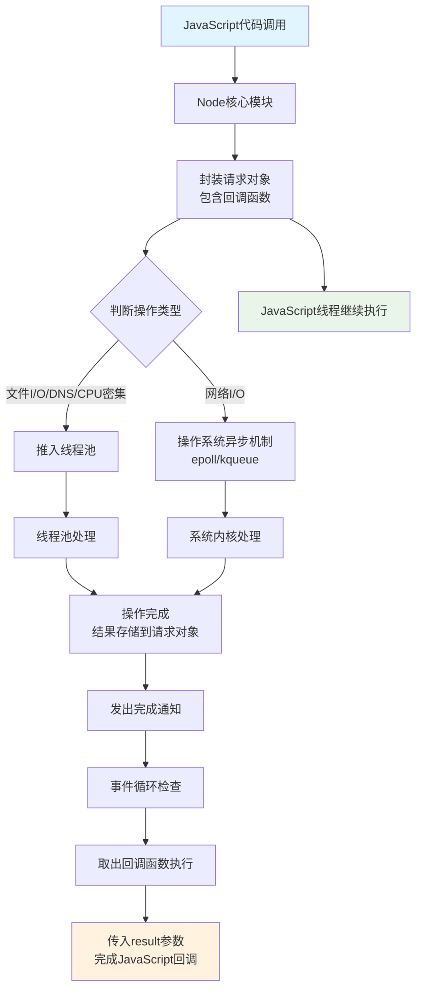
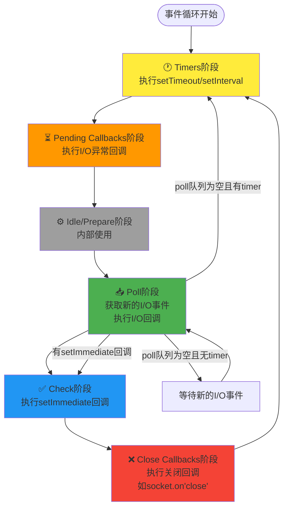
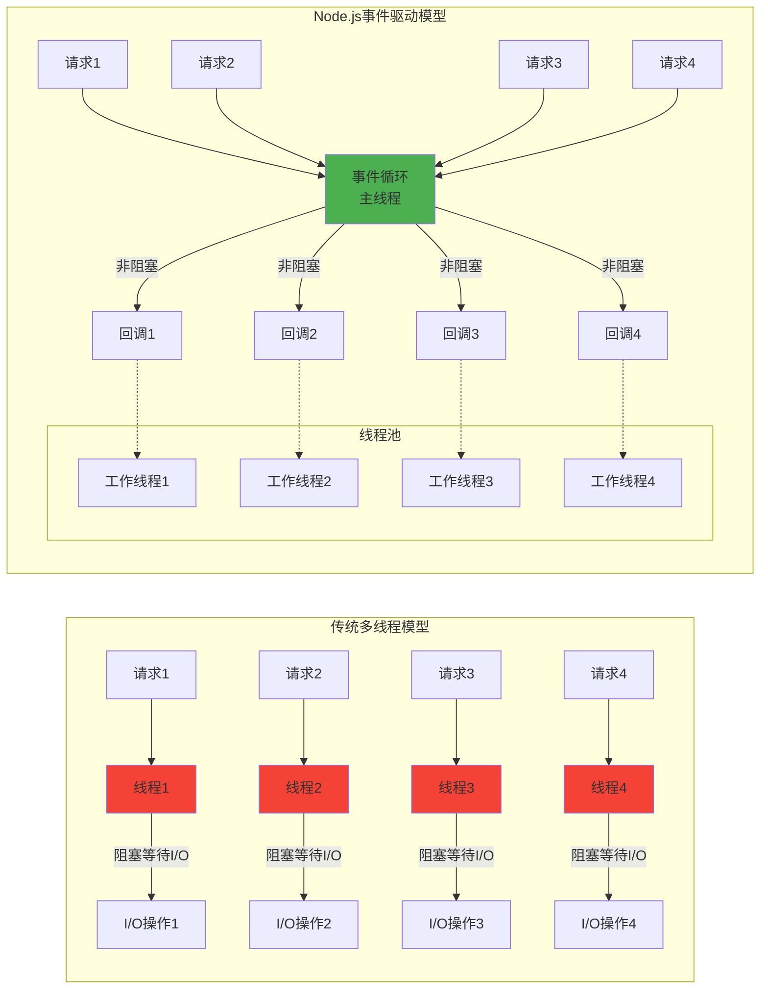

## Node.js异步I/O原理深度解析

### 核心原理总结
书中描述基本正确，Node.js异步I/O的核心是：**单线程事件循环 + 多线程线程池**的协作模式。

### 异步I/O完整流程

### 事件循环详细机制

### 关键技术细节

#### 1. 不同异步操作的处理方式
- **文件I/O、DNS查询、CPU密集型** → 线程池（libuv线程池，默认4个线程）
- **网络I/O（TCP/HTTP/UDP）** → 操作系统异步机制，不占用线程池
- **setTimeout/setInterval** → timers阶段处理
- **setImmediate** → check阶段处理

#### 2. 单线程的准确含义
- **主线程**：执行JavaScript代码，单线程
- **线程池**：处理文件I/O等阻塞操作，多线程
- **异步I/O线程**：由操作系统管理，处理网络操作

#### 3. 观察者模式
每种异步操作类型都有对应的观察者：
- **文件I/O观察者**
- **网络I/O观察者** 
- **定时器观察者**
- **Check观察者**（setImmediate）

### 性能优势
1. **非阻塞**：主线程不会被I/O操作阻塞
2. **高并发**：单线程处理大量连接，内存占用小
3. **事件驱动**：基于事件和回调，响应速度快
4. **系统资源充分利用**：I/O密集型场景下CPU利用率高

### 与传统多线程模型对比

#### 对比分析：
- **传统模型**：每个请求一个线程，线程阻塞等待I/O，资源浪费大
- **Node.js模型**：单线程事件循环处理所有请求，线程池仅处理I/O，资源利用率高

#### Node.js优势：
1. **内存占用小**：单线程vs多线程，每个线程需要2MB内存
2. **上下文切换少**：减少CPU在线程间切换的开销
3. **高并发能力**：能同时处理数万个连接
4. **简化编程模型**：避免线程同步和锁的复杂性

这就是为什么Node.js特别适合I/O密集型应用（如Web服务器、API服务、实时通讯）的根本原因。