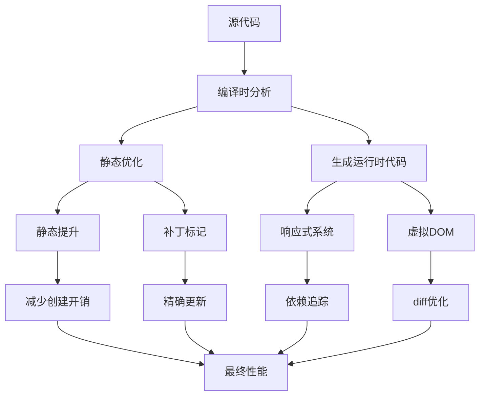

# Vue 3 运行时 + 编译时混合架构深度分析

## 架构设计理念

Vue 3 采用了"运行时 + 编译时"的混合架构，这种设计在保持最大灵活性的同时，通过编译时优化获得接近纯编译时框架的性能表现。

## 三种主流架构对比

### 1. 纯运行时架构
**代表**: 早期jQuery、Vue 1.x
- **优势**: 极高灵活性，可以处理任何动态场景
- **劣势**: 所有工作都在浏览器中完成，性能开销大
- **特点**: 完全依赖运行时的diff和更新机制

### 2. 纯编译时架构  
**代表**: Svelte
- **优势**: 性能极佳，编译后代码接近原生JavaScript
- **劣势**: 灵活性受限，某些动态场景难以处理
- **特点**: 编译时分析所有依赖，生成精确的更新代码

### 3. 运行时 + 编译时混合架构
**代表**: Vue 3、React (部分优化)
- **优势**: 平衡了性能和灵活性
- **特点**: 编译时做能做的优化，运行时处理动态场景

## Vue 3 混合架构的具体实现

### 编译时优化策略

#### 1. 静态提升 (Static Hoisting)
```javascript
// 编译前
<template>
  <div>
    <h1>静态标题</h1>
    <p>{{ message }}</p>
  </div>
</template>

// 编译后 (简化版)
const _hoisted_1 = /*#__PURE__*/ _createElementVNode("h1", null, "静态标题", -1)

function render() {
  return _createElementVNode("div", null, [
    _hoisted_1, // 静态元素被提升，不会重复创建
    _createElementVNode("p", null, _toDisplayString(message), 1)
  ])
}
```

#### 2. 补丁标记 (Patch Flags)
```javascript
// Vue 3 编译器会分析每个节点的变化类型
const PatchFlags = {
  TEXT: 1,           // 文本内容会变化
  CLASS: 2,          // class会变化  
  STYLE: 4,          // style会变化
  PROPS: 8,          // props会变化
  // ... 更多标记
}

// 编译后的代码会携带精确的更新标记
_createElementVNode("p", null, message, 1 /* TEXT */)
```

#### 3. 树结构打平 (Tree Flattening)
```javascript
// 编译时将动态节点打平成数组，避免递归遍历
const dynamicChildren = [
  // 只包含会变化的节点
  textNode,
  conditionalNode
]
```

### 运行时优化策略

#### 1. 响应式系统优化
- **Proxy-based**: 使用Proxy替代Object.defineProperty
- **依赖追踪**: 精确追踪依赖关系，避免不必要的更新
- **懒响应式**: 只有被访问的属性才会建立响应式连接

#### 2. 虚拟DOM优化
- **快速路径**: 对于编译时优化的节点使用快速更新路径
- **动态节点**: 只diff标记为动态的节点
- **组件级缓存**: 缓存不变的组件实例

## 混合架构的优势

### 1. 性能优化


### 2. 灵活性保持
- **动态模板**: 支持运行时动态生成的模板
- **动态组件**: 可以根据条件动态切换组件
- **v-html/v-text**: 处理动态HTML内容
- **渲染函数**: 完全的编程式渲染能力

### 3. 开发体验
- **热更新**: 编译时优化不影响开发时的热更新
- **调试友好**: 保留清晰的运行时信息
- **渐进式**: 可以逐步迁移现有代码

## 实际性能表现

### 编译时收益
```javascript
// 传统方式: 每次都要遍历整个树
function updateTraditional() {
  traverse(vnode) // O(n)
  diff(oldVnode, newVnode) // O(n)
  patch(patches) // O(m)
}

// Vue 3优化后: 直接定位到变化节点
function updateOptimized() {
  // 只更新标记的动态节点
  updateDynamicChildren(dynamicChildren) // O(m), m << n
}
```

### 内存优化
- **静态提升**: 静态元素在模块级别创建一次，所有实例共享
- **Tree Shaking**: 未使用的特性在编译时被移除
- **按需引入**: 只打包实际使用的功能

## 与其他方案的对比

| 特性 | 纯运行时 | 纯编译时 | Vue 3混合 |
|------|----------|----------|-----------|
| 性能 | ⭐⭐ | ⭐⭐⭐⭐⭐ | ⭐⭐⭐⭐ |
| 灵活性 | ⭐⭐⭐⭐⭐ | ⭐⭐ | ⭐⭐⭐⭐ |
| 包体积 | ⭐⭐ | ⭐⭐⭐⭐⭐ | ⭐⭐⭐ |
| 开发体验 | ⭐⭐⭐ | ⭐⭐⭐ | ⭐⭐⭐⭐⭐ |
| 学习成本 | ⭐⭐⭐ | ⭐⭐⭐⭐ | ⭐⭐⭐ |

## 设计哲学体现

Vue 3的混合架构完美体现了尤雨溪的设计哲学：

### 1. 渐进式框架
- 不强制用户改变现有架构
- 可以局部使用，逐步迁移
- 保持API的连续性

### 2. 性能与灵活性平衡
- 编译时优化能优化的部分
- 运行时处理无法预知的动态场景
- 给开发者选择的权利

### 3. 开发体验优先
- 编译时优化对开发者透明
- 保持模板语法的直观性
- 工具链集成度高

## 结论

Vue 3的"运行时 + 编译时"混合架构是一个工程学上的优秀设计：

1. **技术创新**: 通过编译时分析和运行时优化的结合，达到了接近纯编译时框架的性能
2. **实用主义**: 在性能和灵活性之间找到了最佳平衡点
3. **可持续发展**: 为未来更多编译时优化保留了空间，同时不破坏现有生态

这种架构设计体现了现代前端框架发展的一个重要趋势：不是非黑即白的技术选择，而是在保持核心优势的基础上，通过技术创新获得更好的综合表现。

---
*记录日期: 2025-07-29*
*学习来源: Vue 3架构设计分析*
*相关概念: 编译时优化、运行时性能、架构设计*