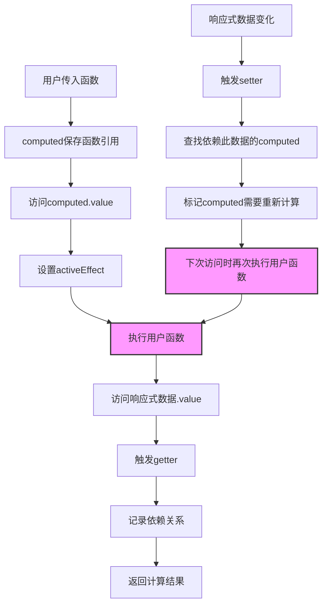

# Vue 3 computed 响应式计算原理深度解析

## 前言

通过与Claude的深入讨论，彻底理解了Vue 3中`computed()`的工作机制。这不是编译时的魔法，而是运行时基于Proxy和依赖追踪实现的精妙设计。

## 核心理解

### computed的本质机制

**核心流程**：
1. `computed()`接收用户传入的函数
2. 当访问计算属性的`.value`时，computed内部执行用户函数
3. 用户函数执行过程中访问响应式数据，触发这些数据的getter
4. getter检测到当前有活跃的computed，记录依赖关系
5. 当依赖的数据发生变化时，根据依赖关系重新调用用户函数

```javascript
let firstName = ref('zhang')
let lastName = ref('san')

// 用户传入计算函数
let fullName = computed(() => {
  console.log('🧮 用户函数被调用')
  return firstName.value + '-' + lastName.value  // 访问响应式数据
})

// 首次访问，建立依赖关系
console.log(fullName.value)  // 输出: 🧮 用户函数被调用, zhang-san

// 依赖变化，自动重新计算
firstName.value = 'li'
console.log(fullName.value)  // 输出: 🧮 用户函数被调用, li-san
```

## 深度技术分析

### 1. computed返回的对象类型

```javascript
let fullName = computed(() => firstName.value + '-' + lastName.value)

console.log(fullName)
// ComputedRefImpl {
//   _value: undefined,
//   __v_isRef: true,        // 是ref类型
//   __v_isComputed: true,   // 是computed类型
//   get value() { ... }     // 只有getter，默认只读
// }
```

**关键特征**：
- 返回`ComputedRefImpl`对象，不是Proxy
- 具有`.value`访问器，类似ref
- 默认只读，但可以通过传入`{get, set}`创建可写computed
- 在模板中自动解包，无需`.value`

### 2. ref vs reactive 的实现差异

通过讨论澄清了重要误解：

```javascript
// ❌ 常见误解：ref返回Proxy对象
let name = ref('zhang')
console.log(name instanceof Proxy)  // false

// ✅ 正确理解：ref返回普通对象，使用getter/setter
// RefImpl {
//   _value: 'zhang',
//   get value() { track(); return this._value },
//   set value(v) { this._value = v; trigger() }
// }

// ✅ reactive才返回Proxy对象
let user = reactive({ name: 'zhang' })  // 返回Proxy
```

**设计原因**：
- **ref**：只需拦截`.value`属性，getter/setter更轻量
- **reactive**：需要拦截对象的所有属性，使用Proxy更合适

### 3. 依赖收集的精确时机

```javascript
// 模拟Vue内部依赖收集机制
let activeEffect = null

function computed(fn) {
  const computedRef = {
    get value() {
      console.log('🚀 computed开始执行用户函数')
      
      // 设置当前活跃的effect
      const prevEffect = activeEffect
      activeEffect = computedRef
      
      try {
        // 执行用户函数 - 关键时刻！
        const result = fn()  // 👈 这里会触发响应式数据的getter
        return result
      } finally {
        activeEffect = prevEffect
      }
    }
  }
  return computedRef
}

// ref的getter实现
function createRef(value) {
  return {
    _value: value,
    get value() {
      // 🔍 关键：检查是否有活跃的computed
      if (activeEffect) {
        console.log('📝 记录依赖关系')
        track(this, 'value')  // 记录：activeEffect依赖this
      }
      return this._value
    }
  }
}
```

### 4. 运行时 vs 编译时机制

**重要澄清**：computed的响应式不是编译时实现的！

```vue
<!-- 编译前的.vue文件 -->
<script setup>
let fullName = computed(() => firstName.value + '-' + lastName.value)
</script>

<!-- 编译后：用户函数完全不变！ -->
<script>
export default {
  setup() {
    let fullName = computed(() => firstName.value + '-' + lastName.value)
    // ↑ 这行代码没有任何改动，响应式是运行时实现的
    return { fullName }
  }
}
</script>
```

**技术基础**：
- **ES6 Proxy**：运行时拦截属性访问
- **执行上下文栈**：运行时管理activeEffect
- **JavaScript getter/setter**：运行时属性访问器

## 实际应用理解

### 条件依赖的动态性

```javascript
let showDetail = ref(true)
let firstName = ref('zhang')
let lastName = ref('san')

let displayName = computed(() => {
  if (showDetail.value) {
    // 这个分支：依赖 [showDetail, firstName, lastName]
    return firstName.value + ' ' + lastName.value
  } else {
    // 这个分支：依赖 [showDetail, firstName]
    return firstName.value
  }
})

// Vue会根据实际执行路径动态调整依赖关系！
showDetail.value = false  // 切换分支
// 现在lastName变化不会触发displayName重新计算
```

### 嵌套computed的依赖链

```javascript
let num1 = ref(10)
let num2 = ref(20)

let sum = computed(() => {
  console.log('计算sum')
  return num1.value + num2.value  // 依赖：[num1, num2]
})

let average = computed(() => {
  console.log('计算average') 
  return sum.value / 2  // 依赖：[sum]，间接依赖[num1, num2]
})

// 修改num1会触发：
// 1. sum重新计算
// 2. average重新计算（因为依赖sum）
num1.value = 15
```

## 核心流程图



## 性能优化特性

### 1. 惰性计算
```javascript
let expensiveComputed = computed(() => {
  console.log('执行复杂计算...')
  // 只有访问.value时才执行
  return heavyCalculation()
})

// 创建computed时不会执行计算函数
console.log('computed已创建，但未计算')
console.log(expensiveComputed.value)  // 现在才执行计算
```

### 2. 智能缓存
```javascript
let count = ref(0)
let doubled = computed(() => {
  console.log('计算doubled')
  return count.value * 2
})

console.log(doubled.value)  // 输出: 计算doubled, 0
console.log(doubled.value)  // 使用缓存，不再输出计算信息

count.value = 1             // 依赖变化
console.log(doubled.value)  // 输出: 计算doubled, 2
```

### 3. 精确依赖追踪
```javascript
// 只有实际访问的数据才会被追踪
let data = reactive({
  used: 'hello',
  unused: 'world'
})

let result = computed(() => {
  return data.used.toUpperCase()  // 只依赖used属性
})

data.unused = 'changed'  // 不会触发result重新计算
data.used = 'hi'         // 会触发result重新计算
```

## 最佳实践总结

### 1. 函数纯净性
```javascript
// ✅ 推荐：纯函数，只依赖响应式数据
let fullName = computed(() => {
  return firstName.value + ' ' + lastName.value
})

// ❌ 避免：依赖外部非响应式数据
let timestamp = Date.now()  // 非响应式
let withTime = computed(() => {
  return `${name.value} - ${timestamp}`  // timestamp变化不会触发重新计算
})
```

### 2. 避免副作用
```javascript
// ❌ 避免：在computed中执行副作用
let badComputed = computed(() => {
  console.log('副作用！')  // 副作用
  localStorage.setItem('data', someValue)  // 副作用
  return someValue.value
})

// ✅ 推荐：纯计算，无副作用
let goodComputed = computed(() => {
  return someValue.value * 2
})
```

### 3. 合理使用可写computed
```javascript
// 双向绑定场景的可写computed
let firstName = ref('zhang')
let lastName = ref('san')

let fullName = computed({
  get() {
    return `${firstName.value} ${lastName.value}`
  },
  set(value) {
    const [first, last] = value.split(' ')
    firstName.value = first
    lastName.value = last
  }
})

// 现在可以双向绑定
fullName.value = 'li si'  // 会更新firstName和lastName
```

## 总结

Vue 3的`computed()`通过以下技术实现了响应式计算：

1. **运行时依赖收集**：基于JavaScript Proxy和getter/setter
2. **执行上下文管理**：通过activeEffect追踪当前计算中的computed
3. **智能缓存机制**：避免不必要的重复计算
4. **精确依赖追踪**：只追踪实际访问的响应式数据
5. **自动更新机制**：依赖变化时自动重新调用用户函数

**核心理解**：computed接收用户函数，内部执行时记录依赖关系，依赖变化时重新调用用户函数得到新结果。这是一个完全基于运行时的响应式系统，不需要编译时的代码转换。

这种设计让开发者只需要专注于**描述计算逻辑**，而Vue会自动处理**何时重新计算**，完美体现了声明式编程的优雅。

---
*记录于2025-08-03，Vue 3 computed机制深度理解成果*