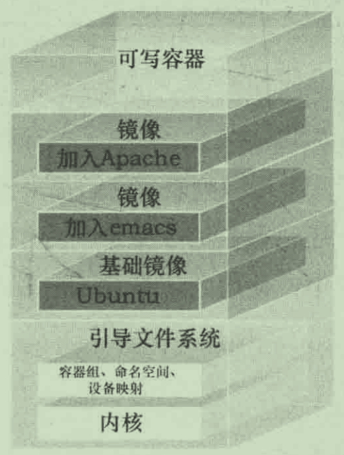

# Docker

Docker的基础知识、命令。

## 1. 安装与配置

```bash
$ sudo apt-get install linux-image-extra-virtual       
$ sudo apt-get install apt-transport-https ca-certificates software-properties-common
$ sudo apt-get install docker.io
$ sudo systemctl daemon-reload
$ sudo systemctl restart docker
$ sudo systemctl enable docker
$ docker version
$ docker info
$ sudo usermod -aG docker $USER      # 免 sudo 执行 docker
$ dockerd -D -H tcp://127.0.0.1:2376 # 监听socket端口，而不是sock文件
$ journalctl -u docker.service       # 查看服务日志
```

配置加速器 /etc/docker/daemon.json

```json
{
    "registry-mirrors":[
        "https://registry.docker-cn.com",
        "https://reg-mirror.qiniu.com",
        "https://x39d1d5v.mirror.aliyuncs.com"
    ],
    "debug":true,
    "hosts":["tcp://127.0.0.1:2376"]
}
```

## 2. 基础

```bash
$ docker run -itd ubuntu /bin/bash
# -t 为容器分配一个伪终端
# -i 开启容器的 STDIN
# -d Daemon
$ docker exec -it 容器 /bin/bash # 进入容器
```

创建了一个新容器，该容器拥有自己的网络 IP地址 以及一个和宿主机通信的桥接网络接口．如果容器内 1 号进程（启动进程）停止运行了，那么容器也会随着退出。

```bash
# 在容器中
root@3798a98859f9:~# hostname
3798a98859f9
root@3798a98859f9:~# cat /etc/hosts
127.0.0.1	localhost
172.17.0.3	3798a98859f9
root@3798a98859f9:~# ps aux
USER         PID %CPU %MEM    VSZ   RSS TTY      STAT START   TIME COMMAND
root           1  0.0  0.0   4108  3288 pts/0    Ss+  04:42   0:00 /bin/bash
```

## 3. 容器管理

### 3.1 运行容器

```bash
# 格式: docker run [options] IMAGE [COMMAND] [ARG]

# 1. 退出后停止运行
$ docker run -it ubuntu:18.04 /bin/bash # 起一个容器，并进入它的终端界面
root@7f62c7880035:~# exit               # 退出容器，容器也直接停止了

# 2. 作为 Daemon 运行
$ docker run -d ubuntu:18.04 /bin/sh -c "while true; do echo hello world; sleep 1; done"
$ docker exec -it 容器ID /bin/bash # 附着到一个容器上,连接到容器的shell

# 常用参数
$ docker run -p [host-port]:[container-port] # 端口映射
$ docker run -v [host-dir]:[container-dir]:[rw|ro] # 存储映射
$ docker run -e VAR="xxxx" # 指定容器环境变量
$ docker run --restart=always # 自动重启
$ docker run --restart=on-failure:5 # 退出代码非 0 时才重启，重启尝试次数为５次
```

### 3.2 管理容器

```bash
$ docker start 容器ID       # 重新启动已经停止的容器
$ docker stop  容器ID       # 停止容器

$ docker stats              # 查看所有正在运行的容器的状态
$ docker ps -a              # 查看所有状态的容器
$ docker logs -ft 容器ID    # 容器日志
$ docker events [OPTIONS]   # 系统事件
$ docker top 容器ID         # 查看容器内进程
$ docker inspect 容器ID     # 查看容器的详细状态
$ docker inspect mysql01 --format '{{.NetworkSettings.IPAddress}}'
172.17.0.2
$ ifconfig # 容器和宿主机有一个虚拟网卡，所以可以通信
docker0: flags=4163<UP,BROADCAST,RUNNING,MULTICAST>  mtu 1500
        inet 172.17.0.1  netmask 255.255.0.0  broadcast 172.17.255.255
$ ping 172.17.0.2                                           
PING 172.17.0.2 (172.17.0.2) 56(84) bytes of data.
64 bytes from 172.17.0.2: icmp_seq=1 ttl=64 time=0.027 ms

## 销毁
$ docker rm 容器ID                 # 删除一个容器
$ docker container prune           # 将所有 exit 状态的容器清除
$ docker rm $(docker ps -aq)       # 删除所有容器

# 其他
$ docker cp data.txt test:/tmp/    # 复制文件到容器内部
$ docker port mysql01									# 查看容器端口映射情况
```

### 3.3 容器启动案例

```bash
# 启动一个数据库
$ docker run -d -p 3306:3306 -v ~/mysqldata:/var/lib/mysql \
-e MYSQL_ROOT_PASSWORD=123456 --restart=always --name db01 mysql:5.6
```

```bash
$ docker volume create -d local test
$ docker run -d -P --mount type=bind,source=/webapp,destination=/opt/webapp training/webapp python app.py
$ docker run -d -P -v /webapp:/opt/webapp training/webapp python app.py 
```

### 3.4 容器应用栈例子

```bash
$ docker pull ubuntu
$ docker pull django
$ docker pull haproxy
$ docker pull redis
```

## 4. 镜像管理

镜像是文件系统叠加而成：

- 底层是 bootfs (引导文件系统)，但是当启动后 bootfs 会被卸载，以节省更多内存空间，恩就是个工具人。

- 第二层是 rootfs ，是操作系统层（裁剪版Debian或Ubuntu），永远处于只读状态
- 往上可以继续叠加更多的文件系统
- 最顶层是一个可读可写的文件系统，Docker中运行的程序就是在这个读写层执行的

Docker使用的是一种联合加载技术（union mount），文件系统一层叠一层，从最顶部往下，同名文件会被遮盖，最终从外面看起来是一个文件系统。



### 4.1 本地操作

```bash
$ docker images -a # 查看本地的镜像
$ docker image prune -f	 # 清理无用的镜像
$ docker rmi 镜像ID/名字	# 删除镜像

$ docker save -o ubuntu_18.04.tar.gz ubuntu:18.04	# 导出镜像到本地文件
$ docker export -o ubuntu18.04.c.tar.gz 容器ID # 导出一个容器

$ docker load -i ubuntu_18.04.tar.gz # 导入本地镜像文件
$ docker import ubuntu18.04.tar.gz - link/ubuntu18.v1 # 导入一个容器

$ docker history [OPTIONS] CONTAINER # 查看镜像构建历史

# 1. 将容器固化为一个新的镜像（临时做法）
$ docker commit -m"commit msg" -a"author: link" 容器ID link/ubuntu:18.04.v1
$ docker tag 9f8af246f7c6 link/ubuntu:dev   # 设置一下 Image tag 方便记忆
$ docker history imageId # 查看一个Image的构建历史
$ docker inspect link/sample:latest -f '{{.Config.Cmd}}' # 查看Image的情况

# 2. 从当前文件夹下 Dockerfile 构建镜像（官方推荐做法）
$ docker build -t="link/ubuntu.v1" ./ 
```

### 4.2 远程操作

```bash
$ docker pull [OPTIONS] NAME[:TAG]  # 从远程库拉取镜像到本地
$ docker push [OPTIONS] NAME:[:TAG] # 推送库到远程仓库
```

### 4.3 Ubuntu镜像

安装些常用命令

```bash
apt-get update
apt install net-tools # ifconfig
apt install iputils-ping # ping 命令
apt-get install iproute2 # ip 命令
apt-get install libterm-readkey-perl 
```

## 5. Dockerfile

### 5.1 Nginx例子

```dockerfile
FROM ubuntu:18.04 # 指定基于的镜像
MAINTAINER link "1162097842@qq.com" # 写入作者信息
ENV CREATED_AT 2020-12-25 # 设置环境变量
# RUN 命令在容器里会使用 /bin/sh -c 执行命令
RUN apt-get update && apt-get install -y nginx # 每条 RUN 命令会创建一个新镜像层
RUN echo 'Hi, I am your container' > /var/www/html/index.html
EXPOSE 80 # 暴露 80 端口
```

```bash
$ docker build -t link/ubuntu:0.6 ./ # 从本目录下的 Dockerfile 开始构建镜像
Status: Downloaded newer image for ubuntu:18.04
 ---> c3c304cb4f22 (stepID) # 每条命令都会产生执行步骤 ID

# 如果结果不符合预期，可以通过 stepID 进入容器，调试正确后，然后退出修改 Dockerfile
$ docker run -it stepID /bin/bash

# 删除 cache，再次构建
$ docker build --no-cache -t link/ubuntu:0.6 ./

# 运行自定义镜像
$ docker run -itd -p 80:80 --name test7 link/ubuntu:0.6 nginx -g "daemon off;" 

$ curl localhost:80
Hi, I am your container
```

```dockerfile
FROM ubuntu:18.04
MAINTAINER link "link@muchenglin.com"
RUN /bin/echo "root:Link_123456" | chpasswd
RUN useradd link
RUN /bin/echo "link:Link_123456" | chpasswd
EXPOSE 22
EXPOSE 80
CMD /usr/sbin/sshd -D
```

## 6. 容器互联

```bash
$ ip a show # 查看 ip 地址，没有 ifconfig 情况下使用
```

```bash
$ docker network create -d bridge link-test-net   # 创建新网络
ba8f1ed449a4bb927418c5a632760a624979dc0791ec0230c874fe222cc03c8c
$ docker network ls # 查看网络
NETWORK ID          NAME                        DRIVER              SCOPE
99a9441d083e        bridge                      bridge              local
7d62ec3cf6e9        host                        host                local
ba8f1ed449a4        link-test-net               bridge              local

$ docker run -itd --name web --network link-test-net link/ubuntu:dev /bin/bash
$ docker run -itd --name db1 --network link-test-net link/ubuntu:dev /bin/bash

$ docker exec -it web /bin/bash   # 和 db1 可以相互 ping通
root@00f61db4e4e1:/# ping db1
PING db1 (172.19.0.3) 56(84) bytes of data.
64 bytes from db1.link-test-net (172.19.0.3): icmp_seq=1 ttl=64 time=0.113 ms
64 bytes from db1.link-test-net (172.19.0.3): icmp_seq=2 ttl=64 time=0.122 ms
```

