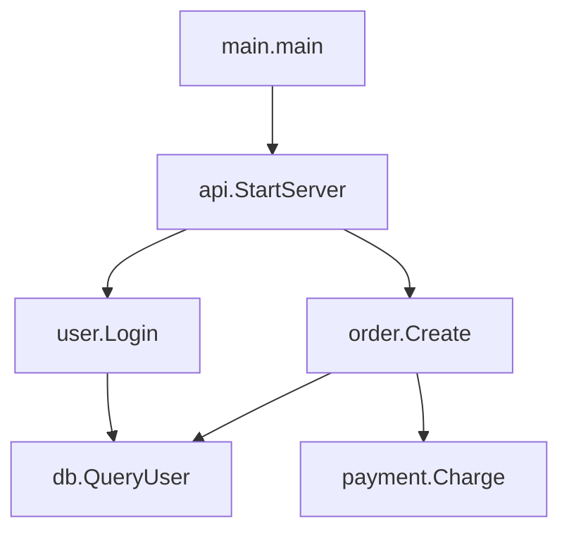

# 代码可视化工具选型与AI分析探索

**学习日期**: 2025-11-17
**参考资料**: Understand 官方文档、Sourcetrail、CodeCompass
**前置知识**: 静态代码分析基本概念、Call Graph、依赖关系图
**实践项目**: Go/PHP 后端项目代码审查

---

## 核心概念

1. **静态分析工具**：通过解析代码 AST（抽象语法树）生成调用图、依赖图、控制流图，不需要运行代码
2. **可视化维度**：调用关系（Call Graph）、依赖关系（Dependency）、UML 类图、控制流图（CFG）、架构热力图
3. **AI 增强分析**：利用大模型的语义理解能力，补充传统工具在动态调用、接口实现、回调识别上的不足

---

## 工具分类对比

### 商业工具（功能完整）

| 工具 | 核心功能 | 适用语言 | 平台支持 | 特色 |
|:---|:---|:---|:---|:---|
| **Understand** | 依赖图/Call Graph/CFG/UML/度量分析 | C/C++/Java/Python/Go/PHP | 跨平台 | 多维度分析、易用性强 |
| **Sonargraph** | 依赖图/架构规则/循环依赖/热力图 | Java/C/C++/C#/Python | 跨平台 | 架构治理、技术债管理 |
| **Lattix Architect** | DSM 矩阵视图/重构建议 | 多语言 | 跨平台 | 基于依赖矩阵的架构分析 |

### 开源/免费工具（够用）

| 工具 | 核心功能 | 适用语言 | 平台支持 | 维护状态 |
|:---|:---|:---|:---|:---|
| **CodeCompass** | Call Graph/依赖/UML/符号跳转 | C/C++ | 跨平台 | 活跃维护 |
| **Sourcetrail** | 代码地图/调用图/依赖浏览 | C/C++/Java/Python | 跨平台 | 已停更但稳定 |
| **Doxygen + Graphviz** | 调用图/被调用图/类图/包依赖 | C/C++/Java/Python/PHP | 跨平台 | 文档生成附带 |
| **go-callvis** | Call Graph 可视化 | Go | 跨平台 | Go 专用轻量工具 |

### IDE 原生功能（日常首选）

| IDE | 功能 | 优势 | 适用场景 |
|:---|:---|:---|:---|
| **GoLand/PhpStorm** | 类图/调用层级/依赖分析 | 零配置、实时更新 | 日常开发 |
| **VS Code** | 插件生态（Call Graph/Dependency Graph） | 轻量、扩展性强 | 跨语言项目 |
| **Visual Studio Enterprise** | 层依赖图/代码映射 | 企业级架构分析 | .NET/C++ 大型项目 |

---

## AI 分析能力边界

### AI 的优势

```
传统工具难点              AI 能力
─────────────────────────────────────
动态调用/反射            ✓ 语义推断
接口实现关系            ✓ 类型推导
回调/闭包追踪            ✓ 上下文理解
架构设计意图            ✓ 自然语言解释
```

### AI 的局限

| 问题 | 影响 | 解决方案 |
|:---|:---|:---|
| **上下文窗口限制** | 大型代码库（几万行+）无法一次性分析 | 分模块/分层分析 |
| **准确性不稳定** | 可能遗漏边缘调用、推断错误 | 与静态工具交叉验证 |
| **实时性差** | 代码变化后需重新分析 | 结合 IDE 实时图 |

---

## 实战方案：AI + 工具结合

### 方案一：IDE + AI 分析瓶颈

```bash
# 1. GoLand 生成调用层级图
右键函数 → Diagrams → Show Diagram → Call Hierarchy

# 2. 截图发给 Claude/GPT
"这是 UserService.Login 的调用链路，帮我分析性能瓶颈"
```

### 方案二：静态工具 + AI 架构审查

```bash
# 1. go-callvis 生成 SVG 调用图
go-callvis -format svg -group pkg -focus github.com/yourproject/user ./cmd/server

# 2. 把图 + 核心代码发给 AI
"这是 user 模块的调用图，找出循环依赖和单点故障风险"
```

### 方案三：AI 生成小型项目调用图

```python
# 适用场景：<5000 行的单体项目
# 直接让 AI 分析代码，生成 Mermaid 图

"""
提示词示例：
分析以下 Go 项目代码，生成 Mermaid 格式的 Call Graph：
- 只包含核心业务逻辑调用
- 忽略标准库调用
- 标注跨包调用
"""
```

**输出示例**：


---

## 设计哲学总结

### 工具选型原则

1. **日常开发优先 IDE**：GoLand/PhpStorm 的图足够 80% 场景，零配置成本
2. **架构审查用专业工具**：Sonargraph/Lattix 提供规则引擎和度量分析
3. **轻量需求用开源**：go-callvis/Doxygen 解决简单可视化需求

### AI 使用边界

```
小项目（<5k行）     → AI 直接生成调用图
中型项目（5k-50k）  → 工具生成图 + AI 分析问题
大型项目（>50k）    → 工具主导 + AI 辅助解释
```

### 组合策略

| 场景 | 工具组合 | 输出 |
|:---|:---|:---|
| **理解新项目架构** | IDE 图 + AI 解释 | 快速建立心智模型 |
| **重构前影响分析** | Sonargraph + AI 风险评估 | 变更影响范围 |
| **性能优化** | go-callvis + AI 热路径分析 | 调用链瓶颈定位 |
| **代码审查** | CodeCompass + AI 安全检查 | 潜在漏洞识别 |

---

## 实践建议

### Go 项目工具链

```bash
# 安装 go-callvis
go install github.com/ofabry/go-callvis@latest

# 生成调用图（按包分组）
go-callvis -format svg -group pkg -focus main ./cmd/server > call-graph.svg

# 结合 pprof 性能分析
go test -cpuprofile=cpu.prof -bench=.
go tool pprof -http=:8080 cpu.prof
```

### PHP 项目工具链

```bash
# PhpStorm 内置功能
右键类/方法 → Diagrams → Show Class Hierarchy

# 或使用 phpDocumentor + Graphviz
phpdoc -d src -t docs --template=clean
```

### AI 辅助分析提示词模板

```
角色：你是资深架构师
任务：分析以下代码的调用关系
输入：[粘贴核心代码/调用图截图]
要求：
1. 识别出循环依赖
2. 找出单点故障风险（被多个模块依赖的关键函数）
3. 建议重构方向
输出：Markdown 表格 + Mermaid 图
```

---

## 延伸阅读

- [Understand 官方文档](https://docs.scitools.com/)
- [CodeCompass GitHub](https://github.com/Ericsson/CodeCompass)
- [go-callvis 使用指南](https://github.com/ofabry/go-callvis)
- [PlantUML 调用图语法](https://plantuml.com/sequence-diagram)

---

**最后更新**: 2025-11-17
**相关博客**: `iTerm2-Hotkey-Window配置指南.md`、`Hammerspoon-macOS自动化神器.md`
