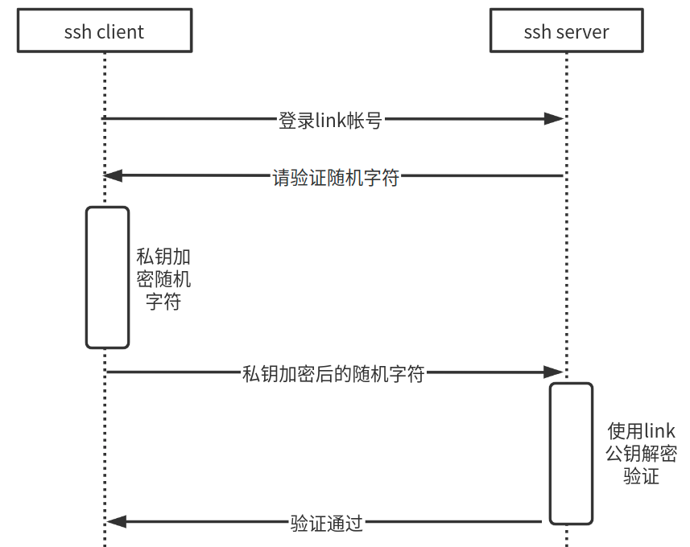
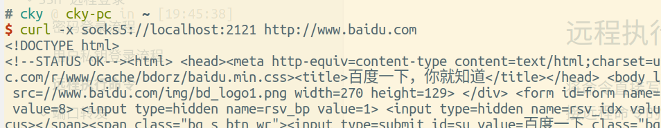

# SSH

SSH 是一个安全的客户端/网络端协议，是关于如何在网络上构建安全通信的规范。实现该规范，可以为一些不安全的网络应用程序 Telnet / FTP / 基于TCP/IP程序增加安全性。

它的内容包括以下三点：

- 认证：可信地判断出用户的身份，通过SSH登录，需要提供数字身份证明，通过测试后才允许登录
- 加密：对数据进行加密，除接受者，其他人都无法理解数据
- 完整性：确保网络上传输的数据到达目的地时，没有被改变

认证是双向的，包含了server 对 client 的验证，也包含了 client 对 server 的验证。

SSH 提供的端到端的加密，基础是随机密钥，每次通过验证后，都会产生一个会话，client 与 server 协商产生随机密钥，发送的数据全部使用该密钥加密。在会话结束后，该密钥被丢弃。对数据加密的算法有: Blowfish / DES / IDEA (对称加密) 等。

授权是认证之后进行的，可以对通过ssh登录的用户权限进行一些限制。

## SSL 安全Socket协议

是一种认证和加密协议，最开始是为了 Web 服务，增强 HTTP 协议的安全性。采用 SSL 的程序通常使用一个证书来表明自己的身份，数字证书的存在说明了有一个可信任的第三方已经对服务器的身份和密钥之间的绑定关系进行了认证。Web 浏览器在进行 SSL 连接时，会自动去第三方服务器查验，检查Web服务器提供的证书是否正确，从而确保Web服务器就是用户想要连接的那个服务器。此后，浏览器和Web服务器之间的传输都是经过加密的了。

从上文的描述看，有一个可信任的“第三方”存在，SSL才是安全可靠的，这种第三方在现实中一般称为 CA (证书管理机构)。

基于TCP通信的程序，可以使用SSL来增强安全性。比如 SSLtelnet / SSLftp .

而 SSH 实现不同于 SSL , SSH 的实现可以和各种用途的工具集成在一起，完全是为了提高安全性而编写的。


[SSH原理与运用（一）：远程登录](http://www.ruanyifeng.com/blog/2011/12/ssh_remote_login.html)

[SSH原理与运用（二）：远程操作与端口转发](http://www.ruanyifeng.com/blog/2011/12/ssh_port_forwarding.html)

## 密码登录流程

首次登录，Server 收到 Client 请求后，会将公钥发给 Client。此时，由于不认识 Server，ssh client 会提醒用户确认，是否需要连接:

```bash
$ ssh cky@blog.codekissyoung.com
The authenticity of host 'blog.codekissyoung.com (101.200.144.41)' can't be established.
ECDSA key fingerprint is SHA256:0IoegENNoDG0T7FvlBxo5GZJBZ7FvSmDG9SiANdOORc.
Are you sure you want to continue connecting (yes/no)? 
```

所谓的 ECDSA key fingerprint 指纹，就是 Server Public Key 的 hash 值。

```bash
# 在服务器上查看指纹
$ ssh-keygen -l -f /etc/ssh/ssh_host_ecdsa_key.pub 
256 SHA256:0IoegENNoDG0T7FvlBxo5GZJBZ7FvSmDG9SiANdOORc root@(none) (ECDSA)
```

填入 yes 确认登录后，指纹会被写入到 ~/.ssh/known_hosts 文件中，下次登录就不会再询问了。

接着，ssh 就会要求用户输入账户密码。使用公钥将帐号密码后，发送给 Server。验证通过后，就能登录远程服务器的 Shell 了。

如果服务器的公钥发生变更，客户端再次连接时，就会发生公钥指纹不吻合的情况。这时，客户端就会中断连接，并显示一段警告信息。


## 用户私钥登录流程

密码需要记忆，密码强度要高，并且还要防止泄漏。所以一种更加安全的机制被引入了：用户公私钥登录机制。

通过非对称加密算法，可以得到公钥（public key）和私钥（private key）。

- 如果数据使用公钥加密，那么只有使用对应的私钥才能解密
- 如果使用私钥加密（俗称“签名”），也只有使用对应的公钥解密

用户生成自己的公私钥：

```bash
$ ssh-keygen
~/.ssh/id_rsa 私钥
~/.ssh/id_rsa.pub 公钥
```

然后将公钥写入到　Server 的　~/.ssh/authorized_keys (权限必须是644) 文件里。后续的登录流程如下：

1. 服务器收到用户 SSH 登录的请求，发送一些随机数据给用户，要求用户证明自己的身份。
1. 客户端收到服务器发来的数据，使用私钥对数据进行签名，然后再发还给服务器。
1. 服务器收到客户端发来的加密签名后，**使用对应的公钥解密**，然后跟原始数据比较。如果一致，就允许用户登录。

为了安全性，启用密钥登录之后，最好关闭服务器的密码登录。



## 远程执行命令

将命令直接写在`ssh`命令的后面，即可在远程执行，采用这种语法执行命令时，ssh 客户端不会提供互动式的 Shell 环境，而是直接远程命令的执行结果输出在命令行。

```bash
$ ssh username@hostname command
```

## 端口转发

转发或隧道是在一个SSH会话中封装另外一个基于TCP的服务，从而完全利用上SSH的安全传输的特性。

通常支持的转发有三种：

- 普通的基于TCP的转发
- X协议转发
- 代理转发，允许 client 使用远程主机上的 private key

### 动态端口转发

```bash
$ ssh -D 2121 cky@blog.codekissoung.com -N
```

指定本机的 Socks 监听端口，该端口收到的请求，都将转发到远程的 SSH 主机，又称动态端口转发. 

-N 表示这个 SSH 连接只进行端口转发，不登录远程 Shell，不能执行远程命令，只能充当隧道。注意，这种转发采用了 SOCKS5 协议。访问外部网站时，需要把 HTTP 请求转成 SOCKS5 协议，才能把本地端口的请求转发出去。



### 本地端口转发

```bash
防火墙ssh  -L 9999:targetServer:80 user@remoteserver -N
```

所有发向本地 9999 端口的请求，都会经过 remoteserver 发往 targetServer 的 80 端口，这就相当于直接连上了 targetServer 的 80 端口。

#### 新闻网站例子

新闻服务器 news.yoyodyne.com 是连接到 Internet 上的，新闻服务监听了 119 端口，然而防火墙将外网的访问，除了 ssh 22 端口外全部禁止了。那么我们可以建立起一条 local ssh -> remote sshd -> remote 119 端口这样一条访问路径呢？答案是可以的。

```bash
$ ssh -L 3002:localhost:119 news.yoyodyne.com -N
```

上句的意思是：建立一条安全连接，它从我本地机器的 3002 端口连接到 news.yoyodyne.com 的 119 端口，访问本地的 3002　端口就是访问远程的 119 端口。中间的 ssh 隧道仿佛是透明的，并且经过的数据都是经过加密的。


### 远程端口转发

```bash
$ ssh -R local-port:target-host:target-port local
$ ssh -R 9999:targetServer:902 local 
```

上面命令需在跳板服务器执行，指定跳板计算机 local 监听自己的 9999 端口，所有发向这个端口的请求，都会转向 targetServer 的 902 端口。

Server 的 Xdebug 检测到 `Xdebug Helper` 附加到 `Http` 请求里的 `XDEBUGSESSIONSTART=PHPSTORM` 信息，PHP的解析执行将被暂停．`XDebug` 将数据发往 29325 端口，经过ssh隧道，到达了 PHP Storm 监听的 9001 端口，触发了调试界面．

```bash
$ ssh -p36000 -NT -R 29325:localhost:9001 xuser@120.79.86.110 # 在 PHP Strom 所在机器执行
```

## 原理

每台服务器上的每个用户都可以生成本用户的一对 “公私钥”，用户 A 将公钥`id_rsa.pub`内容写入到 用户 B 的受信任的公钥文件`authorized_keys`里，则用户 A 使用`ssh userB@hostB`命令登录`hostB`时。

如果两台机器分别将公钥，写入到对方的`authorized_keys`里，那么可以互相免密登录，俗称“互信”。

```bash
$ ssh-keygen                    # 生成公私钥
~/.ssh/id_rsa.pub               # 公钥文件
~/.ssh/id_rsa                   # 私钥文件
~/.ssh/authorized_keys          # 信任的公钥文件 权限 0600
```

```bash
$ /etc/init.d/ssh restart
$ netstat -tlp                          # 判断ssh是否运行
$ sudo systemctl restart sshd.service
$ ssh caokaiyan@192.168.0.103
$ ssh -t hostA ssh hostB                # 通过 hostB 连接到 hostA 跳板机
```

```bash
$ scp .ssh/id_rsa.pub cky@101.202.144.41:~/id_rsa.pub # 本机传文件到远程机器
$ cat id_rsa.pub >> .ssh/authorized_keys              # 远程机器 执行
$ chmod 600 .ssh/authorized_keys                      # 修改权限
```

### SCP

```bash
$ scp ./full.tar.gz 　cky@101.200.144.41:~/data/ # 本地 => 远程
$ scp cky@101.200.144.41:~/data/aa.txt ./        # 远程 => 本地
$ yes | pv | ssh $host "cat > /dev/null"         # 实时SSH网络吞吐量测试
```

保持持久连接

```bash
# /etc/ssh/ssh_config
ServerAliveInterval 20  # 每 20s 请求下 server 从而保持连接
ServerAliveCountMax 5   # server 未响应5次 就断开连接
```

## 临的公私钥登录

拿到公钥`tmpzale.pub`、私钥`tmpzale.pub`、和 `passphrase` 密码为 `pwd1234`。放到`.ssh`目录下：

```bash
.ssh/
├── id_rsa
├── id_rsa.pub
├── known_hosts
├── tmpzale             # 临时私钥
└── tmpzale.pub         # 临时公钥
```

指定私钥就可以登录：

```bash
$ ssh link@10.20.30.40 -i~/.ssh/tmpzale -p9510
Enter passphrase for key '/home/cky/.ssh/tmpzale':
```

这样做每次都需要输入`passphrase`，在一个终端里，可以使用`ssh-agent`来存储公私钥，然后`ssh`直接从`ssh-agent`里取，就不用再输入`passphrase`了。

```bash
$ eval $(ssh-agent)
$ ssh-add -k .ssh/tmpzale
Enter passphrase for .ssh/tmpzale:  # 这里需要输入 passphrase
Identity added: .ssh/tmpzale (.ssh/tmpzale)
$ ssh-add -l                        # 查看存储的私钥
2048 SHA256:aF..........qjc8o0 .ssh/tmpzale (RSA)
$ ssh-add -L                        # 查看存储的公钥
ssh-rsa AAAAxV..........vxr33B .ssh/tmpzale
```

因为每次输入`passphrase`都很麻烦，所以不考虑安全性的话，完全可以将附着在私钥上的`passphrase`去掉，直接使用私钥，这样就无需输入操作了.

```bash
$ openssl rsa -in ./tmpzale -out ./tmpzale.new
Enter pass phrase for ./tmpzale:
writing RSA key
```

[25 个必须记住的 SSH 命令](http://blog.urfix.com/25-ssh-commands-tricks/)

## 中间人攻击

如果有人截获了登录请求，然后冒充远程主机，将伪造的公钥发给用户，那么用户很难辨别真伪。因为不像https协议，SSH协议的公钥是没有证书中心（CA）公证的，也就是说，都是自己签发的。

可以设想，如果攻击者插在用户与远程主机之间（比如在公共的wifi区域），用伪造的公钥，获取用户的登录密码。再用这个密码登录远程主机，那么SSH的安全机制就荡然无存了。这种风险就是著名的["中间人攻击"](http://en.wikipedia.org/wiki/Man-in-the-middle_attack)（Man-in-the-middle attack）。

## sshd

从下图可以看到，每次有一个客户端连入，就会新开一个sshd子进程专门负责对接该客户端，并且还再运行了用户对应的shell作为子程序。在客户端ssh敲入的字符，会直接发送到sshd，然后再到用户shell处理。使用起来的感觉就像直接使用shell一样。

## ssh-agent 认证代理

是一个认证代理程序，运行在后台，用于有多个不同的用户密钥，分别对应不同的服务器上的场景。步骤如下

1. 预先将公钥写入到服务器 authorized_keys 中
1. 在local pc运行 ssh-agent daemon
1. 使用 ssh-add 将密钥转载到代理中
1. ssh 登录会话，选择需要使用的密钥


## Stunnel

为基于TCP的服务增加SSL保护，而不用修改这些程序的源代码。它可以作为任意一个端口上的Daemon进程的封装程序(Wrapper)从inetd中调用，也可以单独运行，从而为特定服务接收网络连接。stunnel对哪些经过SSL到达的用户连接进行认证，如果认证通过，就运行背后的服务程序，并在客户端和服务端程序之间建立一个使用SSL保护的会话。

https://www.stunnel.org/index.html


## 防火墙

是用来防止特定的数据，进入/离开一个网络的硬件设备或软件设备。例如，位于Web站点和Internet之间的防火墙可以只允许HTTP和HTTPS通信到达该站点。

防火墙也可以屏蔽那些不是来自特定网络地址的TCP/IP数据包。


## 加密解密

### 密钥分布问题


