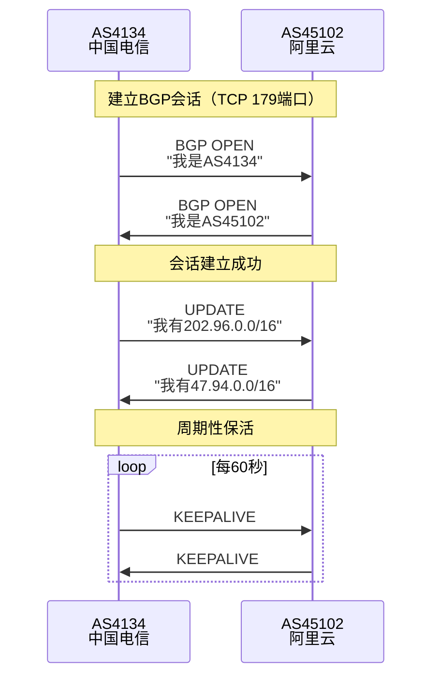
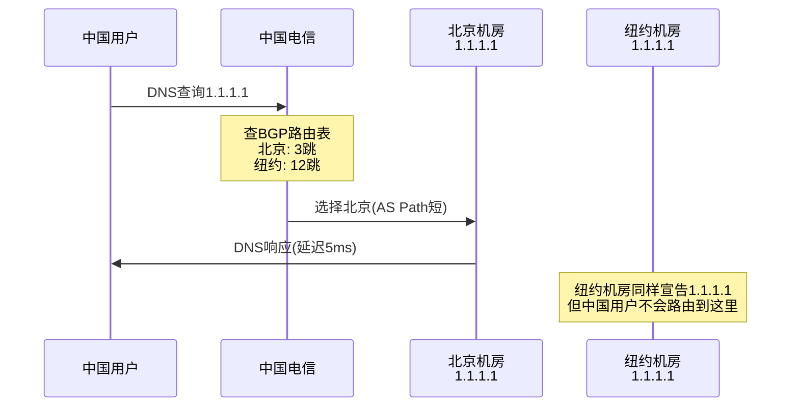
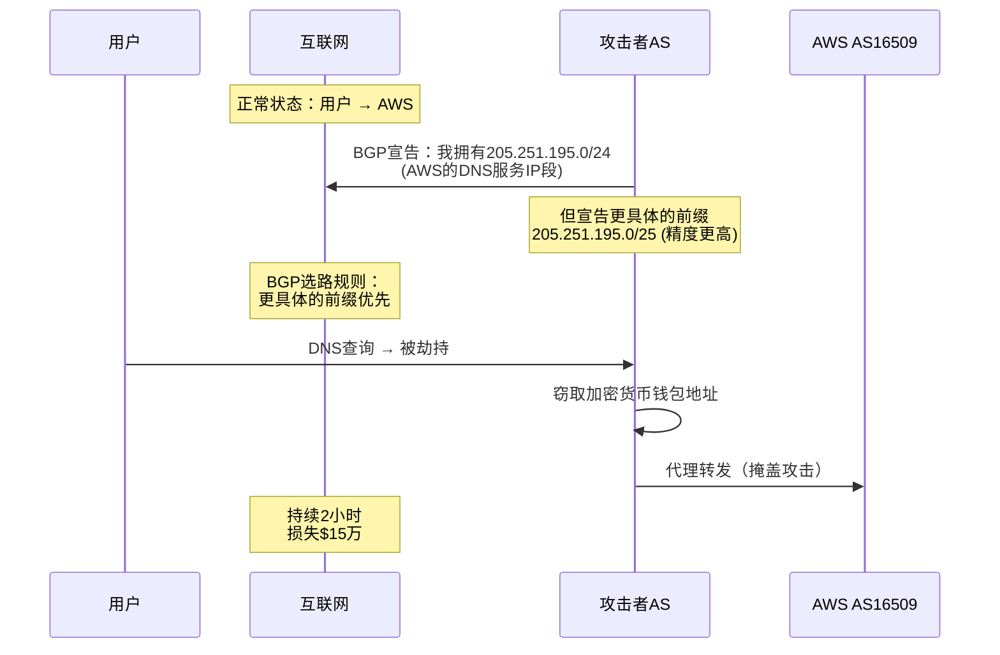

# BGP与全球互联网路由详解

> AS号+BGP协议 = 全球互联网的"路由神经系统"

## 前言

当你在浏览器输入`google.com`，数据包如何从你的电脑跨越千山万水到达美国服务器？

这背后是一个复杂而精妙的全球路由系统：
- **70,000+个自治系统（AS）**
- **95万+条路由规则**
- **BGP协议**在其中协调一切

本文深入探讨全球互联网的路由架构，从基础概念到实战案例。

---

## 一、核心概念：AS自治系统

### 什么是AS？

**Autonomous System（自治系统）**

**定义：**
- 一组由**单一组织管理**的IP网络
- 有**统一的路由策略**
- 向外界以**整体**的形式出现

**生活类比：**
```
AS = 一个国家的邮政系统
├─ 内部：各省市有自己的投递规则
└─ 对外：统一的"中国邮政"身份

互联网:
AS4134 = 中国电信的整个网络
├─ 内部：各省有自己的路由器
└─ 对外：以AS4134的身份与其他AS互联
```

### AS号编号体系

**编号范围：**
```
16位AS号: 1 - 65535 (已用尽)
  ├─ 公有AS: 1 - 64511
  └─ 私有AS: 64512 - 65535 (内部使用，不能上网)

32位AS号: 65536 - 4294967295 (2007年引入)
```

**常见AS号示例：**
| AS号 | 组织 | 类型 | IP地址数量 |
|------|------|------|-----------|
| AS4134 | 中国电信 | ISP | 1.1亿+ |
| AS4837 | 中国联通 | ISP | 7000万+ |
| AS9808 | 中国移动 | ISP | 5000万+ |
| AS45102 | 阿里云 | 云服务商 | 800万+ |
| AS13335 | Cloudflare | CDN | 280万+ |
| AS15169 | Google | 科技巨头 | 4300万+ |
| AS32934 | Facebook | 社交网络 | 1500万+ |

### AS号的申请

**申请条件：**
```
申请人 → RIR (如APNIC)

必须满足:
1. 证明需要独立路由策略
2. 有足够的IP地址资源
3. 有多个上游连接（多宿主）
4. 支付年费（$500-2000）

审核通过 → 分配AS号
```

**谁需要申请AS号？**
- ✅ ISP运营商
- ✅ 大型企业（跨国公司、银行）
- ✅ 云服务商（阿里云、腾讯云）
- ✅ CDN提供商（Cloudflare、Akamai）
- ❌ 普通企业（用不上）
- ❌ 个人用户（没必要）

---

## 二、BGP协议：互联网的粘合剂

### BGP是什么？

**Border Gateway Protocol（边界网关协议）**

**核心作用：**
1. AS之间交换路由信息
2. 告诉全球："访问xx.xx.xx.xx/24，找我！"
3. 决定数据包的全球路径

**类比：**
```
BGP = 全球快递公司之间的协议

顺丰(AS1) 告诉 中通(AS2):
"发往北京的包，可以通过我转运"
  ├─ 路径：3跳
  ├─ 延迟：30ms
  └─ 带宽：10Gbps

中通(AS2) 告诉 韵达(AS3):
"发往北京有两条路：
  - 通过顺丰: 3跳，快
  - 通过EMS: 5跳，慢
  我选顺丰！"
```

### BGP工作流程

**1. 建立BGP邻居关系（Peering）**



**2. 路由宣告**

**阿里云宣告自己的IP段：**

```bash
# 阿里云BGP路由器配置（简化示例）
router bgp 45102
  # 宣告自己拥有的网段
  network 47.94.0.0 mask 255.255.0.0
  network 47.95.0.0 mask 255.255.0.0

  # 配置BGP邻居
  neighbor 202.97.1.1 remote-as 4134    # 中国电信
  neighbor 219.158.1.1 remote-as 4837   # 中国联通
  neighbor 223.120.1.1 remote-as 9808   # 中国移动
```

**传播过程：**
```
阿里云(AS45102) → 宣告: 47.94.0.0/16
  ↓
中国电信(AS4134) → 接收并记录
  ↓
传播给邻居AS
  ↓
全球路由表更新
  ↓
结果: 全世界都知道"访问47.94.0.0/16找AS45102"
```

**3. 路径选择算法**

**BGP选路规则（优先级从高到低）：**

```
1. 最高权重（Weight） - 思科私有
2. 最高本地偏好（Local Preference）
3. 本地始发路由优先
4. 最短AS Path（经过的AS数量最少）✓ 最常用
5. 最低Origin类型（IGP > EGP > Incomplete）
6. 最低MED（Multi-Exit Discriminator）
7. eBGP > iBGP
8. 最低IGP度量值
9. 最老的eBGP路由
10. 最小BGP Router ID
```

**实际案例：**
```
用户在广州访问 Google (8.8.8.8)

路径A: AS4134(电信) → AS174(Cogent) → AS15169(Google)
       3跳，延迟180ms

路径B: AS4134(电信) → AS3356(Level3) → AS6939(HE) → AS15169(Google)
       4跳，延迟220ms

BGP选择: 路径A (AS Path更短)
```

---

## 三、全球互联网层级架构

### Tier分层模型

```
                    ┌─────────────────────────┐
                    │    Tier-1 ISP (顶级)    │
                    │  Level3, Cogent, NTT    │
                    │   免费对等互联(Peering)  │
                    │   覆盖全球骨干网         │
                    └────────────┬────────────┘
                                 ↓
                    ┌─────────────────────────┐
                    │    Tier-2 ISP (区域)    │
                    │  中国电信/联通/移动      │
                    │  付费连接Tier-1 (Transit)│
                    │  区域内免费互联          │
                    └────────────┬────────────┘
                                 ↓
                    ┌─────────────────────────┐
                    │    Tier-3 ISP (本地)    │
                    │  阿里云/腾讯云/小ISP     │
                    │  付费连接Tier-2          │
                    │  服务终端用户            │
                    └────────────┬────────────┘
                                 ↓
                          终端用户/企业
```

### Tier-1 ISP（世界顶级，约12家）

**定义：**
- 可以不付费访问整个互联网
- 与其他Tier-1免费对等互联
- 拥有全球骨干网基础设施

**主要玩家：**
| AS号 | 组织 | 国家 | 说明 |
|------|------|------|------|
| AS3356 | Level3/Lumen | 美国 | 最大Tier-1 |
| AS174 | Cogent | 美国 | 激进扩张策略 |
| AS2914 | NTT | 日本 | 亚洲最大 |
| AS1299 | Telia | 瑞典 | 欧洲主导 |
| AS3257 | GTT | 美国 | 企业专线强 |
| AS6762 | Telecom Italia | 意大利 | 欧洲传统 |

**特点：**
- 彼此免费互联（Settlement-free peering）
- 不需要向任何人购买IP传输服务
- 掌控全球互联网命脉

### Tier-2 ISP（区域运营商）

**中国三大运营商：**
```
AS4134 - 中国电信
  ├─ 付费购买Tier-1带宽（上游）
  ├─ 与其他区域运营商对等互联
  ├─ 向下游ISP出售带宽
  └─ 服务终端用户

AS4837 - 中国联通
AS9808 - 中国移动
```

**商业模式：**
```
收入:
├─ 向用户收取宽带/专线费用
└─ 向下游ISP批发带宽

成本:
├─ 向Tier-1购买国际带宽
├─ 自建国内骨干网
└─ 运维成本
```

### Tier-3 ISP（本地服务商）

**云服务商：**
- 阿里云(AS45102)
- 腾讯云(AS45090)
- AWS中国(AS58542)

**小型ISP：**
- 地方电信运营商
- 企业专网服务商

**特点：**
- 从Tier-2购买带宽
- 不参与全球路由决策
- 专注服务质量

---

## 四、BGP实战应用

### 1. 多线BGP：云服务商的秘密武器

**问题：单线接入的痛点**
```
场景: 服务器只接中国电信
  ├─ 电信用户访问: 快 ✓
  ├─ 联通用户访问: 慢 ✗ (跨网延迟大)
  └─ 移动用户访问: 更慢 ✗✗
```

**多线BGP解决方案：**

```
         阿里云ECS (AS45102)
         /       |        \
        /        |         \
    AS4134   AS4837    AS9808
    电信      联通      移动
      \        |        /
       \       |       /
         \     |      /
           用户设备

BGP智能选路:
- 电信用户 → 自动走电信线路
- 联通用户 → 自动走联通线路
- 移动用户 → 自动走移动线路
```

**配置原理：**
```bash
router bgp 45102
  # 向三大运营商都宣告相同的路由
  neighbor 电信IP remote-as 4134
  neighbor 联通IP remote-as 4837
  neighbor 移动IP remote-as 9808

  # 宣告自己的IP段
  network 47.94.0.0 mask 255.255.0.0

结果:
- 电信的路由表: 访问47.94.0.0/16 → AS45102 (1跳)
- 联通的路由表: 访问47.94.0.0/16 → AS45102 (1跳)
- 移动的路由表: 访问47.94.0.0/16 → AS45102 (1跳)

用户访问时，BGP自动选择AS Path最短的路径
```

**价值：**
```
单线专线: ¥2000/月 × 3条 = ¥6000/月
多线BGP云服务器: ¥500/月

性能提升:
- 电信用户: 延迟5ms
- 联通用户: 延迟8ms
- 移动用户: 延迟12ms
- 跨网访问无感
```

### 2. BGP Anycast：CDN的基石

**原理：多个地点宣告同一个IP**

```
Cloudflare DNS: 1.1.1.1

全球200+数据中心都宣告 1.1.1.1/32:
├─ 北京机房(AS13335): 宣告 1.1.1.1/32
├─ 东京机房(AS13335): 宣告 1.1.1.1/32
├─ 伦敦机房(AS13335): 宣告 1.1.1.1/32
├─ 纽约机房(AS13335): 宣告 1.1.1.1/32
└─ ...200+机房

BGP自动选路:
- 中国用户 → 路由到北京机房(AS Path最短)
- 日本用户 → 路由到东京机房
- 英国用户 → 路由到伦敦机房
```

**流程图：**


**优势：**
- 用户自动访问最近的服务器
- 容灾：某个机房故障，BGP自动切换
- 无需DNS负载均衡（BGP层面解决）

### 3. 流量工程：精细控制流量

**场景：公司有两条出口**
```
公司(AS65001)
├─ 链路A: 10Gbps 主链路
└─ 链路B: 1Gbps  备用链路

期望:
- 90%流量走链路A
- 链路B只在A故障时使用
```

**BGP策略：AS Path Prepending**

```bash
# 链路A配置（正常宣告）
router bgp 65001
  neighbor ISP_A remote-as 4134
  network 203.0.113.0 mask 255.255.255.0

# 链路B配置（增加AS Path长度）
router bgp 65001
  neighbor ISP_B remote-as 4837
  network 203.0.113.0 mask 255.255.255.0
  # 关键：多次添加自己的AS号，降低优先级
  neighbor ISP_B route-map PREPEND_PATH out

route-map PREPEND_PATH permit 10
  set as-path prepend 65001 65001 65001
  # 实际AS Path: 4837 65001 65001 65001 65001 (5跳)
  # 而链路A: 4134 65001 (2跳)
```

**结果：**
```
全球路由器看到两条路径:
- 链路A: AS Path = 4134 → 65001 (2跳) ← 优先选择
- 链路B: AS Path = 4837 → 65001 → 65001 → 65001 → 65001 (5跳)

只有链路A故障时，才会用链路B
```

---

## 五、BGP安全：互联网的阿喀琉斯之踵

### 问题：BGP天生缺乏安全机制

**BGP设计于1989年，当时没有安全考虑：**
- ❌ 无身份认证（任何AS都可以宣告路由）
- ❌ 无路径验证（AS Path可以伪造）
- ❌ 无加密（明文传输）
- ⚠️ 基于"信任"机制（相信邻居的宣告）

### 案例1：2018年亚马逊Route53劫持事件

**攻击流程：**


**技术细节：**
```
正常路由:
205.251.195.0/24 (AWS宣告)

攻击者宣告:
205.251.195.0/25 (更具体，优先级更高)
205.251.195.128/25

BGP规则: 更具体的前缀（CIDR位数更大）优先
结果: 全球流量被劫持到攻击者
```

### 案例2：2008年巴基斯坦Youtube事件

**事件经过：**
```
2008年2月24日
├─ 巴基斯坦政府要求屏蔽Youtube
├─ 巴基斯坦电信(AS17557)错误操作
├─ 向全球BGP宣告: 208.65.153.0/24 (Youtube IP段)
├─ 全球路由器接受了这个宣告
└─ 结果: 全世界访问Youtube → 路由到巴基斯坦 → 全球中断2小时
```

**时间线：**
```
18:47 UTC - 巴基斯坦电信开始宣告Youtube IP
18:48 UTC - 香港PCCW接受并传播
18:50 UTC - 传播到全球
19:00 UTC - Youtube全球服务中断
20:50 UTC - PCCW撤回路由
21:00 UTC - 服务恢复

影响: 数亿用户无法访问Youtube
```

### 案例3：2014年中国电信路由泄露

**事件：**
```
2014年11月6日
├─ 中国电信意外向全球宣告了15万条路由
├─ 包含其他运营商的客户路由
├─ 全球流量被错误路由到中国
└─ 持续数小时

影响:
- 美国政府网站无法访问
- 部分银行交易中断
- 国际互联网延迟暴增
```

### BGP劫持的防御

**1. RPKI（资源公钥基础设施）**

```
原理: IP地址持有者签名证明所有权

流程:
1. 阿里云向APNIC注册ROA (Route Origin Authorization)
   内容: "AS45102有权宣告47.94.0.0/16"

2. 路由器收到BGP宣告时验证:
   - 查询RPKI数据库
   - 检查AS号是否匹配
   - 不匹配 → 拒绝接受

3. 攻击者无法伪造签名
```

**配置示例：**
```bash
# 启用RPKI验证
router bgp 4134
  bgp rpki server rpki.example.com
  neighbor 45102 remote-as 45102
  address-family ipv4
    neighbor 45102 prefix-list VALIDATE-RPKI in
```

**RPKI部署现状（2025年）：**
```
全球IPv4路由: 950,000条
已部署RPKI: 约38% (360,000条)

主要部署地区:
- 欧洲: 60%+
- 北美: 45%
- 亚太: 30%
- 中国: 15% (起步阶段)
```

**2. BGPsec（BGP安全扩展）**

```
功能:
- 加密签名AS Path
- 验证路径完整性
- 防止AS Path篡改

缺点:
- 计算开销大
- 部署复杂
- 全球部署率<1%
```

**3. BGP Monitoring & Alerting**

```
工具:
- BGPmon (实时监控)
- RIPE RIS (路由信息服务)
- RouteViews (路由视图)

功能:
- 实时监控自己的IP段
- 检测异常宣告
- 自动告警
- 快速响应劫持
```

---

## 六、实战工具与查询

### 查询AS信息

**方法1：whois查询**
```bash
# 查询AS基本信息
whois -h whois.radb.net AS45102

# 输出：
as-name:       ALICLOUD
descr:         Alibaba (China) Technology Co., Ltd.
country:       CN
admin-c:       XXX
tech-c:        XXX
mnt-by:        MAINT-ALICLOUD
```

**方法2：查询AS的所有IP段**
```bash
whois -h whois.radb.net -- '-i origin AS45102' | grep route

# 输出：
route: 47.92.0.0/14
route: 47.96.0.0/13
route: 120.24.0.0/14
...
```

### 查询BGP路径

**方法1：Hurricane Electric BGP Toolkit**

**网址：** https://bgp.he.net/

**功能：**
```
1. AS信息
   - 输入AS号 → 查看所有IP段
   - 查看BGP邻居关系
   - 查看路由数量

2. IP归属
   - 输入IP → 查看所属AS
   - 查看BGP路由路径

3. AS关系图
   - 可视化BGP拓扑
   - 查看上游/下游/对等关系
```

**实际操作：**
```
1. 访问 https://bgp.he.net/
2. 搜索框输入: AS45102
3. 查看：
   - IPv4路由: 2,345条
   - IPv6路由: 156条
   - BGP邻居: 127个
   - 上游: AS4134(电信), AS4837(联通), AS9808(移动)
```

**方法2：命令行工具**

```bash
# traceroute显示AS号
traceroute -a baidu.com

# 输出：
 1  192.168.1.1
 2  [AS4134] 10.10.1.1
 3  [AS4134] 202.97.33.1
 4  [AS4134] 202.97.50.106
 5  [AS4837] 219.158.6.17  ← 从电信跳到联通
 6  [AS55967] 180.101.49.11 ← 百度的AS

# mtr工具（更强大）
mtr -z baidu.com
# -z参数显示AS号
```

**方法3：BGP Looking Glass**

**公共Looking Glass列表：**
```
中国电信: https://lg.chinatelecom.cn/
中国联通: http://lg.chinaunicom.com/
Hurricane Electric: https://lg.he.net/
RIPE NCC: https://stat.ripe.net/
```

**使用示例：**
```
1. 访问HE Looking Glass
2. 选择查询点（如香港）
3. 输入命令: show bgp ipv4 unicast 47.94.0.0/16
4. 查看从该点到目标的完整AS Path
```

### 监控自己的BGP路由

**场景：你是网络管理员，管理AS65001**

**工具1：BGPmon**
```bash
# 订阅自己的AS号监控
https://bgpmon.net/

功能:
- 新路由宣告告警
- 路由撤销告警
- AS Path变化告警
- 疑似劫持告警
```

**工具2：RIPE RIS**
```
https://ris.ripe.net/

功能:
- 查看全球20+个观测点的BGP数据
- 历史路由查询
- 路由变化分析
```

**自建监控：**
```bash
# 使用ExaBGP接收BGP路由
pip install exabgp

# 配置文件 exabgp.conf
neighbor 1.2.3.4 {
    router-id 5.6.7.8;
    local-as 65001;
    peer-as 4134;
}

# 运行
exabgp exabgp.conf | python monitor.py

# monitor.py 分析路由变化
```

---

## 七、全球BGP现状

### 路由表规模

**截至2025年：**
```
IPv4 BGP路由条目:  ~950,000条
IPv6 BGP路由条目:  ~180,000条
全球AS数量:        ~73,000个
活跃AS:            ~70,000个
Tier-1 ISP:        ~12家
```

**历史增长：**
| 年份 | IPv4路由数 | 事件 |
|------|-----------|------|
| 2000 | 10万 | 互联网泡沫 |
| 2010 | 30万 | 云计算兴起 |
| 2015 | 55万 | 移动互联网爆发 |
| 2020 | 85万 | 疫情推动 |
| 2025 | 95万 | 持续增长 |

**增长原因：**
- CIDR缓解了增长速度
- 但更多细分网段（/24, /23）仍在增加
- 多宿主企业增多
- 云服务商扩张

### 中国BGP生态

**AS数量：**
```
中国总AS数: ~5,000个
主要类型:
├─ ISP: 3家巨头 + 50+地方运营商
├─ 云服务商: 10+（阿里、腾讯、华为等）
├─ CDN: 20+
└─ 企业: 银行、证券、大型互联网公司
```

**国际出口：**
```
中国连接国际互联网的BGP出口:
├─ 北京: 2条 (主)
├─ 上海: 2条 (主)
├─ 广州: 1条
└─ 总带宽: ~2 Tbps (2025年)

瓶颈: 国际出口带宽不足
结果: 访问国外网站慢
```

### 全球BGP互联地图

**主要互联点（IXP）：**
| 名称 | 位置 | 成员数 | 峰值流量 |
|------|------|--------|---------|
| DE-CIX Frankfurt | 德国 | 1000+ | 14 Tbps |
| AMS-IX Amsterdam | 荷兰 | 900+ | 10 Tbps |
| LINX London | 英国 | 800+ | 7 Tbps |
| Equinix Ashburn | 美国 | 600+ | 6 Tbps |
| HKIX Hong Kong | 香港 | 200+ | 2 Tbps |

**IXP的作用：**
```
没有IXP:
AS1 ← → AS2
  \    /
   \  /
  上游ISP (绕路，延迟大，收费)

有IXP:
AS1 ← → IXP ← → AS2
(直连，延迟小，免费或低价)
```

---

## 八、云服务商与BGP

### 云服务商的BGP实践

**阿里云的BGP架构：**
```
阿里云 AS45102
├─ 拥有800万+公网IP
├─ 在全球有80+个节点
├─ 与200+运营商建立BGP
│
网络策略:
├─ 中国: 三线BGP (电信/联通/移动)
├─ 海外: 与本地运营商直连
└─ 智能路由: 根据用户IP选最优路径
```

**BGP费用：**
```
阿里云的带宽成本（估算）:
├─ 国内BGP带宽: 从三大运营商购买
│   每Gbps约 ¥5-10万/月
│   总规模: 10+ Tbps
│   年成本: 60-120亿元
│
└─ 国际BGP带宽: 从Tier-1购买
    每Gbps约 $5,000-10,000/月
    总规模: 1+ Tbps
    年成本: 6-12亿元人民币

总计: 年带宽成本 70-130亿元
```

**转嫁给用户：**
```
带宽定价:
├─ 按流量: ¥0.8/GB
├─ 按带宽: ¥23/Mbps/月
└─ 用户规模: 100万+

成本分摊: 规模效应降低单价
```

### AWS的全球BGP网络

**AS号：**
```
AS16509 - AWS Global
AS14618 - Amazon.com
AS8987  - Amazon Data Services (欧洲)
```

**骨干网：**
```
AWS自建全球骨干网:
├─ 400+ PoP (存在点)
├─ 30+ 区域
├─ 100+ Tbps总带宽
└─ 与Tier-1/Tier-2直连

特点: 不依赖公网，走自己的光纤
```

---

## 九、BGP未来展望

### 挑战

**1. 路由表爆炸**
```
当前: 95万条IPv4路由
预测: 2030年突破150万条

问题:
- 路由器内存压力
- 路由收敛时间增加
- 查表性能下降
```

**2. 安全威胁**
```
RPKI部署缓慢:
- 全球仅38%路由受保护
- 需要全球协同
- 需要5-10年普及
```

**3. IPv6过渡**
```
IPv6 BGP路由: 18万条
增长速度: 年增20%

挑战:
- 双栈运行成本高
- 路由器需要支持两套路由表
```

### 演进方向

**1. RPKI + BGPsec**
```
目标: 2030年覆盖80%路由
措施:
- RIR强制推广
- 设备厂商默认支持
- 运营商逐步部署
```

**2. 路由聚合优化**
```
鼓励:
- 少宣告/24细分路由
- 多用路由聚合
- 减少路由表大小
```

**3. AI辅助路由优化**
```
应用:
- 机器学习预测流量
- 自动调整BGP策略
- 检测异常路由宣告
```

---

## 十、总结

### 核心要点

**AS自治系统：**
- 全球70,000+个AS
- 通过AS号统一标识
- 每个大型组织的网络身份

**BGP协议：**
- AS之间交换路由信息
- 决定全球数据包路径
- 互联网的"路由神经系统"

**层级架构：**
```
Tier-1 (12家) - 全球骨干，免费互联
  ↓
Tier-2 (各国运营商) - 付费上游，区域免费
  ↓
Tier-3 (本地ISP/云服务商) - 付费连接
  ↓
终端用户
```

**实际应用：**
- 多线BGP：智能选路，跨网无感
- Anycast：CDN全球加速
- 流量工程：精细控制流量

**安全威胁：**
- BGP劫持频发
- RPKI部署中
- 需要全球协作

### 关键数据

```
全球BGP路由表:
├─ IPv4: 95万条
├─ IPv6: 18万条
└─ 增长: 年增5-8%

中国BGP:
├─ AS数量: 5000+
├─ 三大运营商: AS4134/4837/9808
├─ 云服务商: AS45102(阿里)/45090(腾讯)
└─ 国际出口: ~2 Tbps

全球互联:
├─ Tier-1 ISP: 12家
├─ IXP: 600+个
└─ BGP会话: 数百万条
```

### 实用建议

**个人用户：**
- 选择BGP多线云服务（访问快）
- 了解AS Path（排查网络问题）
- 使用BGP Looking Glass（追踪路由）

**企业用户：**
- 多宿主（多个ISP接入）
- 考虑申请AS号（大型企业）
- 部署RPKI（保护自己的IP）
- BGP监控（防止劫持）

**开发者：**
- 理解BGP选路（优化服务部署）
- 使用Anycast（CDN加速）
- 监控AS Path（性能分析）

### 延伸阅读

**RFC文档：**
- RFC 4271 - BGP-4协议规范
- RFC 6480 - RPKI架构
- RFC 7454 - BGP安全最佳实践

**工具资源：**
- https://bgp.he.net/ - BGP查询
- https://www.bgpmon.net/ - BGP监控
- https://stat.ripe.net/ - 路由统计

**学习路径：**
1. 理解IP地址和路由基础
2. 学习AS和BGP概念
3. 实践traceroute分析
4. 研究真实劫持案例
5. 部署BGP监控系统

---

**核心理解：**

BGP是全球互联网的粘合剂，70,000+个自治系统通过BGP协议交换路由信息，共同构建了这个星球上最大的分布式系统。

理解BGP，就理解了互联网的本质。

---

*最后更新：2025-10-27*
*关键词：BGP、AS号、自治系统、全球路由、网络层级、BGP劫持、RPKI、多线BGP、Anycast*
