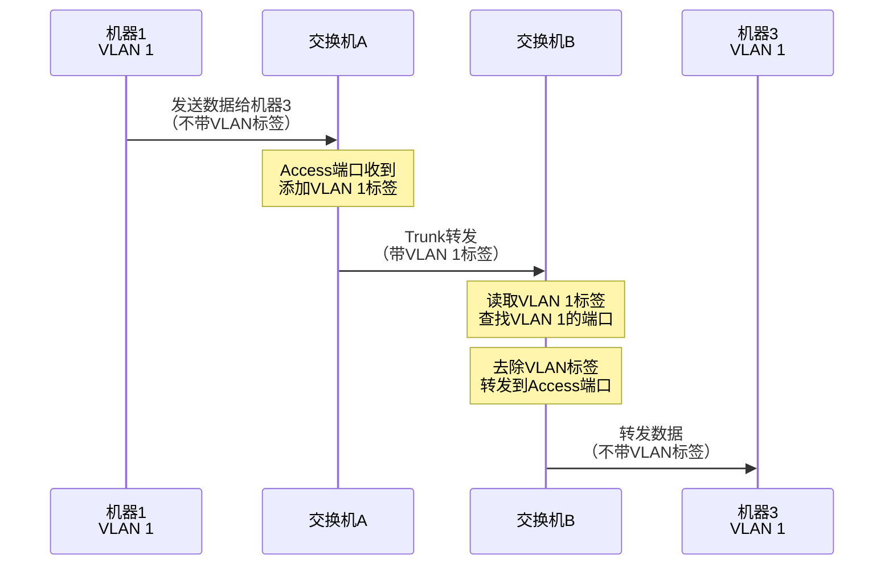
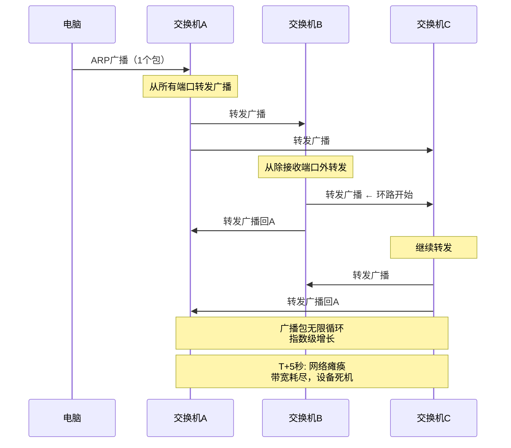

# VLAN与交换机环路问题详解

> 虚拟局域网技术与环路防护的完整实战指南

## 前言

交换机组网是企业网络的基础，但随之而来的是两个核心问题：

1. **如何在物理网络上实现逻辑隔离？** → VLAN
2. **如何防止网络环路导致的广播风暴？** → STP系列协议

本文从实战角度深入讲解VLAN技术原理、应用场景，以及交换机环路的检测与防护。

---

## 一、VLAN核心概念

### 什么是VLAN？

**VLAN = Virtual LAN（虚拟局域网）**

**核心问题：**
```
传统交换机:
所有设备在同一广播域
  ↓
  互相可见，无隔离，安全风险大

VLAN交换机:
划分成多个虚拟网络
  ↓
  逻辑隔离，提升安全和性能
```

**生活类比：**
```
物理交换机 = 一栋办公楼
VLAN = 楼里不同的公司

虽然在同一栋楼（同一台交换机）
但各个公司互不干扰（不同VLAN隔离）
```

---

### VLAN的工作原理

**1. VLAN标签（Tag）**

**IEEE 802.1Q标准：**
```
以太网帧结构（不带VLAN）:
+----------+----------+------+--------+-----+
| 目标MAC  | 源MAC    | 类型 | 数据   | FCS |
+----------+----------+------+--------+-----+

以太网帧结构（带VLAN）:
+----------+----------+------+------+------+--------+-----+
| 目标MAC  | 源MAC    | TPID | TCI  | 类型 | 数据   | FCS |
+----------+----------+------+------+------+--------+-----+
                       ↑      ↑
                    0x8100  VLAN ID
                            (12位，1-4094)
```

**VLAN ID范围：**
```
0:        保留（不使用）
1:        默认VLAN（Native VLAN）
2-1001:   标准VLAN
1002-1005: 保留给特殊用途
1006-4094: 扩展VLAN
4095:     保留（不使用）

实际可用: 4094个VLAN
```

**2. 端口类型**

**Access端口（接终端设备）：**
```
特点:
- 只能属于1个VLAN
- 发送时：去除VLAN标签
- 接收时：添加VLAN标签
- 设备感知不到VLAN存在

用途:
连接电脑、打印机、IP电话等终端设备
```

**Trunk端口（接交换机）：**
```
特点:
- 可以传输多个VLAN的数据
- 保留VLAN标签
- 根据标签转发到对应VLAN

用途:
连接交换机之间，传输多个VLAN流量
```

**Hybrid端口（灵活混合）：**
```
特点:
- 既可以像Access，也可以像Trunk
- 可以给不同VLAN设置Tag/Untag

用途:
复杂网络场景（较少使用）
```

---

### VLAN通信示例

**网络拓扑：**
```
交换机A ←──── Trunk ────→ 交换机B
   ↓                          ↓
机器1,2,8                  机器3,4,5,6

VLAN划分:
- VLAN 1: 机器1, 机器8, 机器3
- VLAN 2: 机器2, 机器5
- VLAN 3: 机器7, 机器4, 机器6
```

**通信流程：**



**关键点：**
- **同VLAN可通信**：机器1 ↔ 机器3（都在VLAN 1）
- **不同VLAN隔离**：机器1 ✗ 机器2（VLAN 1 vs VLAN 2）
- **跨VLAN需路由**：必须通过三层设备（路由器/三层交换机）

---

## 二、VLAN实战配置

### 基础配置示例

**场景：企业部门隔离**
```
要求:
- VLAN 10: 财务部（机器1-10）
- VLAN 20: 技术部（机器11-20）
- VLAN 30: 访客网络（机器21-30）
- Trunk连接核心交换机
```

**交换机配置（Cisco IOS）：**

```bash
# 1. 创建VLAN
vlan 10
  name Finance
vlan 20
  name IT
vlan 30
  name Guest

# 2. 配置Access端口（连接设备）
# 财务部端口 1-10
interface range fastethernet 0/1-10
  switchport mode access
  switchport access vlan 10
  spanning-tree portfast        # 边缘端口，快速启动
  spanning-tree bpduguard enable # BPDU保护

# 技术部端口 11-20
interface range fastethernet 0/11-20
  switchport mode access
  switchport access vlan 20
  spanning-tree portfast

# 访客网络端口 21-30
interface range fastethernet 0/21-30
  switchport mode access
  switchport access vlan 30
  spanning-tree portfast

# 3. 配置Trunk端口（连接核心交换机）
interface gigabitethernet 0/1
  switchport mode trunk
  switchport trunk allowed vlan 10,20,30  # 允许的VLAN
  switchport trunk native vlan 999        # Native VLAN改非1（安全）

# 4. 保存配置
write memory
```

**查看配置：**
```bash
# 查看VLAN信息
show vlan brief

# 输出示例：
VLAN Name                             Status    Ports
---- -------------------------------- --------- ------------------------
1    default                          active
10   Finance                          active    Fa0/1-10
20   IT                               active    Fa0/11-20
30   Guest                            active    Fa0/21-30

# 查看Trunk状态
show interfaces trunk

# 输出示例：
Port        Mode         Encapsulation  Status        Native vlan
Gi0/1       on           802.1q         trunking      999

Port        Vlans allowed on trunk
Gi0/1       10,20,30

# 查看端口详情
show interfaces fastethernet 0/1 switchport

# 输出示例：
Name: Fa0/1
Switchport: Enabled
Administrative Mode: static access
Operational Mode: static access
Access Mode VLAN: 10 (Finance)
```

---

### 跨VLAN通信配置

**问题：不同VLAN默认无法通信**

**解决方案1：三层交换机（单臂路由）**

```bash
# 三层交换机配置VLAN接口（SVI）
interface vlan 10
  ip address 192.168.10.1 255.255.255.0
  no shutdown

interface vlan 20
  ip address 192.168.20.1 255.255.255.0
  no shutdown

# 启用IP路由
ip routing

# 现在VLAN 10和20可以互相通信
```

**解决方案2：路由器（传统方式）**

```bash
# 路由器子接口配置
interface gigabitethernet 0/0.10
  encapsulation dot1Q 10
  ip address 192.168.10.1 255.255.255.0

interface gigabitethernet 0/0.20
  encapsulation dot1Q 20
  ip address 192.168.20.1 255.255.255.0
```

**访问控制（ACL）：**
```bash
# 允许财务访问技术部服务器，但技术部不能访问财务
ip access-list extended FINANCE-TO-IT
  permit tcp 192.168.10.0 0.0.0.255 host 192.168.20.10 eq 3306
  deny   ip 192.168.10.0 0.0.0.255 192.168.20.0 0.0.0.255
  permit ip any any

interface vlan 10
  ip access-group FINANCE-TO-IT in
```

---

## 三、VLAN应用场景

### 场景1：企业部门隔离

**需求：**
```
公司一栋楼，3层
├─ 1楼: 销售部 + 前台
├─ 2楼: 技术部 + 财务部
└─ 3楼: 管理层 + 会议室
```

**VLAN设计：**
```
VLAN 10 - 销售部:
  └─ 可以访问CRM系统，不能访问财务

VLAN 20 - 技术部:
  └─ 可以访问所有服务器，有管理权限

VLAN 30 - 财务部:
  └─ 完全隔离，只能访问财务系统

VLAN 40 - 管理层:
  └─ 可以访问所有资源

VLAN 50 - 访客WiFi:
  └─ 只能上外网，不能访问内网

VLAN 99 - 管理VLAN:
  └─ 用于交换机/路由器管理
```

**拓扑图：**
```
                [核心三层交换机]
                (VLAN 10-50路由)
                       ↓
        ┌──────────────┼──────────────┐
        ↓              ↓               ↓
    [1楼接入]      [2楼接入]       [3楼接入]
    VLAN 10,50     VLAN 20,30      VLAN 40
```

### 场景2：数据中心服务器分组

**需求：**
```
Web服务器、应用服务器、数据库服务器需要隔离
```

**VLAN设计：**
```
VLAN 100 - Web层:
  ├─ 对外提供服务（DMZ）
  ├─ 可以访问应用层
  └─ 不能直接访问数据库

VLAN 200 - 应用层:
  ├─ 业务逻辑处理
  ├─ 可以访问数据库
  └─ 不对外暴露

VLAN 300 - 数据库层:
  ├─ 完全隔离
  ├─ 只允许应用层访问
  └─ 限制IP和端口

VLAN 400 - 存储网络:
  └─ 专用存储流量（iSCSI/NFS）

VLAN 500 - 管理网络:
  └─ 带外管理（IPMI/iLO）
```

**安全策略：**
```
Internet
   ↓
[防火墙]
   ↓
VLAN 100 (Web) ←─ 允许 80/443
   ↓
VLAN 200 (App) ←─ 只允许Web访问
   ↓
VLAN 300 (DB)  ←─ 只允许App访问 3306/5432
```

### 场景3：校园网VLAN划分

**大学网络：**
```
VLAN 10 - 教学楼:
  └─ 多媒体教室、实验室

VLAN 20 - 办公楼:
  └─ 教职工办公网络

VLAN 30 - 学生宿舍:
  ├─ 限速100Mbps
  └─ 限制P2P

VLAN 40 - 图书馆:
  └─ 公共学习区

VLAN 50 - 访客网络:
  └─ 临时访问，认证上网

VLAN 60 - 校园监控:
  └─ 视频监控专网

VLAN 70 - 一卡通系统:
  └─ 食堂/门禁支付网络
```

**特点：**
- 跨楼宇VLAN（通过光纤Trunk）
- 按时间段限速（深夜加速）
- 实名认证（802.1X）

---

## 四、VLAN使用现状

### 仍然广泛使用的场景

**✅ 企业网络（90%+使用率）**
```
中小企业: 基本标配
大型企业: 复杂VLAN规划
跨国企业: 全球VLAN统一管理
```

**✅ 数据中心**
```
传统DC: VLAN划分租户
云DC: VXLAN（VLAN扩展）
混合云: VLAN + VPN
```

**✅ 校园网络**
```
高校: 按楼宇/院系划分
中小学: 教学/办公/学生分离
```

**✅ 酒店/医院**
```
酒店:
├─ VLAN 10: 客房网络
├─ VLAN 20: 办公网络
├─ VLAN 30: POS收银
└─ VLAN 40: 视频监控

医院:
├─ VLAN 10: HIS系统（医疗信息）
├─ VLAN 20: PACS系统（影像）
├─ VLAN 30: 办公网络
└─ VLAN 40: 访客网络
```

### 不常用或被替代的场景

**❌ 家庭网络**
```
原因:
- 设备少，无需隔离
- 家用路由器不支持
- 配置复杂度高
```

**⚠️ 云环境（部分替代）**
```
传统: VLAN隔离
现代: VPC (Virtual Private Cloud)
  ├─ AWS VPC
  ├─ 阿里云VPC
  └─ 更灵活，跨地域

但底层仍基于VLAN/VXLAN
```

**⚠️ 超大规模数据中心**
```
VLAN限制:
- 最多4094个VLAN
- 跨数据中心困难

VXLAN替代:
- 支持1600万虚拟网络（24位VNI）
- 支持跨DC
- 云原生
```

---

## 五、交换机环路问题

### 什么是环路？

**物理环路拓扑：**
```
        交换机A
       /        \
      /          \
交换机B -------- 交换机C
  (形成三角环路)
```

**为什么会有环路？**
```
目的: 冗余 - 一条链路故障，另一条顶上
代价: 如果不处理，会导致灾难性后果
```

---

### 环路的三大危害

**1. 广播风暴（最致命）**



**实际数据：**
```
T+0秒: 1个广播包
T+1秒: 10个
T+2秒: 100个
T+3秒: 1,000个
T+4秒: 10,000个
T+5秒: 100,000个 → 网络瘫痪

症状:
- 交换机CPU 100%
- 指示灯疯狂闪烁
- 所有设备无法通信
- 交换机发烫，甚至死机
```

**2. MAC地址表震荡**

```
正常情况:
交换机学习: MAC-A在端口1 ✓

环路情况:
时刻1: MAC-A在端口1
时刻2: 从端口2收到MAC-A（环路导致）→ 更新为端口2
时刻3: 从端口1又收到MAC-A → 更新为端口1
时刻4: 从端口2又收到MAC-A → 更新为端口2
...无限循环

结果:
- MAC地址表不停变化
- 转发决策混乱
- 单播也变广播（找不到准确端口）
```

**3. 多帧复制**

```
主机A发送1个包给主机B
  ↓
包经过环路，复制成3个
  ↓
主机B收到3个相同的包
  ↓
应用层混乱:
- TCP重复确认
- 数据库重复写入
- 文件传输校验失败
```

---

### 真实案例

**案例1：某公司网络瘫痪**
```
时间: 2023年3月
原因: 员工私接未配置的交换机

过程:
09:00 - 员工连接交换机，形成环路
09:01 - 广播风暴开始
09:02 - 整层楼网络瘫痪
09:05 - 影响扩散到全公司
09:10 - IT发现，拔掉违规交换机
09:15 - 网络恢复

损失:
- 200人无法工作15分钟
- 交易系统中断，损失约50万
```

**案例2：数据中心事故**
```
时间: 2021年
原因: 割接时误操作，形成三角环路

后果:
- 3000台服务器受影响
- 持续30分钟
- 部分交换机过热重启
- 估计损失数百万
```

---

## 六、环路解决方案演进

### 方案1：STP（Spanning Tree Protocol）

**IEEE 802.1D - 经典方案（1990年代）**

**核心思想：逻辑上阻断环路，保留物理冗余**

**工作原理：**

**1. 选举根桥（Root Bridge）**
```
所有交换机比较Bridge ID:
Bridge ID = 优先级(2字节) + MAC地址(6字节)

示例:
交换机A: 32768 + 00:11:22:33:44:01 ← 最小，成为根桥
交换机B: 32768 + 00:11:22:33:44:02
交换机C: 32768 + 00:11:22:33:44:03

手动设置根桥:
spanning-tree vlan 1 priority 4096  # 优先级越小越优
```

**2. 计算最短路径**
```
每个非根桥交换机:
├─ 选择到根桥成本最低的端口 → 根端口(Root Port)
├─ 每个网段选择一个指定端口(Designated Port)
└─ 其他端口 → 阻塞(Blocking)

路径成本(Cost):
10Mbps   = 100
100Mbps  = 19
1Gbps    = 4
10Gbps   = 2
```

**3. 端口状态机**
```
Blocking (阻塞)
  ↓ 20秒
Listening (监听BPDU)
  ↓ 15秒
Learning (学习MAC地址)
  ↓ 15秒
Forwarding (转发数据)

总收敛时间: 30-50秒 ← 慢！
```

**STP示例：**
```
物理拓扑（有环）:
        交换机A (根桥)
       /        \
     19/        \19  (链路成本)
     /            \
交换机B ----19---- 交换机C

STP逻辑拓扑（无环）:
        交换机A (根桥)
       /        \
     RP/        \RP  (根端口)
     /            \
交换机B    X     交换机C
      (阻塞端口)

正常: B-C链路阻塞，不转发数据
故障: A-B断线 → B-C自动启用（30秒后）
```

**配置示例：**
```bash
# 启用STP（默认启用）
spanning-tree mode pvst  # Per-VLAN STP

# 设置根桥
spanning-tree vlan 1 root primary  # 自动设置最低优先级
# 或手动设置
spanning-tree vlan 1 priority 4096

# 查看STP状态
show spanning-tree

# 输出示例：
VLAN0001
  Spanning tree enabled protocol ieee
  Root ID    Priority    4097
             Address     0011.2233.4455
             This bridge is the root

  Interface        Role Sts Cost      Prio.Nbr Type
  Gi0/1            Desg FWD 4         128.1    P2p
  Gi0/2            Desg FWD 4         128.2    P2p
  Gi0/3            Desg BLK 4         128.3    P2p  ← 阻塞端口
```

**STP缺点：**
- ❌ 收敛慢（30-50秒）
- ❌ 链路利用率低（一半链路阻塞）
- ❌ 拓扑变化频繁时不稳定

---

### 方案2：RSTP（Rapid Spanning Tree）

**IEEE 802.1w - 快速生成树（2001年）**

**改进点：**
```
STP收敛: 30-50秒
RSTP收敛: 1-2秒 ✓

关键改进:
1. 简化端口状态（5个→3个）
   - Discarding (丢弃)
   - Learning (学习)
   - Forwarding (转发)

2. 主动确认机制
   - 不等定时器，主动握手
   - Proposal/Agreement机制

3. 边缘端口(Edge Port)
   - 连接终端设备
   - 直接进入Forwarding状态
   - 不参与STP计算

4. 点对点链路检测
   - 全双工链路快速切换
```

**RSTP端口角色：**
```
Root Port (根端口)     - 到根桥最短路径
Designated Port (指定) - 每个网段的转发端口
Alternate Port (替代)  - 根端口的备份
Backup Port (备份)     - 指定端口的备份
```

**配置示例：**
```bash
# 启用RSTP
spanning-tree mode rapid-pvst

# 配置边缘端口（连接PC）
interface range gi0/1-24
  spanning-tree portfast  # 快速启动

# 配置上行端口（连接交换机）
interface gi0/25
  spanning-tree link-type point-to-point

# 查看RSTP状态
show spanning-tree summary
# 输出：
Switch is in rapid-pvst mode
Root bridge for: VLAN0001
Extended system ID           is enabled
Portfast Default             is disabled
PortFast BPDU Guard Default  is disabled
...
```

---

### 方案3：MSTP（Multiple Spanning Tree）

**IEEE 802.1s - 多生成树（2003年）**

**解决问题：VLAN负载均衡**

**传统RSTP问题：**
```
公司有VLAN 10,20,30,40
RSTP为所有VLAN计算一棵树
  ↓
链路A: 转发所有VLAN
链路B: 阻塞所有VLAN
  ↓
链路B完全浪费 ✗
```

**MSTP解决方案：**
```
创建多个生成树实例:
实例1: VLAN 10,20 → 使用链路A
实例2: VLAN 30,40 → 使用链路B
  ↓
两条链路都转发，负载均衡 ✓
```

**拓扑示例：**
```
        核心交换机
       /          \
    链路A        链路B
     /              \
接入交换机1      接入交换机2

MSTP配置:
实例1 (VLAN 10,20):
  链路A: Forwarding
  链路B: Blocking

实例2 (VLAN 30,40):
  链路A: Blocking
  链路B: Forwarding

结果:
VLAN 10,20流量走链路A
VLAN 30,40流量走链路B
负载均衡实现！
```

**配置示例：**
```bash
# 启用MSTP
spanning-tree mode mst

# 定义MST配置
spanning-tree mst configuration
  name COMPANY
  revision 1
  instance 1 vlan 10,20
  instance 2 vlan 30,40

# 设置实例1的根桥
spanning-tree mst 1 root primary

# 设置实例2的根桥（在另一台交换机）
spanning-tree mst 2 root secondary

# 查看MSTP状态
show spanning-tree mst configuration
show spanning-tree mst 1
```

---

### 方案4：堆叠（Stack）

**物理上多台，逻辑上一台**

**原理：**
```
传统方案:
交换机A ←→ 交换机B ←→ 交换机C
   ↓
3台独立设备，需要STP防环

堆叠方案:
[交换机A + B + C] = 一台逻辑交换机
   ↓
   1个IP地址
   1个管理接口
   内部专用堆叠线缆（环路不存在）
```

**优势：**
```
✅ 无环路（逻辑上一台设备）
✅ 管理简单（一个IP）
✅ 带宽聚合（堆叠带宽达160Gbps）
✅ 单一故障（一台坏了，其他继续工作）
✅ 跨设备链路聚合
```

**厂商技术：**
| 厂商 | 技术名称 | 最大成员数 | 堆叠带宽 |
|------|---------|-----------|---------|
| Cisco | StackWise | 9 | 480Gbps |
| Huawei | iStack/CSS | 9 | 576Gbps |
| HP/Aruba | IRF | 9 | 320Gbps |
| Juniper | Virtual Chassis | 10 | 128Gbps |

**配置示例（Cisco StackWise）：**
```bash
# 查看堆叠状态
show switch

# 输出示例：
Switch/Stack Mac Address : 0011.2233.4455
                                           H/W   Current
Switch#  Role   Mac Address     Priority Version  State
1       Master  0011.2233.4455     15     V01    Ready
2       Member  0011.2233.4456     14     V01    Ready
3       Member  0011.2233.4457     13     V01    Ready

# 设置堆叠优先级（决定Master）
switch 1 priority 15  # 数字越大越优

# 重启堆叠成员
switch 2 reload
```

---

### 方案5：VSS/vPC（虚拟双活）

**Virtual Switching System / Virtual Port Channel**

**核心思想：两台交换机虚拟成一台**

**架构：**
```
        核心交换机A + B（虚拟成一台）
              /          \
             /            \
        接入交换机1    接入交换机2
            |  \       /  |
            |   \LACP/   |
            |    \  /     |
          设备    双活    设备

特点:
- 两台核心交换机同时工作（双活）
- 接入交换机看到的是"一台"核心交换机
- 两条上行链路同时转发（100%利用率）
- 无环路（逻辑上一台）
```

**对比：**
| 特性 | 传统STP | VSS/vPC |
|------|---------|---------|
| 链路利用率 | 50% | 100% |
| 收敛时间 | 1-2秒 | <1秒 |
| 管理复杂度 | 低 | 高 |
| 成本 | 低 | 高 |

**厂商技术：**
- Cisco: VSS (Catalyst 6500), vPC (Nexus)
- Huawei: CSS, M-LAG
- Arista: MLAG
- Dell: VLT

**配置示例（Cisco vPC）：**
```bash
# 核心交换机A配置
feature vpc
vpc domain 1
  peer-keepalive destination 192.168.1.2 source 192.168.1.1

interface port-channel 1
  vpc peer-link  # Peer-link连接两台核心

interface port-channel 10
  vpc 10  # 下行到接入交换机的vPC

# 接入交换机配置（正常链路聚合）
interface port-channel 1
  channel-group 1 mode active  # LACP
```

---

### 方案6：SDN（软件定义网络）

**集中控制器，无需STP**

**传统网络：**
```
每台交换机独立运行STP
  ↓
  分布式决策
  收敛慢，配置复杂
```

**SDN网络：**
```
        [SDN控制器]
         (集中计算)
             ↓
   下发流表到所有交换机
             ↓
       交换机只负责转发
             ↓
   无需STP，秒级收敛
```

**优势：**
- 全局视角，最优路径
- 流量工程精细控制
- 快速故障切换
- 自动化配置

**技术：**
- OpenFlow
- VXLAN + EVPN
- Cisco ACI
- VMware NSX

---

## 七、环路检测与防护

### 检测环路

**症状：**
```
✓ 网络突然变慢/中断
✓ 交换机CPU 100%
✓ 指示灯疯狂闪烁
✓ 设备发烫
✓ 大量广播包
✓ MAC地址表疯狂变化
```

**排查命令：**

```bash
# 1. 查看STP状态
show spanning-tree

# 查看是否有端口频繁变化
show spanning-tree interface gi0/1 detail

# 2. 查看端口流量（找异常高的）
show interfaces counters

# 输出示例：
Port       InOctets    InUcastPkts   InMcastPkts  InBcastPkts
Gi0/1      123456789   1234567       12345        1234567890 ← 异常高的广播
Gi0/2      98765432    987654        9876         98765

# 3. 查看MAC地址表（观察是否震荡）
show mac address-table | include Gi0/1

# 4. 查看CPU使用率
show processes cpu sorted
# CPU过高表明可能有环路

# 5. 临时措施：关闭可疑端口
interface gi0/1
  shutdown

# 等待几秒观察网络是否恢复
# 如果恢复，说明gi0/1有问题
```

### 预防措施

**1. BPDU Guard（BPDU保护）**

```bash
# 全局启用
spanning-tree portfast bpduguard default

# 或单个端口
interface gi0/1
  spanning-tree portfast
  spanning-tree bpduguard enable

# 原理:
# 边缘端口收到BPDU（说明连了交换机）→ 自动关闭端口
# 防止员工私接交换机造成环路
```

**2. Root Guard（根保护）**

```bash
# 在边界端口启用
interface gi0/1
  spanning-tree guard root

# 原理:
# 防止下游设备宣称自己是根桥
# 保护网络拓扑稳定性
```

**3. Loop Guard（环路保护）**

```bash
# 全局启用
spanning-tree loopguard default

# 原理:
# 检测单向链路故障
# 防止因BPDU丢失导致的环路
```

**4. UDLD（单向链路检测）**

```bash
# 全局启用
udld enable

# 接口启用
interface gi0/1
  udld port aggressive

# 原理:
# 发送专用数据包检测双向通信
# 发现单向链路自动关闭端口
```

**5. Storm Control（风暴控制）**

```bash
# 限制广播/组播/未知单播流量
interface gi0/1
  storm-control broadcast level 10.00  # 限制10%
  storm-control multicast level 10.00
  storm-control action shutdown  # 超限关闭端口

# 原理:
# 限制广播流量占用带宽的比例
# 超过阈值自动关闭端口
```

---

## 八、实战案例对比

### 场景：企业双核心网络

**拓扑：**
```
      核心交换机1 ←→ 核心交换机2
         /    \        /    \
        /      \      /      \
   接入1      接入2  接入3   接入4
   (24口)    (24口) (24口)  (24口)
```

**需求：**
- 核心冗余（一台故障不影响）
- 链路利用率最大化
- 收敛时间最短
- 管理尽量简单

**方案对比：**

| 方案 | 收敛时间 | 链路利用率 | 配置复杂度 | 成本 | 推荐指数 |
|------|---------|-----------|-----------|------|---------|
| STP | 30-50秒 | 50% | ⭐ | ¥ | ⭐⭐ |
| RSTP | 1-2秒 | 50% | ⭐ | ¥ | ⭐⭐⭐ |
| MSTP | 1-2秒 | 80% | ⭐⭐ | ¥ | ⭐⭐⭐⭐ |
| 堆叠 | 0秒 | 100% | ⭐⭐ | ¥¥ | ⭐⭐⭐⭐ |
| VSS/vPC | <1秒 | 100% | ⭐⭐⭐ | ¥¥¥ | ⭐⭐⭐⭐⭐ |

**选择建议：**

**小型企业（<100人）：**
```
方案: RSTP
理由:
- 成本低（设备自带）
- 配置简单
- 满足基本需求
```

**中型企业（100-500人）：**
```
方案: MSTP + 堆叠
理由:
- MSTP实现负载均衡
- 核心采用堆叠（双活）
- 性价比高
```

**大型企业/数据中心：**
```
方案: VSS/vPC + VXLAN
理由:
- 性能最优
- 高可用性
- 灵活扩展
```

---

## 九、总结与最佳实践

### VLAN关键要点

**核心概念：**
```
VLAN = 虚拟局域网
├─ 逻辑隔离（同一交换机，不同VLAN隔离）
├─ 减少广播域（提升性能）
├─ 提升安全（敏感数据隔离）
└─ 灵活管理（跨交换机组网）
```

**端口类型：**
```
Access: 连接终端（PC/服务器）
  └─ 只属于1个VLAN

Trunk: 连接交换机
  └─ 传输多个VLAN，带标签

Hybrid: 混合模式（灵活但少用）
```

**VLAN ID范围：**
```
1:        默认VLAN（不建议使用）
2-1001:   标准VLAN
1002-1005: 保留
1006-4094: 扩展VLAN
```

### 环路防护最佳实践

**1. 分层设计：**
```
核心层: VSS/vPC双活
汇聚层: MSTP负载均衡
接入层: RSTP + 端口保护
```

**2. 端口保护：**
```
连接PC端口:
  ├─ spanning-tree portfast
  ├─ spanning-tree bpduguard enable
  └─ storm-control broadcast level 10

连接交换机端口:
  ├─ spanning-tree guard root
  └─ udld port aggressive
```

**3. 监控告警：**
```
监控项:
├─ STP拓扑变化
├─ 端口状态变化
├─ CPU使用率
├─ 广播流量占比
└─ MAC地址表大小

告警阈值:
├─ STP变化 > 5次/小时
├─ CPU > 80%持续5分钟
├─ 广播流量 > 20%
└─ 立即通知管理员
```

**4. 变更流程：**
```
添加新交换机:
1. 离线配置VLAN和STP
2. 测试环境验证
3. 业务低峰期上线
4. 监控1小时
5. 备份配置
```

**5. 应急预案：**
```
发现环路:
1. 立即查看STP状态
2. 识别问题端口（流量异常高）
3. shutdown问题端口
4. 确认网络恢复
5. 排查根本原因
6. 修复后重新启用
7. 记录事故报告
```

### 技术演进路线

**当前企业网络（2025年）：**
```
小型: RSTP（够用）
中型: MSTP + 堆叠（主流）
大型: VSS/vPC + VXLAN（趋势）
云DC: SDN + VXLAN（未来）
```

**未来方向：**
```
传统VLAN → VXLAN（云数据中心）
  ├─ 4094个VLAN → 1600万个VNI
  ├─ 二层网络 → 三层Overlay
  └─ 手动配置 → SDN自动化

STP系列 → SDN控制
  ├─ 分布式决策 → 集中控制
  ├─ 30秒收敛 → 秒级收敛
  └─ 静态拓扑 → 动态流量工程
```

---

## 十、常见问题FAQ

**Q1: VLAN 1能删除吗？**
```
A: 不能。VLAN 1是默认VLAN，无法删除。
   但可以不使用它（分配其他VLAN）。
   建议: 管理VLAN用VLAN 99，避免用1。
```

**Q2: Trunk端口可以连接PC吗？**
```
A: 技术上可以，但不推荐。
   PC需要支持802.1Q标签（大部分不支持）。
   除非特殊需求（如虚拟化主机）。
```

**Q3: 为什么要修改Native VLAN？**
```
A: 安全原因。
   默认Native VLAN是1，攻击者可能利用。
   建议改成未使用的VLAN（如999）。

   switchport trunk native vlan 999
```

**Q4: STP能完全关闭吗？**
```
A: 技术上可以，但非常危险！
   no spanning-tree vlan 1

   只有在确定无环路时才关闭（如点对点链路）。
   否则一旦有环路，立即瘫痪。
```

**Q5: 链路聚合和STP冲突吗？**
```
A: 不冲突。
   链路聚合（LACP）将多条物理链路虚拟成一条逻辑链路。
   STP看到的是逻辑链路，不会阻塞。

   这是实现100%链路利用率的方法之一。
```

**Q6: VLAN间通信一定要三层设备吗？**
```
A: 是的。
   不同VLAN = 不同IP网段
   二层交换机只转发同一VLAN的流量
   跨VLAN需要IP路由 = 三层设备（路由器/三层交换机）
```

**Q7: 环路能自动恢复吗？**
```
A: 取决于配置。

   STP/RSTP: 会自动阻塞端口，防止环路 ✓

   但如果:
   - STP被禁用 ✗
   - 广播风暴太严重，交换机死机 ✗
   - 需要人工干预
```

---

## 参考资料

**RFC文档：**
- IEEE 802.1Q - VLAN标准
- IEEE 802.1D - STP
- IEEE 802.1w - RSTP
- IEEE 802.1s - MSTP

**Cisco文档：**
- Cisco Campus Network Design Guide
- Spanning Tree Protocol Best Practices
- Virtual Switching System Configuration Guide

**实用工具：**
```bash
# Wireshark过滤VLAN
vlan.id == 10

# 过滤STP
stp

# 抓取Trunk链路
tcpdump -i eth0 -nn vlan
```

**学习建议：**
1. 搭建GNS3/EVE-NG实验环境
2. 模拟环路，观察广播风暴
3. 配置STP，观察端口状态变化
4. 实践不同VLAN场景
5. 测试故障切换时间

---

**核心记忆：**

**VLAN三要素：**
1. VLAN ID（1-4094）
2. Access端口（接设备）
3. Trunk端口（接交换机）

**环路三大害：**
1. 广播风暴（致命）
2. MAC表震荡（混乱）
3. 多帧复制（重复）

**STP三步走：**
1. 选举根桥
2. 计算路径
3. 阻塞端口

**现代方案：**
- 中小企业：RSTP/MSTP
- 大型企业：VSS/vPC
- 云数据中心：SDN/VXLAN

---

*最后更新：2025-10-27*
*关键词：VLAN、802.1Q、Trunk、Access、STP、RSTP、MSTP、环路、广播风暴、VSS、vPC、堆叠*
