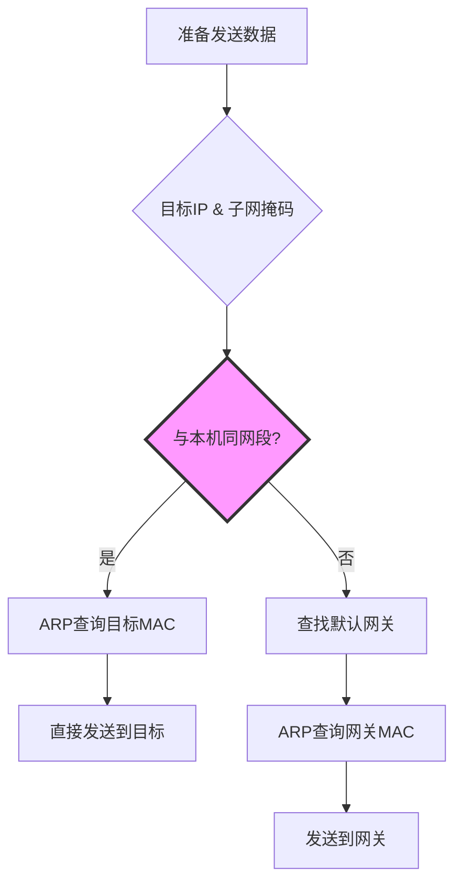
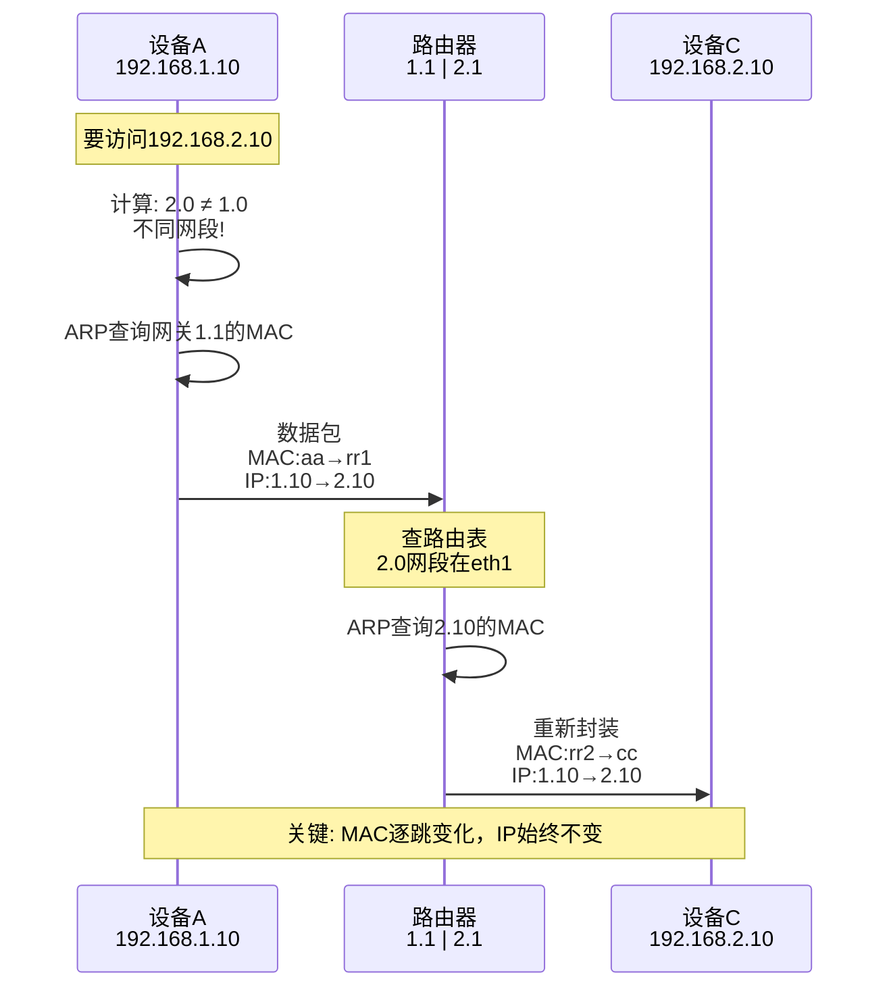
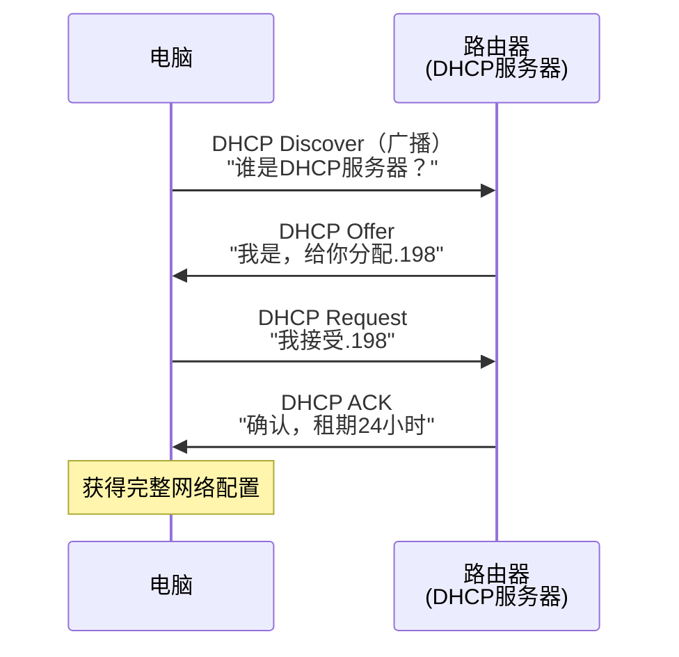
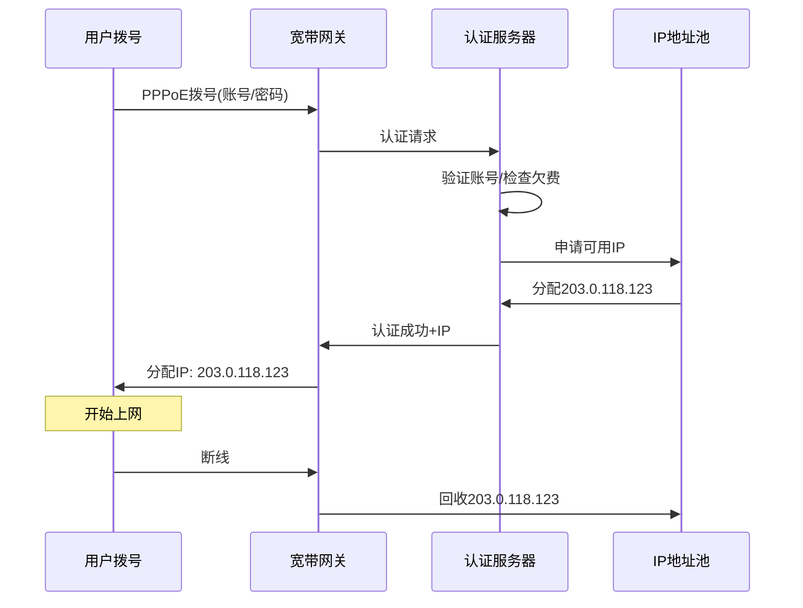
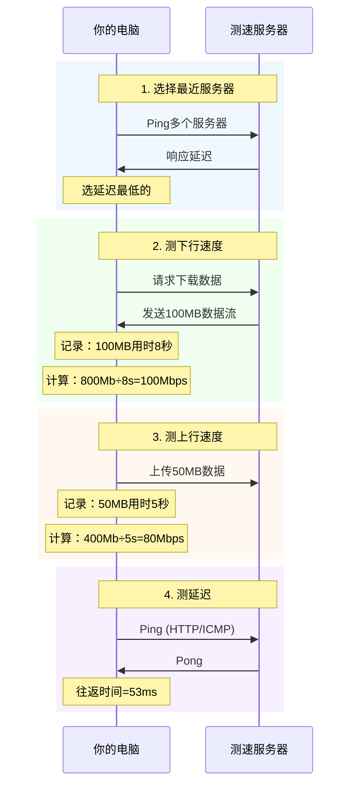

# 网络基础知识实战详解

> 从交换机到ISP，从本机配置到全球IP管理的完整认知

## 前言

作为开发者，我们每天都在用网络，但很多基础概念其实模糊不清：

- 交换机和路由器到底有什么区别？
- 为什么要有网关？
- 宽带是什么意思？
- 上行下行带宽为什么不对称？
- 测速是怎么测的？

本文通过实战探索，把这些概念彻底搞清楚。

---

## 一、交换机 vs 路由器：职责边界

### 核心区别

| 维度 | 交换机 | 路由器 |
|------|--------|--------|
| **工作层级** | 数据链路层（Layer 2） | 网络层（Layer 3） |
| **转发依据** | MAC地址 | IP地址 |
| **网段** | 只能同一网段 | 连接不同网段 |
| **广播域** | 不隔离 | 隔离 |
| **典型应用** | 局域网内部扩展端口 | 连接不同网络 |

### 实际场景

**只用交换机（企业内部）：**
```
所有设备在 192.168.1.0/24 网段
├─ 交换机1: 电脑A(.10), 电脑B(.20)
├─ 交换机2: 电脑C(.30), 电脑D(.40)
└─ 桥接: 交换机1 ← → 交换机2

特点:
- 简单，即插即用
- 所有设备同一广播域
- 无法隔离网段
```

**加入路由器（网段隔离）：**
```
       路由器
       /    \
    .1.1    .2.1
     /        \
网段A          网段B
192.168.1.x    192.168.2.x
财务部          技术部

特点:
- 部门网络隔离
- 可以设置访问控制
- 广播域隔离
```

### 选择建议

- **≤8设备**：单台交换机
- **需要隔离**：路由器分段
- **家庭/小办公室**：交换机够用
- **企业/安全要求**：路由器必备

---

## 二、网络地址体系

### IP地址与子网掩码

**设备如何判断是否同网段？**

```
设备A: 192.168.1.10/24
设备B: 192.168.1.20/24
设备C: 192.168.2.10/24

计算过程:
192.168.1.10 & 255.255.255.0 = 192.168.1.0
192.168.1.20 & 255.255.255.0 = 192.168.1.0  ← 同网段 ✓
192.168.2.10 & 255.255.255.0 = 192.168.2.0  ← 不同网段 ✗
```

**设备的路由决策：**



### 网关的本质

**网关 = 路由器在本网段的IP地址**

**生活类比：**
- 你家（设备）在小区内（局域网）
- 同小区串门（同网段）：直接走
- 去外面（跨网段/外网）：必须走大门（网关）

**实际配置示例：**
```bash
# 查看本机配置
ifconfig en0 | grep "inet "
# inet 192.168.101.198 netmask 0xfffffe00

# 查看网关
netstat -nr | grep default
# default 192.168.101.1 UGScg en0

# 结论：
# 本机: 192.168.101.198
# 网关: 192.168.101.1
# 访问其他网段 → 全部发给 192.168.101.1
```

### 跨网段通信流程



---

## 三、网络配置实战

### DHCP：自动配置的功臣

**查看DHCP分配信息：**
```bash
ipconfig getpacket en0

# 输出（简化）：
yiaddr: 192.168.101.198        # 分配的IP
subnet_mask: 255.255.254.0     # 子网掩码
router: 192.168.101.1          # 网关
domain_name_server: 192.168.20.1  # DNS
lease_time: 86400秒            # 租期24小时
server_identifier: 192.168.101.1  # DHCP服务器
```

**DHCP工作流程：**


### DNS：内网还是公网？

**为什么DNS是内网地址？**

```
本机DNS: 192.168.20.1  （内网）
         ↓
工作模式:
  ├─ 内部域名（git.公司.com） → 直接解析
  └─ 外网域名（baidu.com）    → 转发到公网DNS
```

**验证DNS正常工作：**
```bash
nslookup baidu.com 192.168.20.1

# 输出：
Server: 192.168.20.1
Address: 192.168.20.1#53

Name: baidu.com
Address: 39.156.70.37

# 结论：内网DNS正常转发外网查询
```

### DNS能监控什么？

**内网DNS服务器可以记录：**
```
时间              用户IP              访问域名
2025-10-27 10:00  192.168.101.198    zhihu.com
2025-10-27 10:05  192.168.101.198    github.com
2025-10-27 10:10  192.168.101.198    job.51job.com  ← 在找工作？
```

**能看到的：**
- ✅ 访问了哪个域名（zhihu.com）
- ✅ 什么时候访问
- ✅ 访问频率

**看不到的：**
- ❌ 具体URL路径（/question/12345）
- ❌ 页面内容
- ❌ HTTPS加密数据

**但如果公司部署了HTTPS中间人：**
- 安装公司根证书
- 解密HTTPS流量
- 能看到完整URL和内容

**检测代理：**
```bash
env | grep -i proxy

# 输出：
HTTP_PROXY=http://localhost:8001   ← 本地V2Ray
HTTPS_PROXY=http://localhost:8001
GOPROXY=https://goproxy.cn,direct

# 结论：流量走本地代理，公司网关看不到明文
```

---

## 四、公网IP管理体系

### 全球三级管理架构

```
IANA (全球总管)
  ↓ 分配大块IP
RIR (5个区域组织)
  ├─ APNIC (亚太) ← 中国在这里
  ├─ ARIN (北美)
  ├─ RIPE NCC (欧洲)
  ├─ LACNIC (拉美)
  └─ AFRINIC (非洲)
  ↓ 分配给ISP
ISP (运营商)
  ├─ 中国电信
  ├─ 中国联通
  └─ 中国移动
  ↓ 分配给用户
终端用户
```

**现状（2025年）：**
- ❌ IANA：2011年分配完
- ❌ APNIC：进入"最后/8池"模式
- ⚠️ 新申请：每个组织最多/22（1024个IP）

### IPv4枯竭的应对

**1. NAT技术（主流）：**
```
公司公网IP: 14.154.126.59 (1个)
  ↓ NAT转换
内网设备:
  ├─ 192.168.101.100
  ├─ 192.168.101.101
  └─ ...500台设备共享1个公网IP
```

**2. IPv4地址交易市场：**
- 价格：$20-50/个IP
- 微软2011年花750万美元买66.6万个IP
- AWS、阿里云常年收购

**3. IPv6推广：**
- 地址数量：2^128（几乎无限）
- 普及率：中国约50%

### CIDR：告别分类地址

**为什么需要CIDR？**

**传统分类地址的浪费：**
```
A类: /8  (1670万个) - 太大
B类: /16 (6.5万个)  - 还是大
C类: /24 (254个)    - 太小

实际需求: 500台主机
  ├─ C类不够（254个）
  └─ B类浪费（65000个，用不完）
```

**CIDR解决方案：**
```
公司需要500台主机：
传统: B类 172.16.0.0/16  (浪费64500个)
CIDR: 172.16.0.0/23      (512个，刚好)

节省: 99.2%
```

**路由聚合优势：**
```
传统分类:
192.168.1.0/24  → 路由条目1
192.168.2.0/24  → 路由条目2
...256条路由

CIDR聚合:
192.168.0.0/16  → 1条路由（聚合256个网段）
```

**历史：**
- 1981年：IPv4发布，A/B/C分类
- 1993年：CIDR提出（RFC 1519）
- 现在：全面使用CIDR

---

## 五、ISP实战：管理公网IP段

### 场景：你是ISP，拿到 203.0.113.0/20

**网段规划：**
```
总网段: 203.0.113.0/20 (4096个IP)
├─ 基础设施: 203.0.113.0/24   (256)  ← 路由器/DNS/网关
├─ 企业专线: 203.0.114.0/22   (1024) ← 固定IP客户
├─ 家庭宽带: 203.0.118.0/21   (2048) ← 动态IP池
├─ 预留增长: 203.0.126.0/23   (512)  ← 未来扩展
└─ IP交易储备: 203.0.128.0/23 (512)  ← 升值资产
```

### 家庭宽带：动态IP复用

**PPPoE地址池：**
```
地址池: 203.0.118.0/21 (2048个IP)
在线用户: ~5000人
复用比例: 2.5:1

原理:
- 用户拨号上线 → 分配1个IP
- 用户下线 → IP回收
- 高峰期可能不够 → 需监控调整
```

**RADIUS认证流程：**


### 企业专线：固定IP管理

**客户需求：8个固定IP**
```
分配: 203.0.114.0/29 (8个IP)
可用: 203.0.114.1-6 (6个，去掉网络地址和广播地址)
网关: 203.0.114.1
月费: ¥2000

配置:
1. 边界路由器静态路由
2. IPAM系统记录:
   - 客户ID: ENT-12345
   - 网段: 203.0.114.0/29
   - 到期: 2026-10-27
3. 反向DNS: 203.0.114.2 → customer.example.com
```

### BGP路由宣告

**向全球宣告：**
```bash
router bgp 65001
  network 203.0.113.0 mask 255.255.240.0  # 宣告/20网段
  neighbor 上游ISP的IP remote-as 上游AS号

# 结果：
# 全球路由器知道：访问203.0.113.0/20 → 找AS65001
```

### 中国ISP现状

**三巨头垄断：**
```
中国电信 (AS4134)  - 40%市场
中国联通 (AS4837)  - 30%市场
中国移动 (AS9808)  - 29%市场
中国广电           - 1%市场

死亡名单:
├─ 长城宽带 (2018年破产)
├─ 鹏博士 (2020年退出家宽)
└─ 艾普宽带 (几乎消失)
```

**小ISP消失原因：**
1. 带宽成本高（从三大租带宽）
2. 基础设施弱（光纤入户要钱）
3. 恶性竞争（三大降价打压）
4. IPv4枯竭（拿不到新IP）

---

## 六、宽带与带宽

### 宽带的定义

**技术定义：**
- ITU标准：≥ 256 Kbps
- 美国FCC：≥ 25 Mbps
- 中国现实：100M起步

**历史对比：**
```
1990s: 拨号 56 Kbps    → 窄带
2000s: ADSL 512K-8M   → 宽带
2010s: 光纤 100M-1000M → 宽带
2020s: 万兆 10Gbps    → 还是叫"宽带"
```

**中国语境：**
- 宽带 = 家庭固定网络（FTTH光纤）
- 移动数据 = 4G/5G流量
- 专线 = 企业级接入

### 上行 vs 下行

**方向定义（以你为中心）：**
```
        ↓ 下行（Download）
      [你的设备]
        ↑ 上行（Upload）
```

**家庭宽带不对称：**
```
下行: 100 Mbps  ← 看视频爽
上行: 20 Mbps   ← 只有1/5

原因:
1. 用户下载多、上传少
2. 运营商节省成本
3. ADSL时代的技术遗留
```

**企业专线对称：**
```
下行: 100 Mbps
上行: 100 Mbps  ← 对等，贵！

月费:
家庭100M: ¥100
企业100M: ¥2000 (20倍)
```

**应用需求对比：**
| 应用 | 主要占用 | 带宽需求 |
|------|---------|---------|
| 看4K视频 | 下行 | 25 Mbps |
| 视频会议 | 上行+下行 | 各5 Mbps |
| 上传视频到B站 | 上行 | 10+ Mbps |
| 直播推流 | 上行 | 8-10 Mbps |
| 远程访问NAS | 上行（NAS端）| 20+ Mbps |

**单位换算：**
```
网络速度: Mbps (兆比特/秒) ← 运营商标注
下载速度: MB/s (兆字节/秒) ← 软件显示

换算: 1 MB/s = 8 Mbps

示例:
100 Mbps宽带
= 100 ÷ 8 = 12.5 MB/s (理论下载速度)
```

---

## 七、测速原理

### 核心流程



### 技术细节

**1. 多线程并发：**
```
单线程: 无法跑满带宽（TCP慢启动）
多线程: 8-16个连接 → 跑满带宽 ✓
```

**2. 随机数据：**
```
目的: 防止中间设备压缩
方法: 生成不可压缩的随机数据
```

**3. 动态调整：**
```
慢速网络: 测更久（获取稳定值）
高速网络: 快速完成
```

**4. 防缓存：**
```
URL加随机参数: /download?r=0.123456
避免CDN缓存影响
```

### 测速的局限

**1. 只测特定服务器：**
```
测速显示: 100 Mbps (连国内服务器)
访问国外: 1 Mbps (国际出口拥堵)
```

**2. 短时突发 vs 持续：**
```
测速: 短时间跑满带宽
实际: 长时间可能被限速
```

**3. 理想条件：**
```
测速: 直连，无干扰
实际: 多人共享，有干扰
```

### 自己实现简单测速

**下载测速：**
```bash
time curl -o /dev/null http://cachefly.cachefly.net/100mb.test

# 输出：
# real 0m8.234s  (用时8.234秒)
# 100MB = 800Mb
# 速度 = 800 / 8.234 ≈ 97 Mbps
```

**Ping测试：**
```bash
ping -c 10 baidu.com

# 输出平均延迟：
# rtt min/avg/max = 30/35/42 ms
```

---

## 八、实战验证

### 判断公司是否有独立公网IP

**方法1：查看本机IP**
```bash
ifconfig en0 | grep "inet "
# inet 192.168.101.198  ← 私网IP

结论：内网IP，有NAT
```

**方法2：查看出口公网IP**
```bash
curl ifconfig.me
# 14.154.126.59

whois 14.154.126.59
# 中国电信广东省
```

**方法3：判断独立还是共享**
```
对比:
本机IP:  192.168.101.198 (私网)
出口IP:  14.154.126.59    (公网)

结论: 公司内网通过NAT共享公网IP

进一步测试:
1. IP是否固定？(记录对比)
2. 外网能否访问内网？(端口映射测试)
3. 路由器WAN口IP是公网还是运营商内网？
```

**快速判断表：**
| 特征 | 独立IP | 共享IP |
|------|--------|--------|
| 出口IP固定 | ✓ | ✗ |
| 外网可访问内网 | ✓ | ✗ |
| 路由器WAN口 | 公网IP | 内网IP |
| 月费 | ¥2000+ | ¥500 |

### 完整网络配置检查

```bash
# 1. 本机IP和子网掩码
ifconfig en0 | grep "inet "
# inet 192.168.101.198 netmask 0xfffffe00

# 2. 网关
netstat -nr | grep default
# default 192.168.101.1 UGScg en0

# 3. DNS服务器
ipconfig getpacket en0 | grep domain_name_server
# domain_name_server: 192.168.20.1

# 4. DHCP完整信息
ipconfig getpacket en0

# 5. ARP缓存
arp -a
# _gateway (192.168.101.1) at 8c:53:c3:80:18:ad on en0

# 6. 出口公网IP
curl ifconfig.me
# 14.154.126.59

# 7. IP归属
whois 14.154.126.59 | grep -i chinanet
# CHINANET Guangdong province network
```

---

## 九、核心知识点总结

### 设备与协议

**交换机（Layer 2）：**
- 只认MAC地址
- 通过MAC地址表转发
- 无法跨网段
- 广播域不隔离

**路由器（Layer 3）：**
- 认IP地址
- 通过路由表转发
- 连接不同网段
- 隔离广播域

**ARP协议：**
- IP → MAC地址映射
- 请求：广播
- 应答：单播
- 缓存机制

**DHCP协议：**
- 自动分配IP、掩码、网关、DNS
- 四步握手：Discover → Offer → Request → ACK
- 租期机制

**DNS协议：**
- 域名 → IP解析
- 内网DNS可以监控访问记录
- 但只能看域名，看不到URL路径

### 地址体系

**IP地址：**
- 逻辑地址，可变
- 网络号 + 主机号
- 通过子网掩码划分

**子网掩码：**
- 区分网络号和主机号
- IP & 掩码 = 网络号
- 判断是否同网段

**网关：**
- 路由器在本网段的IP
- 设备访问外网的"大门"
- 不同网段流量全部发给网关

**MAC地址：**
- 硬件地址，固定（可软件修改）
- 数据链路层使用
- 逐跳变化

**关键公理：**
- MAC地址逐跳变化，IP地址保持不变
- 设备通过 IP & 掩码 判断同网段
- 同网段直接ARP，不同网段发给网关

### 全球IP管理

**三级架构：**
```
IANA (全球) → RIR (区域) → ISP (运营商) → 用户
```

**CIDR优势：**
- 任意长度网络前缀（/1-/32）
- 按需分配，减少浪费
- 路由聚合，减少路由表

**IPv4枯竭应对：**
- NAT共享IP
- IPv4地址交易市场（$20-50/个）
- 推广IPv6

### 宽带与带宽

**宽带定义：**
- 相对于拨号的高速接入
- 现在特指光纤入户（FTTH）
- 永久在线，不用拨号

**上行/下行：**
- 下行：互联网 → 你（看、下载）
- 上行：你 → 互联网（发、上传）
- 家庭不对称（1:5），企业对称（1:1）

**单位换算：**
- 1 MB/s = 8 Mbps
- 100 Mbps = 12.5 MB/s理论下载速度

### 测速原理

**核心公式：**
```
速度 = 数据量 / 时间
```

**关键技术：**
- 选最近服务器（Ping测试）
- 多线程并发（跑满带宽）
- 随机数据（防压缩）
- 动态调整（适应不同网速）

---

## 十、实用建议

### 家庭网络优化

**1. 路由器位置：**
- 中心位置，减少墙体阻挡
- 避免微波炉、电磁炉等干扰

**2. 有线 > 无线：**
- 桌面电脑：优先网线连接
- WiFi 6：千兆宽带必备

**3. QoS配置：**
- 视频会议、游戏优先
- 下载、更新降低优先级

### 企业网络规划

**1. 网段划分：**
```
办公区: 192.168.1.0/24
服务器: 192.168.2.0/24
访客: 192.168.100.0/24
```

**2. 访问控制：**
- 办公区可访问服务器
- 访客网络隔离内网
- 防火墙规则

**3. 监控与日志：**
- 流量监控（Netflow）
- 异常检测
- 日志留存（合规要求）

### 开发者工具

**网络诊断：**
```bash
# Ping测试
ping -c 10 目标主机

# 路由追踪
traceroute baidu.com

# 端口测试
nc -zv 目标主机 端口

# DNS查询
nslookup 域名
dig 域名

# 抓包分析
sudo tcpdump -i en0 -n
```

**性能测试：**
```bash
# 测速
speedtest-cli

# HTTP性能测试
ab -n 1000 -c 100 http://目标网站/

# 网络质量测试（丢包、抖动）
mtr 目标主机
```

---

## 总结

网络基础看似复杂，实则有清晰的层次和逻辑：

**底层（数据链路层）：**
- 交换机用MAC地址转发
- 只能同一网段通信
- ARP协议完成IP→MAC映射

**中层（网络层）：**
- 路由器用IP地址路由
- 连接不同网段
- IP不变，MAC逐跳变化

**上层（应用层）：**
- DNS域名解析
- DHCP自动配置
- HTTP/HTTPS应用通信

**管理层面：**
- 全球三级IP管理（IANA→RIR→ISP）
- CIDR按需分配
- IPv4枯竭，IPv6是未来

**实战应用：**
- 理解宽带、上下行带宽
- 判断独立IP还是NAT
- 测速原理与局限性

掌握这些基础知识，不仅能解决日常网络问题，更能深入理解分布式系统、微服务架构中的网络设计。

**记住两个核心：**
1. 分层架构：每层只管自己的事
2. 地址映射：MAC逐跳变，IP始终不变

---

**扩展阅读：**
- 《网络通信核心公理详解》（本仓库）
- TCP/IP详解卷一：协议
- 计算机网络：自顶向下方法

---

*最后更新：2025-10-27*
*关键词：网络基础、交换机、路由器、IP地址、CIDR、ISP、宽带、测速*
