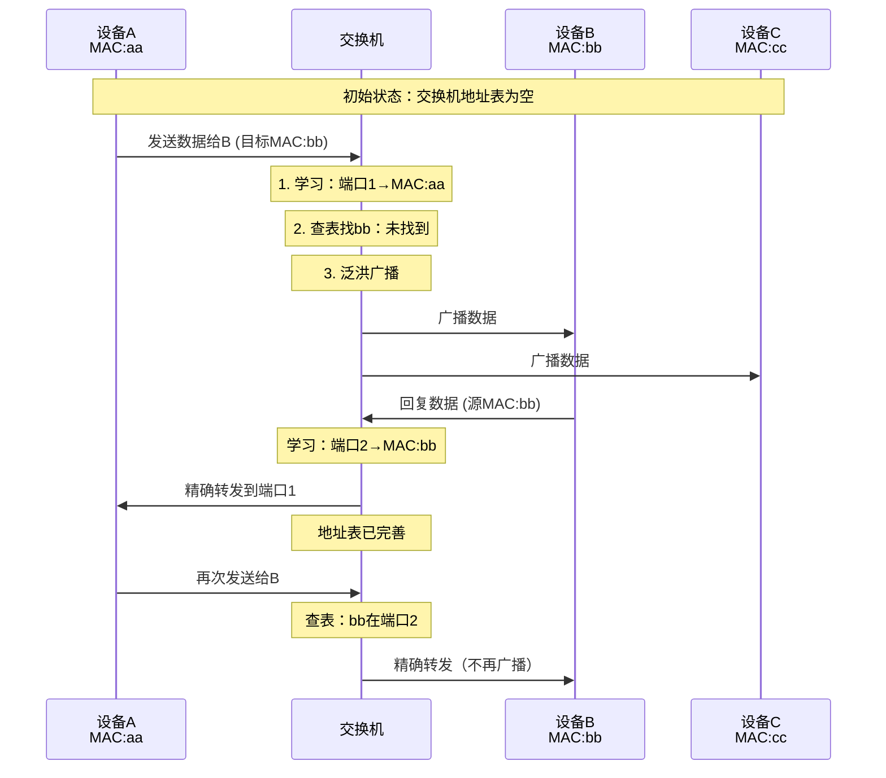
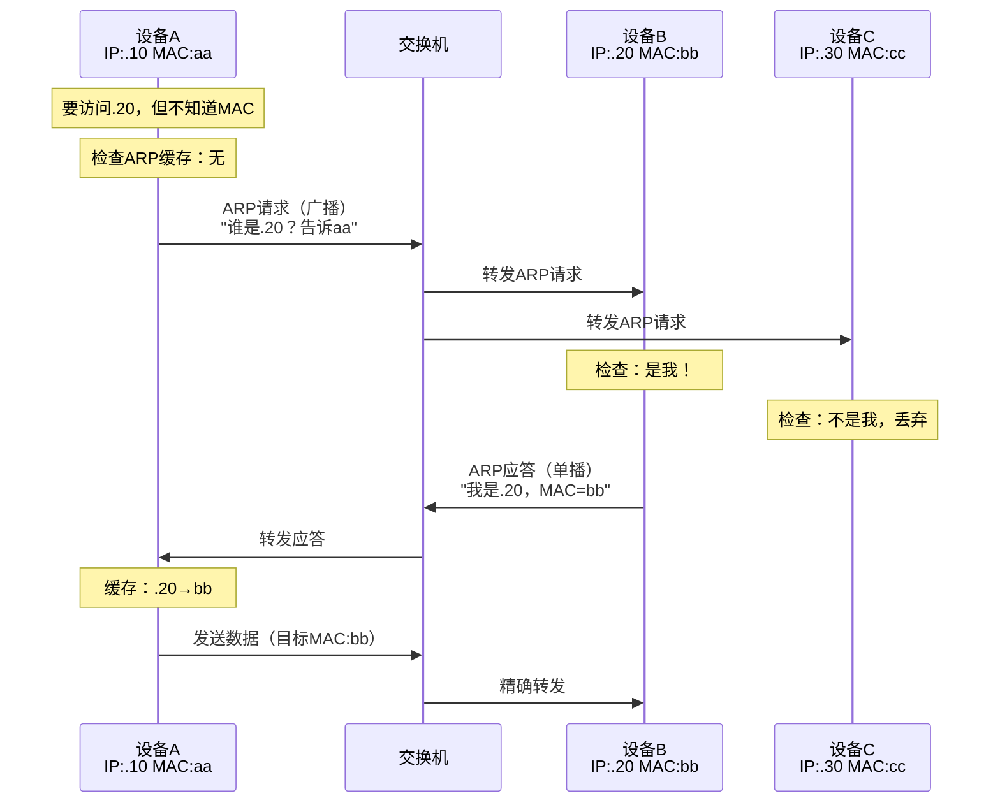
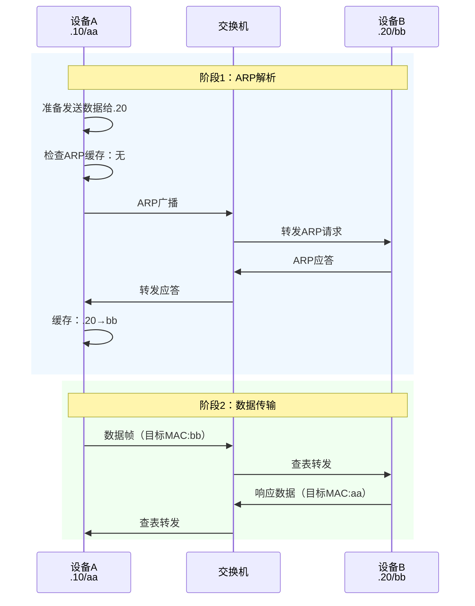
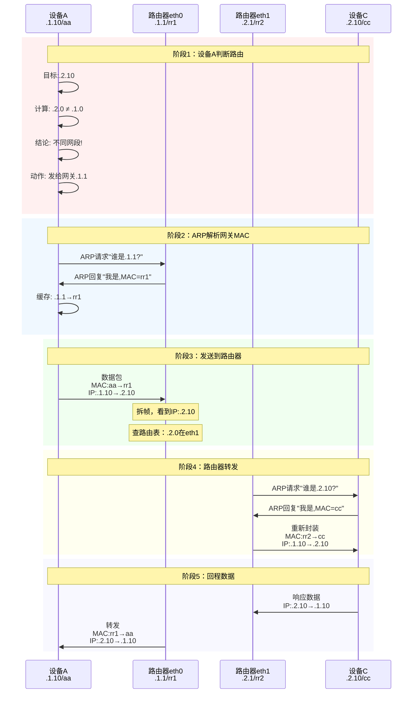
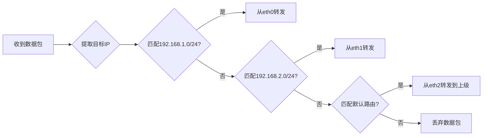
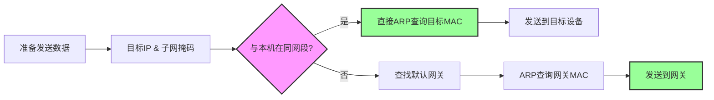

# 网络通信核心公理详解

> 从数据链路层到网络层，自底向上理解网络通信的本质原理

## 前言

网络通信的底层设计，就像数学公理一样，是不可违背的基础规则。这些规则从1980年代TCP/IP标准化后就固定下来，成为所有网络实现的基石。

本文自底向上梳理网络核心公理，用时序图详解关键流程。

---

## 第一层：数据链路层（Layer 2）

### 核心公理1：同一物理网络内的设备直接通信

**关键概念**：
- **MAC地址**：网卡出厂烧录的硬件地址（48位），全球唯一
- **交换机**：基于MAC地址转发数据帧的二层设备
- **广播域**：交换机连接的所有设备在同一个广播域

**类比**：MAC地址就像身份证号，出生就固定；IP地址像临时地址，可以换。

---

### 1. 以太网帧结构

```
+----------------+----------------+-----------+----------+-----+
| 目标MAC(6字节) | 源MAC(6字节)   | 类型(2)   | 数据     | FCS |
+----------------+----------------+-----------+----------+-----+
```

**公理1-1**：同一链路上的设备**必须通过MAC地址通信**

---

### 2. 交换机MAC地址学习

交换机通过"学习"建立MAC地址表，实现从"泛洪广播"到"精确转发"的进化。



**公理1-2**：交换机**只认MAC，不认IP**

**关键过程**：
1. 接收帧 → 学习源MAC地址
2. 查表转发 → 找不到就泛洪
3. 表项老化 → 定期清理过期条目

---

### 3. ARP协议：IP到MAC的映射

**问题**：我知道目标IP (192.168.1.20)，但发送数据帧需要MAC地址，怎么办？

**解决方案**：ARP协议（Address Resolution Protocol）



**公理1-3**：IP必须通过ARP转换为MAC才能在链路层发送

**关键点**：
- ARP请求：**广播**（所有设备收到）
- ARP应答：**单播**（只回给询问者）
- 缓存机制：避免重复ARP查询

**验证本机ARP缓存**：
```bash
arp -a
# 输出示例：
# _gateway (192.168.101.1) at 8c:53:c3:80:18:ad on en0
```

---

### 4. 完整通信流程（第一次通信）



---

### 数据链路层的局限

| 问题 | 影响 |
|------|------|
| 只能同一物理网络通信 | 无法跨网段 |
| 广播域无隔离 | 设备多了广播风暴 |
| 无路由能力 | 无法构建大规模网络 |

**结论**：需要引入**网络层**解决跨网段通信。

---

## 第二层：网络层（Layer 3）

### 核心公理2：通过IP地址实现跨网段路由

**关键概念**：
- **IP地址**：逻辑地址，可变，用于全局路由
- **子网掩码**：划分网络号和主机号
- **路由器**：连接不同网段，转发数据包
- **网关**：设备访问外网的"大门"

**类比**：数据链路层是"小区内部道路"，网络层是"城市道路网络"。

---

### 1. IP地址与子网划分

**IP地址结构**：
```
192.168.1.10 / 24
     ↓          ↓
   IP地址    CIDR前缀长度

子网掩码: 255.255.255.0
二进制:   11111111.11111111.11111111.00000000
          |←────── 网络部分 ──────→|←主机→|
```

**公理2-1**：设备通过**IP & 子网掩码**判断是否同网段

**示例**：
- 设备A: 192.168.1.10 → 网络号: 192.168.1.0 ✓
- 设备B: 192.168.1.20 → 网络号: 192.168.1.0 ✓ **同网段**
- 设备C: 192.168.2.10 → 网络号: 192.168.2.0 ✗ **不同网段**

---

### 2. 路由器工作原理

**路由器 = 多网卡设备，每个网卡连接不同网段**

```
网段A: 192.168.1.0/24                    网段B: 192.168.2.0/24
      |                                         |
  [交换机A]                                 [交换机B]
      |                                         |
   设备A(.10)                                设备C(.10)
   设备B(.20)                                设备D(.20)
      |                                         |
      └──────────────┐                ┌────────┘
                     |                |
                        [路由器双网卡]
                    eth0(.1.1)  eth1(.2.1)
```

**路由器配置**：
```
eth0: 192.168.1.1/24  # 在网段A中
eth1: 192.168.2.1/24  # 在网段B中
```

**公理2-2**：路由器连接不同网段，每个接口有独立IP

---

### 3. 跨网段通信完整流程

**场景**：设备A (192.168.1.10) 访问 设备C (192.168.2.10)



**关键发现**：
- **MAC地址每跳都变**：aa → rr1 → rr2 → cc
- **IP地址始终不变**：.1.10 ↔ .2.10
- **数据链路层看不到跨网段**：只看到本段的MAC地址

**公理2-3**：MAC地址逐跳变化，IP地址保持不变

---

### 4. 路由表：路由器的决策依据

**路由器的路由表**：
```
目标网段          网关           接口      跳数
192.168.1.0/24   直连           eth0       0
192.168.2.0/24   直连           eth1       0
0.0.0.0/0        上级路由器     eth2       1  ← 默认路由
```

**查表流程**：


**公理2-4**：路由器根据**目标IP的网络号**查路由表决定转发接口

---

### 5. 设备的路由决策

**设备的路由表**（简化版）：
```bash
# 本机路由表
目标网段          网关           接口
192.168.1.0/24   直连           en0
0.0.0.0/0        192.168.1.1    en0  ← 默认路由（网关）
```

**设备的决策流程**：


**公理2-5**：设备不认识的网段，全部发给默认网关

**验证本机网关**：
```bash
netstat -nr | grep default
# 输出示例：
# default    192.168.101.1    UGScg    en0
```

---

### 6. 网关的本质

**网关 = 路由器在本网段的IP地址**

```
你的设备配置：
IP: 192.168.1.10
子网掩码: 255.255.255.0
网关: 192.168.1.1  ← 这就是路由器eth0的IP
```

**通信规则**：
- 访问 **同网段**（192.168.1.x）：直接发送 ✓
- 访问 **不同网段**（192.168.2.x）：发给网关 ✓
- 访问 **外网**（baidu.com）：发给网关 ✓

**类比**：网关是小区大门，出小区必须经过大门。

---

### 7. 三层通信 vs 二层通信对比

**同网段通信（纯二层）**：
```
设备A ──【交换机MAC转发】──> 设备B
```

**跨网段通信（需要三层）**：
```
设备A ──【MAC→网关】──> 路由器 ──【MAC→目标】──> 设备C
       IP不变              拆帧查IP             IP不变
       MAC=网关MAC         重新封装             MAC=目标MAC
```

---

## 核心公理总结

### 数据链路层（Layer 2）

| 公理 | 内容 |
|------|------|
| **公理1** | 同一物理网络内设备通过MAC地址直接通信 |
| **公理2** | 交换机只认MAC地址，不处理IP |
| **公理3** | IP必须通过ARP转换为MAC才能发送 |

**关键机制**：
- MAC地址学习表
- ARP地址解析
- 广播/单播转发

---

### 网络层（Layer 3）

| 公理 | 内容 |
|------|------|
| **公理4** | 设备通过**IP & 子网掩码**判断是否同网段 |
| **公理5** | 路由器连接不同网段，每个接口独立IP |
| **公理6** | MAC地址逐跳变化，IP地址保持不变 |
| **公理7** | 路由器根据目标IP查路由表决定转发接口 |
| **公理8** | 设备将不同网段的流量发给默认网关 |

**关键机制**：
- IP地址与子网掩码
- 路由表查找
- 逐跳转发

---

## 设计哲学

这些公理的设计体现了分层架构的精髓：

1. **职责分离**：
   - 数据链路层：本地转发（MAC）
   - 网络层：全局路由（IP）

2. **地址解耦**：
   - 硬件地址（MAC）：固定不变
   - 逻辑地址（IP）：灵活分配

3. **逐跳转发**：
   - 每个设备只需关心下一跳
   - 无需知道完整路径

4. **分层透明**：
   - 上层看到IP端到端通信
   - 下层看到MAC逐跳转发

---

## 实战验证

### 1. 查看本机网络配置
```bash
# 查看IP地址和子网掩码
ifconfig en0 | grep "inet "
# 输出：inet 192.168.101.198 netmask 0xfffffe00

# 查看网关
netstat -nr | grep default
# 输出：default 192.168.101.1 UGScg en0

# 查看ARP缓存
arp -a
# 输出：_gateway (192.168.101.1) at 8c:53:c3:80:18:ad on en0
```

### 2. 验证DHCP自动分配
```bash
# 查看DHCP分配详情
ipconfig getpacket en0
# 关键信息：
# yiaddr: 192.168.101.198  （分配的IP）
# router: 192.168.101.1     （网关）
# subnet_mask: 255.255.254.0
```

### 3. 抓包验证ARP
```bash
# 监听ARP协议
sudo tcpdump -i en0 -ent arp
# 观察ARP请求/应答过程
```

---

## 常见问题

### Q1: 只用交换机能跨网段通信吗？
**A**: 不能。交换机只认MAC，无法路由不同网段的IP。

### Q2: MAC地址能手动修改吗？
**A**: 可以软件修改（MAC地址欺骗），但出厂硬件地址不可改。

### Q3: 为什么需要ARP，直接用IP不行吗？
**A**: 数据链路层（以太网）只认MAC，IP是网络层的概念，必须转换。

### Q4: 路由器和交换机能合并吗？
**A**: 可以，家用路由器就是"路由器+交换机+AP"的组合设备。

### Q5: 网关挂了会怎样？
**A**: 无法访问外网和其他网段，但同网段内部通信正常。

---

## 扩展阅读

### 相关协议
- **ICMP**：网络层控制协议（ping、traceroute）
- **DHCP**：动态主机配置协议
- **DNS**：域名解析（应用层）

### 下一步学习
- **传输层（Layer 4）**：TCP/UDP端口通信
- **应用层（Layer 7）**：HTTP、HTTPS、FTP等

### 实践建议
1. 搭建双网段环境，实际观察路由过程
2. 使用tcpdump抓包分析完整通信流程
3. 配置静态路由，理解路由表工作机制

---

**总结**：网络通信的底层设计，是计算机网络40多年积累下来的"公理体系"。理解这些公理，就能从本质上掌握网络原理。

**记住**：
- 数据链路层：MAC逐跳变化，负责本地转发
- 网络层：IP保持不变，负责全局路由
- 设备不认识的网段：全部交给网关处理

---

*最后更新时间：2025-10-27*
